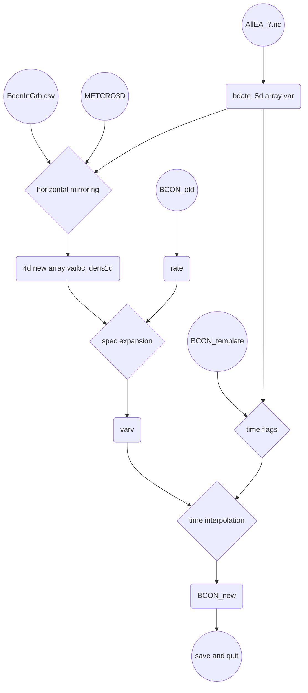

# [CAMS][CAMS]預報數據寫成CMAQ邊界檔
{: .no_toc }

<details open markdown="block">
  <summary>
    Table of contents
  </summary>
  {: .text-delta }
- TOC
{:toc}
</details>
---

## 背景
- 過去執行[中期天氣預報中心][ecmwf]再分析空品數據寫成CMAQ邊界檔有2個作法
  1. 先將全月數據寫成m3nc檔案，在用CMAQ系統的bcon程式進行切割。由於全月m3nc檔案非常龐大，此一作法不單浪費空間，同時也耗費計算時間。
  1. 直接將grib檔案寫bcon檔案。此法也需處理龐大的grib檔案，效率不彰。
- 此處除了針對[ecmwf][ecmwf]數值預報數據檔與再分析數據檔的[差異][CAMS_diff_tab]，改進[EAC4檔案轉成5階m3.nc][grb2D1m3]作業方式，也需要改進前述作業的作法，提升計算效率，以運用在日常作業中。
- 改進構想
  1. 是否直接讀取grib檔案，不再經轉換成nc檔案？這題在[CAMS_ic][CAMS_ic]內詳細討論，此處就不贅述了。對邊界檔而言，需處理41個time step，如果是要循序讀取grib檔案、將每個2維陣列放在正確的5度空間矩陣，那將會是個災難。  
  1. 由於是廣大範圍、遙遠位置的邊界濃度，對臺灣地區模擬結果的影響不是很大，過去詳細進行網格內插(scipy.griddata)似乎沒有必要。改成最近點直接代替，會比較有效率，同時也可以避免找不到適合進行內插的值而發生nan的結果。
  1. 時間內插：如果CMAQ可以接受解析度3小時的邊界條件就最方便了。但這項因素似乎是模式整體控制，不能個別差異。如果要改，連mcip、排放等都要系統性更換。
- 除了此處之邊界檔案之外，CMAQ還需要初始檔，可以進行[grb2icon.py][grb2icon.py]，與邊界檔作業沒有前後關連性。

## 建立CMAQ邊界點位置與[CAMS][CAMS]網格系統的對照關係([BconInGrb.py][BconInGrb.py])

- 目標是產生BconInGrb.csv檔案，將每一邊界點最靠近的[CAMS][CAMS]經緯度位置記錄下來，供後續使用。
- 因為對照關係不會因為時間日期而異，因此可以從日常的下載及處理程序中獨立出來，只做一次。待網格系統有異動時再執行即可。

### CMAQ邊界位置的座標
- CMAQ的邊界定義有點特別，在水平面上共有(nrow+ncol)*2+4點，自**模式外圍**西南角落開始向東、向北、向西、再向南完成一圈。詳細的程式碼：

```python
nt1,nlay1,nbnd1=nc1.variables[V1[2][0]].shape
nrow0,ncol0=nc1.NROWS+5,nc1.NCOLS+5
x1d=[nc1.XORIG+nc1.XCELL*(i-2) for i in range(ncol0)]
y1d=[nc1.YORIG+nc1.YCELL*(i-2) for i in range(nrow0)]
x1,y1=np.meshgrid(x1d, y1d)
i0,j0=1,1
i1,j1=i0+ncol1+1,j0+nrow1+1
idx=[(j0,i) for i in range(i0+1,i1+1)]  +   [(j,i1) for j in range(j0+1,j1+1)] + \
    [(j1,i) for i in range(i1-1,i0-1,-1)] + [(j,i0) for j in range(j1-1,j0-1,-1)]
idxo=np.array(idx,dtype=int).flatten().reshape(nbnd1,2).T
x1,y1=x1[idxo[0],idxo[1]],y1[idxo[0],idxo[1]]
```
- 邊界比正常模式模擬範圍還要**大1圈**，x1d,y1d則設成比模擬範圍多2圈、nrow0,ncol0多5，以擴大內插範圍(沿用[grb2bc][grb2bc]的作法，雖然此處不再進行內插)。
- 有了目標網格系統的座標，還需進行[CAMS][CAMS]經緯度座標的轉換

### [CAMS][CAMS]經緯度座標的轉換
- 應用Proj進行座標轉換。參數則直接引用bcon模版，不另外內設以避免錯誤。
- 經緯度在grib檔與nc檔案裏都有，此處版本使用grib檔，經緯度是任一grb的屬性，直接呼叫比較方便。
- 注意：此處並不翻轉南北方向之y軸，未來應用時也不必翻轉。

```python
...
pnyc = Proj(proj='lcc', datum='NAD83', lat_1=nc1.P_ALP, lat_2=nc1.P_BET, lat_0=nc1.YCENT, lon_0=nc1.XCENT, x_0=0, y_0=0.0)
...
#grib file
fname='allEA_1.grib'
grbs = pygrib.open(fname)
grb=grbs[1]
lats, lons = grb.latlons()
x,y=pnyc(lons,lats, inverse=False) #no flip
```

### 計算距離並選出最近距離
- 先產生座標系統的JI值(seq)。seq, x, y都壓縮成1維備用。

```python
ny,nx=x.shape
seq=np.zeros(shape=(ny,nx),dtype=int)
for j in range(ny):
    for i in range(nx):
        seq[j,i]=j*1000+i
for i in ['x','y','seq']:
    exec(i+'='+i+'.flatten()')
```
- 計算舊網格到邊界上的距離，找到最近點，將其記錄下來，以對照前述seq及x,y。

```python
n=[-1 for i in range(nbnd1)]
for i in range(nbnd1):
    dist=(x-x1[i])**2+(y-y1[i])**2      #nearest grib data for bcon
    idx=np.where(dist==np.min(dist))[0]
    if type(idx)==list and len(idx)>1: idx=idx[0]
    n[i]=idx
```    
### 儲存結果
- 以DataFrame形式儲存結果，方便檢查與日後讀取。

```python
df=DataFrame({'NumOfBnd':[i for i in range(nbnd1)],'x1':x1,'y1':y1,'JinBCON':idxo[0],'IinBcon':idxo[1],'JIseqInGrb':[seq[n[i]][0] for i in range(nbnd1)]})
df.set_index('NumOfBnd').to_csv('BconInGrb.csv')
```
- 由於df是正確順序的資料表，未來引用JIseqInGrb即可連到grib的數據。

## [grb2bcon.py][grb2bcon.py]
- 首要任務是將3批下載的grib檔案進行整併，存成5維度的矩陣備用。
  - 不在作業環境使用ncks進行橫向污染物質整併的理由
    1. 檔案會非常大，沒有必要儲存。
    1. 累加的作業方式也不利平行化處理。
- 讀進前述位置對照關係(BconInGrb.csv)之濾鏡，經此濾鏡可以快速將5維度矩陣降階為4度(水平x,y消失，簡化為邊界線形維度)。
  - 前述5維度矩陣之記憶體可以覆蓋、不再使用
- 空間問題解決後，即可在污染物維度進行展開，由27項展開為39項。
- 最後進行時間的內插，將CAMS 3小時之架構線性內插展開為逐時檔。時間由41項增加為121。存入舊檔模版。

### [grb2icon.py][grb2icon.py]程式IO
- AllEA_1.nc ~ AllEA_3.nc：3批次下載之grib檔案，經ncl_convert2nc轉換之結果
- 與[grb2icon.py][grb2icon.py]相同
  1. BCON_v53_1912_run5_regrid_20191201_TWN_3X3：取粒狀物IJK比例(rate)之模版
  2. METCRO3D_2208_run8.nc：讀取空氣密度進行粒狀物的單位轉換
- BconInGrb.csv：座標點對照關係([前述](https://sinotec2.github.io/Focus-on-Air-Quality/AQana/GAQuality/ECMWF_CAMS/3.CAMS_bc/#建立cmaq邊界點位置與cams網格系統的對照關係bconingrbpy))
- BCON_v53_2208_run8_regrid_20220811_CWBWRF_45k：模版及結果檔

### [grb2bcon.py][grb2bcon.py]流程



## 污染項目對照與展開
- 此部分之處理方式與[CAMS_ic](https://sinotec2.github.io/Focus-on-Air-Quality/AQana/GAQuality/ECMWF_CAMS/4.CAMS_ic/#污染項目對照與展開)相同，僅輸入及輸出的矩陣因應調整

```python
#iv in (gas+par) transfer to V1[2]
for v in list(nms_gas)+list(nms_part):
  print(v)
  iv=(gas+par).index(dic[v])
  if v in nms_gas:
    nm=nms_gas[v]
    if nm not in V1[2]:continue
    varv[V1[2].index(nm),:,:,:]=varbc[iv,:,:,:]*28.E6/mws[dic[v]] #mixing ratio to ppm
    continue
  skip=0
  nms=nms_part[v]
  for nm in nms:
    if nm not in V1[2]:skip=1
  if skip==1:continue
#    unit=dens[:] (kg/kg) to microgram/M3
  for nm in nms:
    im=nms.index(nm)
    varv[V1[2].index(nm),:,:,:]+=varbc[iv,:,:,:]*rate[v][im]*dens1d[None,:,:]
```

## 結果檢討

## 2023/06更新

- 更新項目內容全貌詳見[CAMS_ic#2023/06更新](4.CAMS_ic.md#202306更新)，此處說明邊界檔更動部分

### 程式更新

- 因應[grib_to_netcdf](../../../utilities/grib/eccodes.md#grib_to_netcdf)轉檔結果，時間標籤改在`nc['time']`，單位是1900-01-01 00:00:00.0之後的小時數。其餘沒有更動。
- [對照表的內容](4.CAMS_ic.md#物質對照表)更新了，但檔名沒有更動。

```python
kuang@dev2 /u01/ecmwf/CAMS/CAMS_global_atmospheric_composition_forecasts/2022
$ diff grb2bcon.py grb2bconV2.py
44,45c44,47
<     fcst_hr=float(np.array(nc['forecast_time0'])[0])
<     bdatef=datetime.datetime.strptime(nc.variables[V[3][0]].initial_time,'%m/%d/%Y (%H:%M)')+datetime.timedelta(hours=fcst_hr)
---
>     v='time'
>     udate=datetime.datetime.strptime(' '.join(nc[v].units.split()[2:4]),'%Y-%m-%d %H:%M:%S.0')
>     fcst_hr=float(np.array(nc[v])[0])
>     bdatef=udate+datetime.timedelta(hours=fcst_hr)
```

[ecmwf]: <https://zh.wikipedia.org/zh-tw/歐洲中期天氣預報中心> "歐洲中期天氣預報中心，創立於1975年，是一個國際組織，位於英格蘭雷丁。"
[grb2icon.py]: <https://github.com/sinotec2/Focus-on-Air-Quality/blob/main/AQana/GAQuality/ECMWF_CAMS/grb2icon.py> "CAMS預報數據寫成CMAQ初始檔之內插與對照程式"
[grb2D1m3]: <https://sinotec2.github.io/Focus-on-Air-Quality/AQana/GAQuality/ECMWF_rean/grb2D1m3/> "歐洲中期預報中心再分析檔案轉成USEPA m3nc 檔"
[CAMS_diff_tab]: <https://sinotec2.github.io/Focus-on-Air-Quality/AQana/GAQuality/ECMWF_CAMS/4.CAMS_ic/#ecmwf數值預報數據檔與再分析數據檔的差異> "ecmwf數值預報數據檔與再分析數據檔的差異說明"
[CAMS_ic]: <https://sinotec2.github.io/Focus-on-Air-Quality/AQana/GAQuality/ECMWF_CAMS/4.CAMS_ic/#grib2或netcdf的選擇> "grib2或netcdf的選擇"
[grb2bc]: <https://sinotec2.github.io/Focus-on-Air-Quality/AQana/GAQuality/ECMWF_rean/grb2bc/> "EAC4檔案轉成4階邊界檔案"
[BconInGrb.py]: <https://github.com/sinotec2/Focus-on-Air-Quality/blob/main/AQana/GAQuality/ECMWF_CAMS/BconInGrb.py> "建立CMAQ邊界點位置與CAMS網格系統的對照關係BconInGrb.csv檔案"
[grb2bcon.py]: <https://github.com/sinotec2/Focus-on-Air-Quality/blob/main/AQana/GAQuality/ECMWF_CAMS/grb2bcon.py> "CAMS預報數據寫成CMAQ邊界檔之對照程式" 
[CAMS]: <https://ads.atmosphere.copernicus.eu/cdsapp#!/dataset/cams-global-atmospheric-composition-forecasts?tab=overview> "CAMS每天2次進行全球大氣成分的5天預報，包括50多種氣狀物和7種顆粒物(沙漠塵埃、海鹽、有機物、黑碳、硫酸鹽、硝酸鹽和銨氣溶膠)。初始條件為衛星及地面觀測數據同化分析結果，允許在地面觀測數據覆蓋率低、或無法直接觀測到的大氣污染物進行估計，除此之外，它還使用到基於調查清單或觀測反衍的排放估計，以作為表面的邊界條件。"
