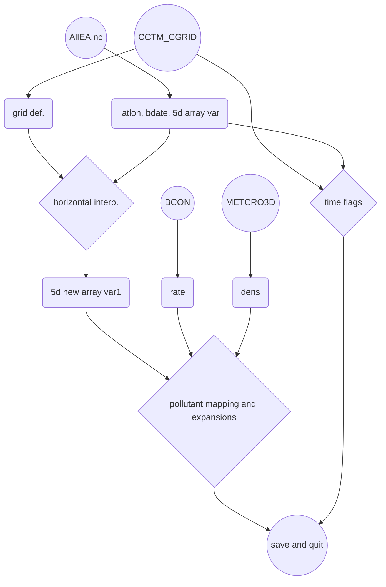

# [CAMS][CAMS]預報數據寫成CMAQ初始檔
{: .no_toc }

<details open markdown="block">
  <summary>
    Table of contents
  </summary>
  {: .text-delta }
- TOC
{:toc}
</details>
---

## 背景
- 歐洲[中期天氣預報中心][ecmwf]再分析空品數據寫成USEPA的m3nc格式，已經在[EAC4檔案轉成5階m3.nc][grb2D1m3]完成。然而該項作業仍然有待改進：
  1. 因為下載全月數據，再進行轉檔(增加網格與時間的解析度)，結果檔案會非常大。而此處僅需要初始小時的數據，且在自動化與作業流程中，似乎不允許如此耗時、耗費硬碟空間的作法。
  1. 數值預報數據檔與再分析數據檔的差異如下表，必須更新
  1. 有關空間之內插（Proj模組）：調整成按照目標檔的座標定義。而不在python程式內重新定義，以避免發生錯誤。
  1. 有關時間的校準
    - 空氣密度來自於mcip的結果，但時間似乎並不重要，取時間平均
    - 只有初始時刻，無需進行時間內插，此部分刪除
- 除了此處之初始檔案之外，CMAQ還需要邊界檔，可以另外進行[grb2bcon.py][grb2bcon.py]，與初始檔作業沒有前後關連性。

### [ecmwf][ecmwf]數值預報數據檔與再分析數據檔的差異

項目|預報|再分析|說明
-|-|-|-
臭氧等5項氣狀物編號|前綴MASSMR_P40_L105_GLL0_A|前綴VAR_192_210與後綴P0_L105_GLL0|略有不同，詳下述對照關係。
時間標籤|存在屬性|為一特定的變數|需重作
層數|137層|60層|CMAQ目標檔案舊版為40層，新版為24層

- 除了前述差異與更新之外，[grb2icon.py][grb2icon.py]大多參考[grb2D1m3][grb2D1m3]的作法。以下著重介紹IO及前後處理。

- 數值預報數據檔部分氣狀物編號對照關係之更動

```json
"MASSMR_P40_L105_GLL0_A0":"ozone",
"MASSMR_P40_L105_GLL0_A4":"carbon_monoxide",
"MASSMR_P40_L105_GLL0_A5":"nitrogen_dioxide",
"MASSMR_P40_L105_GLL0_A8":"sulphur_dioxide",
"MASSMR_P40_L105_GLL0_A11":"nitrogen_monoxide",
```
- 這些污染物舊版的對照關係

```json
"VAR_192_210_203_P0_L105_GLL0":"ozone",
"VAR_192_210_123_P0_L105_GLL0":"carbon_monoxide",
"VAR_192_210_121_P0_L105_GLL0":"nitrogen_dioxide",
"VAR_192_210_122_P0_L105_GLL0":"sulphur_dioxide",
"VAR_192_217_27_P0_L105_GLL0":"nitrogen_monoxide",
```

## 預報檔時間的切割與橫向合併
### grib2或netCDF的選擇
- 小型檔案、循序處理的情況下，使用pygrib直接處理grib2檔案似乎有其簡捷的好處。但由於此處的grib2檔案為41個小時、27種物質的預報檔，下載就必須拆分成3批進行，使用pygrib的速度遠遠無法比netCDF4階層讀取來的有效。
- 使用ncl_convert2nc轉換檔案並不會花費太多時間，且方便切割(取初始時間)。雖然磁碟機空間會佔2份，但在每天作業中可以覆蓋過去，不需存檔。
- ncl_convert2nc對於大型grib2檔案仍有限制。使用-nc4c（classic nc4）格式將可以轉換超過2GB的大型檔案。
  - 選項加在檔案名稱之後
  - 新版本後產生.nc4新檔案，舊版本名稱還是.nc。要注意名稱的差異。

### 時間切割
- 分別將前述3個批次下載結果轉換成nc檔
  - 3個批次的定義為3組污染項目(如下述對照關係中的1 ~9、10 ~18、19 ~ 27)  
- 再以ncks進行時間維度的切割。
- 如果[CAMS][CAMS]模式初始時間與CMAQ不同時

狀況|[CAMS][CAMS]初始時間|CMAQ初始時間|forecast_time0值|說明
-|-|-|-|-
1.|昨日0時|當日0時|0|預報僅剩3天
2.|昨日12時|當日0時|4|仍然落後實際時間
3.|昨日12時|翌日0時|12|可趕上實際時間

```bash
for grb in allEA_1.grib  allEA_2.grib  allEA_3.grib;do
ncl_convert2nc $grb -nc4c
done
for nc in allEA_1.nc  allEA_2.nc  allEA_3.nc;do
ncks -d forecast_time0,0 $nc ${nc}_0
done
```
- specname.json: 預報grib 檔中ID與grab.name的對照關係

```json
{"1": "Ozone mass mixing ratio (full chemistry scheme)", 
"2": "Sulphur dioxide mass mixing ratio", 
"3": "Propane", 
"4": "Nitrogen monoxide mass mixing ratio", 
"5": "Nitrogen dioxide mass mixing ratio", 
"6": "Isoprene", 
"7": "Formaldehyde", 
"8": "Ethane", 
"9": "Carbon monoxide mass mixing ratio", 
"10": "Hydrophilic Black Carbon Aerosol Mixing Ratio", 
"11": "Dust Aerosol (0.9 - 20 um) Mixing Ratio", 
"12": "Dust Aerosol (0.55 - 0.9 um) Mixing Ratio", 
"13": "Dust Aerosol (0.03 - 0.55 um) Mixing Ratio", 
"14": "Paraffins", 
"15": "Organic nitrates", 
"16": "Olefins", 
"17": "Nitrate", 
"18": "Ammonium", 
"19": "Sulphate Aerosol Mixing Ratio", 
"20": "Sea Salt Aerosol (5 - 20 um) Mixing Ratio", 
"21": "Sea Salt Aerosol (0.5 - 5 um) Mixing Ratio", 
"22": "Sea Salt Aerosol (0.03 - 0.5 um) Mixing Ratio", 
"23": "Peroxyacetyl nitrate", 
"24": "Nitric acid", 
"25": "Hydrophobic Organic Matter Aerosol Mixing Ratio", 
"26": "Hydrophobic Black Carbon Aerosol Mixing Ratio", 
"27": "Hydrophilic Organic Matter Aerosol Mixing Ratio"}
```

### 污染項目間之橫向合併(merge.cs)
- 一個檔案有9個變數，多了變數($var)的迴圈，因為grep的結果var有很多筆，參照舊版[merge.cs](https://sinotec2.github.io/Focus-on-Air-Quality/AQana/GAQuality/ECMWF_rean/EC_ReAna/#橫向合併)修改應用，同樣也是ncks -v再ncks -A疊加在$fn的後面。
- 三個nc檔案持續在變數維度方向進行疊加

```bash
#kuang@master /nas1/ecmwf/CAMS/CAMS_global_atmospheric_composition_forecasts/2022
#$ cat merge.cs
fn=AllEA.nc
for i in 1 2 3;do
  nc=allEA_${i}.nc_0
  var=$(ncdump -h $nc|grep float|grep 0_L|awkk 2|cut -d'(' -f1)
  for v in $(echo $var);do
    c=$(grep $v G*json|cut -d: -f2|cut -c2-|rev|cut -c3-|rev)
    ncks -O -v $v --mk_rec_dmn initial_time0_hours $nc tmp.nc
    ncks -A tmp.nc $fn
    echo $c
  done
done
```

## [grb2icon.py][grb2icon.py]程式IO
- AllEA.nc：前述橫向合併之結果
- 與[grb2bcon.py][grb2bcon.py]相同的輸入檔案
  1. BCON_v53_1912_run5_regrid_20191201_TWN_3X3：取粒狀物IJK比例(rate)之模版
  2. METCRO3D.nc：讀取空氣密度進行粒狀物的單位轉換
- CCTM_CGRID_v53_gcc_2208_run7_20220810_CWBWRF_45k_11.nc：CMAQ初始檔模版及輸出

## [grb2icon.py][grb2icon.py]流程
- 先進行水平xy方向空間的內插，再進行污染項目的對照與擴張



## 水平方向空間內插
### 翻轉垂直及南北方向軸(np.flip())
- 包括1維的緯度矩陣以及5d變數矩陣
- 初始場需保持水平方向的正確，才能進行內插計算。

```python
...
xlat=np.flip(nc['lat_0'])
xlon=nc['lon_0']
lonm, latm = np.meshgrid(xlon, xlat)
...
for v in V[3]:
  iv=(gas+par).index(dic[v])
  var[iv,:,:,:,:]=nc.variables[v][:,:,:,:]
var=np.flip(var,axis=(2,3))
```

### 座標系統之準備
- 這段不需要(不可以)修改

```python
pnyc = Proj(proj='lcc', datum='NAD83', lat_1=nc1.P_ALP, lat_2=nc1.P_BET, lat_0=nc1.YCENT, lon_0=nc1.XCENT, x_0=0, y_0=0.0)
x,y=pnyc(lonm,latm, inverse=False)
V1=[list(filter(lambda x:nc1.variables[x].ndim==j, [i for i in nc1.variables])) for j in [1,2,3,4]]
nt1,nlay1,nrow1,ncol1=nc1.variables[V1[3][0]].shape
##interpolation indexing
x1d=[nc1.XORIG+nc1.XCELL*i for i in range(ncol1)]
y1d=[nc1.YORIG+nc1.YCELL*i for i in range(nrow1)]
x1,y1=np.meshgrid(x1d, y1d)
```

### griddata之準備
- griddata 需要將二維平面所有的觀測點(mp)全部納入。
- 因為與其他維度都沒有關係，可以獨立在迴圈之外先準備好。

```python
maxx,maxy=x1[-1,-1],y1[-1,-1]
minx,miny=x1[0,0],y1[0,0]
boo=(abs(x) <= (maxx - minx) /2+nc1.XCELL*10) & (abs(y) <= (maxy - miny) /2+nc1.YCELL*10)
idx = np.where(boo)
mp=len(idx[0])
xyc= [(x[idx[0][i],idx[1][i]],y[idx[0][i],idx[1][i]]) for i in range(mp)]
```

### 執行griddata
- 分污染項目、時間(只有單筆)、高度等三個迴圈進行griddata
- griddata的對象只能限定在2維的矩陣。其輸出也**一定**是2維
- 將其他維度壓縮成2維進行griddata將會出錯

```python
var1=np.zeros(shape=(nv,nt1,nlay1,nrow1,ncol1))
for v in range(nv):
  for t in range(nt1):
    for k in range(nlay1):
      c = [var[v,t,k,idx[0][i], idx[1][i]] for i in range(mp)]
      var1[v,t,k,:, :] = griddata(xyc, c, (x1, y1), method='linear')
var1[:,:,:,0,0]=(var1[:,:,:,1,1]+var1[:,:,:,0,1]*2+var1[:,:,:,1,0]*2)/5
```
- 經檢查發現原點為nan，由附近其他點加權平均而得

### [搜尋半徑距離平方反比加權之內插機制][near_wgt]
- griddata在周邊點數不太足夠時，很容易出現NaN的內插結果。這將導致後續計算上的錯誤。
- 納入平面上的所有點，造成計算效率低落。
- 可以搜尋半徑概念減少納入內插計算的點數，提高內插效率。
- （此為最終版本）

## 污染項目對照與展開
- 此部分之處理方式與[grb2D1m3][grb2D1m3]相同，程式碼略有精進
  1. 也是切分氣狀物與粒狀物2大類進行計算
  1. [grb2D1m3][grb2D1m3]先做時間的內插再進行污染項目展開，矩陣記憶體需求會比較大。此處因無時間內插的需要(只單一筆時間項)，予以修正，直接取空間內插後的矩陣(var1)進行處理。

```python
#iv in (gas+par) transfer to V1[3]
for v in list(nms_gas)+list(nms_part):
  print(v)
  iv=(gas+par).index(dic[v])
  if v in nms_gas:
    nm=nms_gas[v]
    if nm not in V1[3]:continue
    nc1[nm][:]=var1[iv,:,:,:,:]*28.E6/mws[dic[v]] #mixing ratio to ppm
    continue
  skip=0
  nms=nms_part[v]
  for nm in nms:
    if nm not in V1[3]:skip=1
  if skip==1:continue
#    unit=dens[:] (kg/kg) to microgram/M3
  for nm in nms:
    im=nms.index(nm)
    nc1[nm][:]+=var1[iv,:,:,:,:]*rate[v][im]*dens[None,:,:,:]
```

## 結果檢討
- 確認項目：y軸的方向、Z軸的方向。grib檔案是由北向南、由上到下，經np.flip()結果必須要符合地理位置特性。


|  |
|:--:|
| <b>[CAMS][CAMS]數值預報結果轉成CMAQ CWBWRF_45k網格之初始檔(精確時間為 2022/8/11 pm8:00LST)。圖為地面臭氧濃度。單位ppm</b>|  

- [CAMS][CAMS]預報檔的解析度是0.4度，約為44km，與此處之45km相差無幾。然而發現內插結果濃度較低。
- 特定項目如硝酸鹽，濃度又更低。可能與[CAMS][CAMS]為12時的預報，大陸地區為晚上，硝酸鹽沒有產生項，因而濃度會較低，可由硝酸濃度在孟加拉 ~ 新疆有明顯之日落線，瞭解太陽對光化學污染的效應。
- 粒狀物IJK的比例是空間與時間、以及綜合粒徑的函數(APMDIAG檔)，此處使用單一比例似乎過度簡單。如為連續CMAQ模擬作業，就可以找到初始時間詳細的粒徑分佈比例。
|  |  |
|:--:|:--:|
| <b>地面氣狀硝酸濃度。單位log-ppm</b>|  <b>地面硝酸鹽(i-mode)單位log-&mu;g/m<sup>3</sup></b>| 
|  |  |
| <b>地面硝酸鹽(j-mode)單位log-&mu;g/m<sup>3</sup></b>|  <b>地面硝酸鹽(k-mode)單位log-&mu;g/m<sup>3</sup></b>| 

- 有關時間的校準：CWB每6小時更新，但CMAQ並不能由任意時間起始。是否意味CMAQ只能每天執行預報一次。值得進一步確認。
- 初始場的**下載**似乎可以獨立出來，一次下載單一時間27個物種，直接進行ncl_convert2nc，可以減少橫向整併的時間。


[ecmwf]: <https://zh.wikipedia.org/zh-tw/歐洲中期天氣預報中心> "歐洲中期天氣預報中心，創立於1975年，是一個國際組織，位於英格蘭雷丁。"
[grb2icon.py]: <https://github.com/sinotec2/Focus-on-Air-Quality/blob/main/AQana/GAQuality/ECMWF_CAMS/grb2icon.py> "下載CAMS預報數據寫成CMAQ初始檔之內插與對照程式"
[grb2D1m3]: <https://sinotec2.github.io/Focus-on-Air-Quality/AQana/GAQuality/ECMWF_rean/grb2D1m3/> "歐洲中期預報中心再分析檔案轉成USEPA m3nc 檔"
[grb2bcon.py]: <https://github.com/sinotec2/Focus-on-Air-Quality/blob/main/AQana/GAQuality/ECMWF_CAMS/grb2bcon.py> "下載CAMS預報數據寫成CMAQ邊界檔之對照程式" 
[near_wgt]: <https://sinotec2.github.io/FAQ/2022/08/20/NearstWeight.html> "這個內插機制主要針對2維griddata速度太慢所因應的修改方案。同時也需要規避griddata結果會有NaN內插錯誤的結果。主要因為空氣品質或排放量的內插會與距離的遠近有關，太遠的數據對內插影響也較低，還是適用距離相關的內插機制較為合理。同時摒除遙遠的數據對提升計算速度有非常重要的貢獻。"
[CAMS]: <https://ads.atmosphere.copernicus.eu/cdsapp#!/dataset/cams-global-atmospheric-composition-forecasts?tab=overview> "CAMS每天2次進行全球大氣成分的5天預報，包括50多種氣狀物和7種顆粒物(沙漠塵埃、海鹽、有機物、黑碳、硫酸鹽、硝酸鹽和銨氣溶膠)。初始條件為衛星及地面觀測數據同化分析結果，允許在地面觀測數據覆蓋率低、或無法直接觀測到的大氣污染物進行估計，除此之外，它還使用到基於調查清單或觀測反衍的排放估計，以作為表面的邊界條件。"