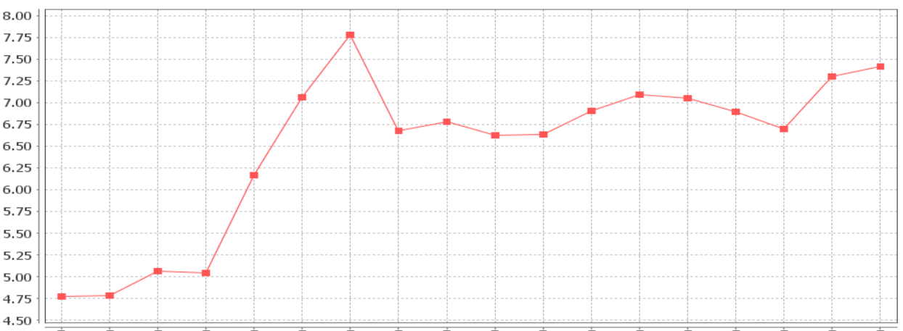
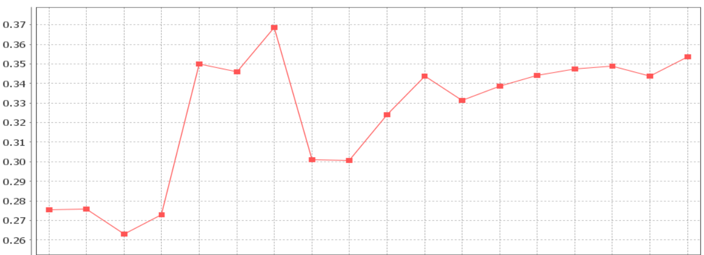
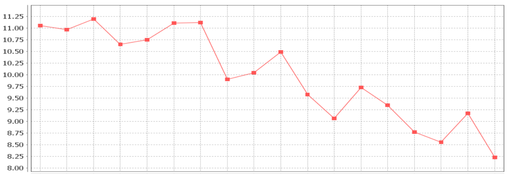
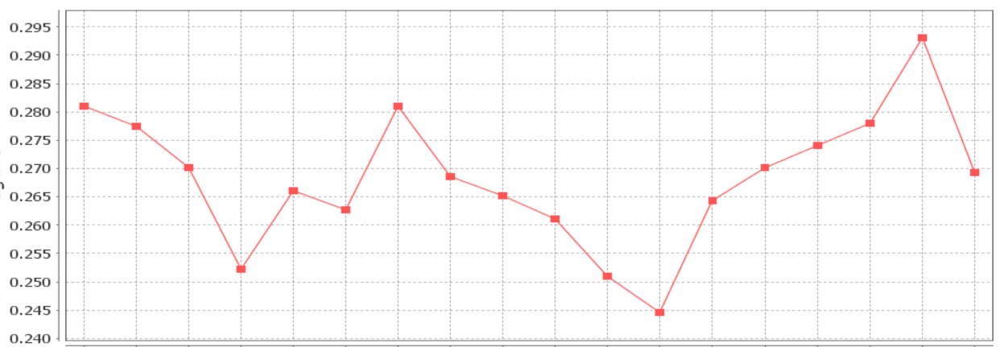

# OMI L3長期區域平均結果與再思
{: .no_toc }

  

    Table of contents
  

  {: .text-delta }
- TOC
{:toc}

---

## 背景

## 時間變化趨勢

### 東亞及西太平洋範圍

- 東亞地區2009、2011有突兀之最高值，原因不明，如果消除此一波動之後，二者的背景濃度長期來說是在增加之中。

|
:-:|:-:
<b>東亞及西太平洋範圍2005~22年OMI_MINDS_NO2d之平均結果(近地層ppb)</b>|<b>時空範圍同左，但為OMI-Aura_L3-OMSO2e值，單位DU</b>

### 臺灣範圍

- 很顯然地，臺灣地區的NO2d濃度比區域平均濃度還要高，SO2e則在東亞地區平均水準之下。
- NO2d受到局部污染的影響較嚴重，而台灣地區近年來的排放減量，尤其在汽機車交通源方面，18年來降幅達到27%之多。
- SO2e的改善趨勢並不明顯，各年度平均值上下來回震盪，可能因為濃度已在低濃度範圍徘徊。但至少數據顯示長期來說並沒有明顯的增加趨勢。

|
:-:|:-:
<b>臺灣地區2005~22年OMI_MINDS_NO2d之平均結果(近地層ppb)</b>|<b>時空範圍同左，但為OMI-Aura_L3-OMSO2e值，單位DU</b>

## 空間分布

- 不論由東亞或台灣地區的濃度分布來看，NO2d與SO2e二者單位上的差異，前者有較大的範圍、後者濃度分布似較為平緩。

### 東亞及西太平洋範圍

- 區域內最高/最低的比例，前者(NO2d)超過10倍以上，內陸沙漠高原及海洋濃度很低，後者(SO2e)則較為平緩、差異在10倍以下，海上可以維持較低濃度。
- 二者在華北都有較高濃度，前者在華東長江沿岸有較高濃度，後者在華中、華東也普遍較高。
- 台灣看來是在大陸影響的邊陲地帶，介於大陸近海及太平洋低濃度範圍之漸變地帶。

|
:-:|:-:
<b>OMI_MINDS_NO2d在東亞及西太平洋範圍之分布。2005~22年之平均結果(近地層ppb)</b>|<b>時空範圍同左，但為OMI-Aura_L3-OMSO2e值，單位DU</b>

### 臺灣範圍

- NO2d與SO2e二者單位上的差異，前者超過20倍之多，後者僅有4倍。
- NO2d在北、中、高等地區有較高值，顯示出都會區分布的特色。SO2e則在新竹~台中及近海一帶有較高值，似為電廠的影響。

|
:-:|:-:
<b>OMI_MINDS_NO2d在臺灣地區之分布。2005~22年之平均結果(近地層ppb)</b>|<b>時空範圍同左，但為OMI-Aura_L3-OMSO2e值，單位DU</b>