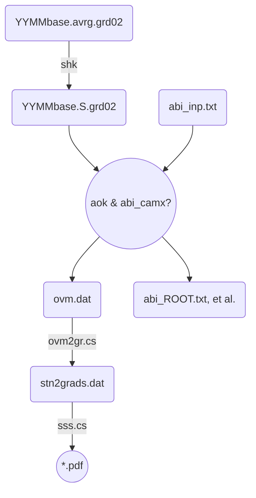
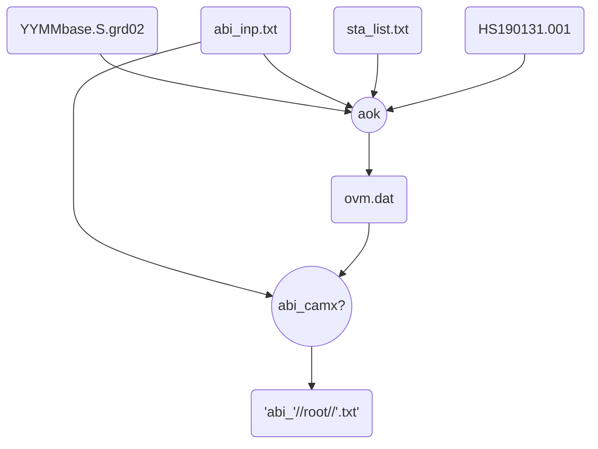

# CAMx模擬結果之比對(aok)

{: .no_toc }

<details open markdown="block">
  <summary>
    Table of contents
  </summary>
  {: .text-delta }
- TOC
{:toc}
</details>
---

## 背景

- [AvrgvsHourlyObs.f(aok)][aok]這支程式讀取CAMx模擬結果([壓縮][shk]過後之地面濃度)、測站當月或指定時間範圍的測值，進行逐時之比較、同時也進行模式之性能評估[abi_camx?.f][abi]系列程式，以及後續的製圖作業。
- CAMx模式後處理整體流程如[下圖][pp_LR]所示。
  - aok之前一步驟為[shk][shk]
  - 下一步驟為[ovm2gr.cs][ovm2gr]及[sss.cs][sss]以[grads][grads]繪製時間序列比較圖。

### [CAMx模式後處理整體流程][pp_LR]



- 中間結果檔案[ovm.dat][ovm.dat]為一文字檔
  - 為逐時、逐站的空品對照，格式有些類似CMAQ系統[wsite][wsite]結果檔。
  - 此檔將作為
    1. 性能評估(abi_camx?系列)、以及
    1. 時間序列比對圖([ovm2grads][ovm2gr])之繪製。

## aok (& abi_camx?)之執行

### [aok (& abi_camx?)作業流程圖][aok_LR]



- abi_camx?.f雖然是獨立的系列程式，但與aok有上下游的連帶關係，設計在aok程式末以call system()方式呼叫，接續一併執行。

### 程式INPUT

- 引數：(無)
- abi_inp.txt
  - 控制aok的文字檔
  - 第1行為CAMx壓縮後的檔案名稱
    - 命名方式為YYMMROOT.S.grd0N
    - YYMM為4碼年月
    - ROOT為CAMx.in中的輸出檔案群組名稱(如圖中base)
    - N為CAMx巢狀網格層數(範例N=2)
  - 第2行為指定比對起迄的時間點
    - 格式：%y%m%d%H共8碼，中間空1格
    - LST，非UTC
  - 第3行為指定測站之位置點(for abi_camxS使用)  
  - 範例

```bash
#kuang@master /nas1/camxruns/2016_v7/outputs/con12
#$ cat abi_inp.txt
1612baseEC.S.grd01
16113020 16123120  !▒p▒ɰ϶▒▒▒0~23
-65.898   -98.950
```

- sta_list.txt
  - 測站名稱與LCP座標(原點在臺灣中心點，單位為公尺)
  - 範例

```bash
#kuang@master /nas1/camxruns/2016_v7/outputs/con12
#$ head sta_list.txt
ID      NAME    LBTX    LBTY    I/O   NOTE1         NOTE2
1       ▒▒     71323   160778 1
2       ▒▒▒     62555   154275 1
3       ▒U▒▒     65794   166367 1     ▒I▒▒▒
4       ▒s▒▒     51222   144779 1
...
69      ▒ˤs    -32153    14691 1
70      ▒éM     49120   148973 0     ▒▒q
71      ▒_▒▒    -68537  -107225 0     ▒▒q
```

- 環保署測站空品數據檔案
  - 位置：`/st1/data/epa/'//myr//'/HS'//YR//IMO//AD(IM)//'.'//A3`
  - myr為4碼西元年代
  - A3為測站序號

### ovm.dat

- ovm程式結果：ovm.dat
  - 為每一測站、逐時的實測值(左半部)與模擬值(右半部)的大表，欄位除了測站名稱、日期時間之外，即為各污染項目。
  - 相同內容另有csv檔案格式之輸出：檔名為ovm_YYMMROOT.csv
  - 類似結果包括
    - 日均值的比對：`'ovd_'//nam0(3)(1:icha)//'.csv'`
    - 測站全月平均值之日夜24小時變化`'avg_'//nam0(3)(1:icha)//'.csv`
- 此檔後續用途
  1. abi_camx?性能評估
  1. [ovm2gr.cs][ovm2gr]及[sss.cs][sss]以[grads][grads]繪製時間序列比較圖。

```bash
#kuang@master /home/camxruns/2019/outputs/con09
#$ head ovm.dat
 57NAME  JuliHr CalDat    SO2    CMO    OZN    PMT    NOX    P25    NO2    THC    NMH    WSP    WDR    SO2    CMO    OZN    PMT    NOX    P25    NO2    THC    NMH    WSP    WDR
  1▒▒_071_160   26320 092020    1.7    0.3   56.0   63.0   17.0   14.0   14.0    -99.     90.    1.9  153.0    0.7    0.5   62.3   12.7    0.0   10.8    3.0     28.
  1▒▒_071_160   26321 092021    2.5    0.3   49.0   54.0   23.0   14.0   18.0    -99.     90.    1.0  181.0    0.8    0.5   66.3   16.8    0.0   14.4    2.7     30.
  1▒▒_071_160   26322 092022    1.6    0.3   47.0   40.0   18.0   12.0   14.0    -99.     70.    0.9  203.0    0.8    0.5   70.0   19.4    0.0   16.7    2.0     29.
  1▒▒_071_160   26323 092023    1.2    0.3   46.0   29.0   14.0    8.0   12.0    -99.     80.    0.9  185.0    0.9    0.7   69.7   22.2    0.0   19.0    2.8     34.
  1▒▒_071_160   26400 092100    0.8    0.3   47.0   18.0   12.0    5.0    9.9    -99.     80.    0.9  169.0    0.9    0.7   69.1   24.1    0.0   20.6    3.1     37.
  1▒▒_071_160   26401 092101    0.8    0.2   51.0   21.0    6.0    6.0    6.3    -99.     60.    0.6  203.0    1.1    0.5   73.2   26.0    0.0   22.3    1.6     33.
```

### abi_camx?執行結果

- abi_camx.f：`'abi_'//root(1:icha)//'.txt'`逐時比對之性能評估報告
- abi_camxD.f：`'abi_'//root(1:icha)//'_d.txt'`逐日比對之性能評估報告
- abi_camxS.f：`'abi_'//root(1:icha)//'_s.txt'`以特定測站為中心距離反比加權的性能評估
- 範例

```bash
$ head abi_1612baseEC.txt
STA NAME  MB_O3  OB_O3  GE_O3 OB_PMT GE_PMT OB_PMf GE_PMf OB_NO2 GE_NO2 OB_HC  GE_HC   OB_SO2 GE_SO2
  1 ▒▒ -0.08* -0.11*  0.13*  0.37*  0.68*  0.34*  0.80* -0.13*  0.45* -0.08*  0.45* -0.12*  0.50*
  2 ▒▒▒  0.00* -0.06*  0.14* -0.14*  0.39* -0.28*  0.42* -0.52   0.56*   NaN    NaN  -0.36*  0.61*
  3 ▒U▒▒  0.00* -0.14*  0.14* -0.57   0.67* -0.35*  0.61* -0.30*  0.54*   NaN    NaN  -0.50   0.66*
  4 ▒s▒▒  0.00* -0.16   0.17*  0.85   1.10*  0.05*  0.52* -0.16*  0.49*   NaN    NaN  -0.22*  0.54*
  5 ▒g▒▒  0.00* -0.17   0.19*  0.58   0.82*  1.23   1.42*  0.22*  0.52*  1.24   1.32  -0.03*  0.56*
...
 66 ▒V▒s  0.00* -0.10*  0.13* -0.15*  0.39*  3.52   3.71  -0.15*  0.53*   NaN    NaN  -0.58   0.61*
 69 ▒ˤs  0.00* -0.18   0.23* -0.33*  0.44* -0.34*  0.52* -0.30*  0.37*   NaN    NaN  -0.61   0.61*
101 all  -0.08* -0.20   0.23* -0.09*  0.57*  0.11*  0.77* -0.13*  0.48*  0.03*  0.55* -0.29*  0.54*
Attainment MB_O3 OB_O3  GE_O3 OB_PMT GE_PMT OB_PMf GE_PMf OB_NO2 GE_NO2 OB_HC  GE_HC  OB_SO2  GE_SO2
   76.0% 100.0%  41.4%  84.5%  70.7%  98.3%  70.7%  96.6%  82.8% 100.0%  77.8%  88.9%  65.5%  94.8%
```

### 全年執行

- 複製舊的abi_inp.txt：`for m in {01..12};do cp /nas1/camxruns/2016_v7/outputs/con$m/abi_inp.txt /nas1/camxruns/2019/outputs/con$m;done`
  - 使用sed指令將16年改成19年：`sed -i 's/16/19/g' con??/abi_inp.txt`
  - 注意2月有潤月的問題，2月的最末日及3月的第一天需修改
- 逐月下到月份目錄、執行aok： `for m in {01..12};do cd con$m;aok;cd ..;done`

## aok程式說明

## abi_camx?系列程式說明

- abi_camx?系列程式包括3支類似的程式，依序進行3項性能評估
  - [abi_camx.f][1]：逐時比對，適用一般氣狀物粒狀物雖然也會進行計算，但其性能評估結果僅供參考
  - abi_camxD.f：逐日比對，適用在粒狀物之計算。其他氣狀物結果僅供參考
  - abi_camxS.f：以特定測站為中心距離反比加權的性能評估。開發計畫周邊需要較高的準確性、予以較高加權，其他距離遙遠的空品區則可忽略、予以較低加權。
  - 這三項程式是個別獨立的程式，並沒有寫成副程式型態，會單獨開啟[ovm.dat][ovm.dat]進行計算，計算過程的變數也不會互相交換。

### abi_inp.txt之讀取解析

```fortran
      open(11,file='abi_inp.txt',status='old')
      read(11,*)inp
      read(11,'(4a2,1x,4a2)')(atmp(i),i=1,8)

      read(atmp(1),'(i2)')isyy
      read(atmp(2),'(i2)')ismm
      read(atmp(3),'(i2)')isdd
      read(atmp(4),'(i2)')ishh
      read(atmp(5),'(i2)')ieyy
      read(atmp(6),'(i2)')iemm
      read(atmp(7),'(i2)')iedd
      read(atmp(8),'(i2)')iehh

      sjd=jd(isyy,ismm,isdd)
      ejd=jd(ieyy,iemm,iedd)
c      hh=(iedd-isdd)*24+(iehh-ishh+1)
      ann=365
      if(mod(isyy,4).eq.0)ann=366
      hh=((ieyy-isyy)*ann+(ejd-sjd))*24+(iehh-ishh+1)

      if(hh.le.0)then
        write(*,*)'Running hours less than 0.',hh
        stop
      endif
```

### [ovm.dat][ovm.dat]讀取解析

```fortran
      open(13,file='ovm.dat',status='old')
      ista=100
      allocate(id_sta(ista+1))
      allocate(sta_name(ista+1))
      allocate(mb1(ista+1))
      allocate(ob1(7,ista+1))
      allocate(ge1(7,ista+1))
      sta_name='*'
      hh=0
      read(13,*)
      DO
      read(13,*,end=121)
      hh=hh+1
      ENDDO
121   rewind(13)  
      allocate(obs(hh,6,ista+1))
      allocate(sim(hh,6,ista+1))
      read(13,*)
      ii=0
        do ih=1,hh
!      S        O&PMT       PMf       N        V
            read(13,'(i3,t4,a14,
     + t31,f7.1, t45,2f7.1, t66,f7.1, t73,f7.1,t88,f8.0,
     + t110,f7.1,t124,2f7.1,t147,f7.1,t152,f7.1,f8.0)')
     +        ii,sta_name(ii),
     +        (obs(ih,j,ii),j=1,6),(sim(ih,k,ii),k=1,6) !SOPPNV
        enddo
```

### 模擬與實測比對之統計分析

- 統計指標名稱為舊版模式模擬規範中的名稱
  - mb:maximun bias
  - ob:overall bias
  - ge:gross error
- 初始化

```fortran
      mb1=0.
      mb2=0.
      ob1=0.
      ob2=0.
      ge1=0.
      ge2=0.
        WithData(ii)=.false.
      ns=0
      do ii=1,100
        if(sum(obs(:,:,ii))*sum(sim(:,:,ii)).eq.0) cycle
        WithData(ii)=.true.
        ns=ns+1
      enddo
      print*,'total station=',ns
```

- 計算mb
  - mb只適用在臭氧，如果最大值低於40ppb還不納入分析
  - mb指一日之最大值，因此計算上與其他逐時比對不太一樣
  - 下標<sub>1</sub>為逐站結果，下標<sub>2</sub>為所有測站結果

``` fortran
c-----計算mb
      idays=ejd-sjd+1
      ii2=0
      do ii=1,ista
        if(.not.WithData(ii).or.sta_name(ii).eq.'*')cycle
        ii1=0
        do id=1,idays
          if(id.eq.1)then
            i1=1
            i2=24-ishh
          else
            i1=i2+1
            i2=min0(i1+23,hh)
          endif
          r1=maxval(obs(i1:i2,2,ii))
          if(r1.lt.40.)cycle !note O3>40
          if(r1.le.0.)cycle
            ii1=ii1+1
            ii2=ii2+1
            r2=maxval(sim(i1:i2,2,ii))            
            mb1(ii)=mb1(ii)+(r2-r1)/r1
            mb2=mb2+(r2-r1)/r1
        enddo
        if(ii1.gt.0)mb1(ii)=int(mb1(ii)/real(ii1)*100.)/100.
      enddo
      if(ii2.gt.0)mb2=int(mb2/real(ii2)*100.)/100.
```

- 計算ob,ge
  - 所有污染項目都納入分析(包括PM)
  - 低值排除：SO2 < 1 ppb、NMHC < 50 ppbc

```fortran
c-----計算ob,ge
      do isp=1,6
        i2=0
        do ii=1,ista
        if(.not.WithData(ii).or.sta_name(ii).eq.'*')cycle
          i1=0
          do ih=1,hh
            r1=obs(ih,isp,ii)
            if(isp.eq.2.and.r1.lt.40.)then
              cycle
            elseif(isp.eq.1.and.r1.lt.1.)then  !so2小於1ppb(偵測極限)不納入計算
              cycle
            elseif(isp.eq.6.and.r1.lt.50.)then  !NMHC小於50ppb(偵測極限)不納入計算
              cycle
            elseif(r1.le.0.)then
              cycle
            endif
            i1=i1+1
            i2=i2+1
            r2=sim(ih,isp,ii)
            if(r1.le.0)stop 'r1.eq.0'
            ob1(isp,ii)=ob1(isp,ii)+(r2-r1)/r1
            ob2(isp)=ob2(isp)+(r2-r1)/r1
            ge1(isp,ii)=ge1(isp,ii)+abs(r2-r1)/r1
            ge2(isp)=ge2(isp)+abs(r2-r1)/r1
          enddo
          ob1(isp,ii)=ob1(isp,ii)/real(i1)
          ge1(isp,ii)=ge1(isp,ii)/real(i1)
        enddo
        ob2(isp)=int(ob2(isp)/real(i2)*100.)/100.
        ge2(isp)=int(ge2(isp)/real(i2)*100.)/100.
      enddo
```

### 寫出各站分析結果

- 評估標準寫在std之data內
  - 符合標準的測站分項，會在其後加上星號\*

```fortran
c-----寫出
      open(12,file='abi_'//root(1:icha)//'.txt')
      write(12,'(a)')
     +'STA NAME  MB_O3  OB_O3  GE_O3 OB_PMT GE_PMT OB_PMf GE_PMf OB_NO2'
     +//' GE_NO2 OB_HC  GE_HC   OB_SO2 GE_SO2'
      data std/0.40,0.80,  0.15,0.35,  0.50,1.50, 0.50,1.50,0.40,0.80, 0.40,0.80,
     + 0.10, -1.0/
      data m/2,3,4,5,6,1/ !output sequence
      i=ista+1
      sta_name(i)='all'
      id_sta(i)=1000
      do l=1,6 !SOPNV
        ob1(l,i)=ob2(l)
        ge1(l,i)=ge2(l)
      enddo
      mb1(i)=mb2
      istd=0
      nstd=0
      do i=1,ista+1
        if(i.le.ista.and..not.WithData(i))cycle
        if(sta_name(i).eq.'*')cycle
      LPAS=' ' 
      do l=1,6 !SOPPNV
        if(isnan(ob1(l,i)).or.isnan(ge1(l,i)))cycle !NaN
        if(abs(ob1(l,i)).le.std(1,l)) LPAS(1,l)='*'
        if(abs(ge1(l,i)).le.std(2,l)) LPAS(2,l)='*'
        if(l.ge.5.and.l.le.6) then !NV
          if(ob1(l,i).ge.-0.4.and.ob1(l,i).le.0.5) LPAS(1,l)='*'
        endif
        nstd(l)=nstd(l)+1
      enddo
        if(mb1(i)-1.ne.mb1(i).and.abs(mb1(i)).le.std(1,7))LPAS(1,7)='*'
        do l=1,7
        do k=1,2
          if(LPAS(k,l).eq.'*')istd(k,l)=istd(k,l)+1
        enddo
        enddo
        if(mb1(i)-1.ne.mb1(i))nstd(7)=nstd(7)+1
        if(sta_name(i).ne.'')then
       write(12,'(i3,1x,a4,13(f6.2,A1))')i,sta_name(i)(1:4),mb1(i),
     + LPAS(1,7),
     +  (ob1(m(l),i),LPAS(1,m(l)),ge1(m(l),i),LPAS(2,m(l)),l=1,6)
```

### 所有測站之分析結果

- 除了性能評估指標項目以外，再加上所有測站的符合度比例
  - 按照模式模擬規範，測站符合度需以大於60%測站數為目標

```fortran
        if(i.eq.ista+1)then
      write(12,'(a)')
     +'Attainment MB_O3 OB_O3  GE_O3 OB_PMT GE_PMT OB_PMf GE_PMf OB_NO2'
     +//' GE_NO2 OB_HC  GE_HC  OB_SO2  GE_SO2'
        ssum=0
        nsum=0
        do l=1,7
          nsum=nsum+nstd(l)
        do k=1,2
          ssum=ssum+istd(k,l)
         ob1(l,i)=real(istd(1,l))/real(nstd(l))*100.
         ge1(l,i)=real(istd(2,l))/real(nstd(l))*100.
        enddo
        enddo
         ge1(7,i)=ssum*100./real(nsum*2.)
        write(12,'(1x,14(f6.1,A1))')ge1(7,i),'%',ob1(7,i),
     +  '%',(ob1(m(l),i),'%',ge1(m(l),i),'%',l=1,6)
        endif
        endif
      enddo
```

### [abi_camxD.f][2]

- 計算逐日比對之模式性能評估項目，適用在粒狀物之計算。其他氣狀物結果僅供參考
- 開啟檔案：前述ovm.dat改以日均值型式，檔名為ovd.dat
  - 因不存在逐時值，因此臭氧的最大小時值的比對將無法執行
  - 橫向欄位減少1欄(mb)

```bash
$ diff abi_camx.f abi_camxD.f
54c54
<       open(13,file='ovm.dat',status='old')
---
>       open(13,file='ovd.dat',status='old')
59,60c59,60
<       allocate(ob1(7,ista+1))
<       allocate(ge1(7,ista+1))
---
>       allocate(ob1(6,ista+1))
>       allocate(ge1(6,ista+1))
```

- 時間的順序改成逐日

```bash
103,105c103,104
<           if(id.eq.1)then
<             i1=1
<             i2=24-ishh
---
>           if(id.eq.idays)then
>             i2=hh
107,108c106
<             i1=i2+1
<             i2=min0(i1+23,hh)
---
>             i2=id*24-ishh+1
```

- 執行結果範例

```bash
$ tail abi_1612_d.txt
 65 ▒y▒▒ -0.08* -0.00*  0.07* -0.19*  0.23*  0.42   0.43*  0.14*  0.19*   NaN    NaN   0.65   0.65*
 66 ▒V▒s  0.17   0.03*  0.10* -0.15*  0.27*  0.83   0.84   0.19*  0.25*   NaN    NaN   0.40*  0.40*
 67 ▒T▒▒   NaN    NaN    NaN  -0.09*  0.12*  0.13*  0.21*  0.09*  0.15*   NaN    NaN   0.29*  0.31*
 68 ▒▒▒c -0.20   0.04*  0.15*  0.05*  0.19*  0.19*  0.29*  0.29*  0.30*   NaN    NaN   0.41*  0.42*
 69 ▒ˤs -0.30  -0.27   0.30*  0.28*  0.28*  0.01*  0.15*  0.12*  0.17*   NaN    NaN  -0.03*  0.20*
 70 ▒éM  0.13  -0.00*  0.10*  0.09*  0.15*  0.10*  0.16*  0.25*  0.28*   NaN    NaN   0.44*  0.44*
 71 ▒_▒▒ -0.44  -0.39   0.40   0.50   0.50*  0.52   0.52*  0.36*  0.36*   NaN    NaN   0.16*  0.24*
101 all  -0.22  -0.14*  0.21* -0.04*  0.27*  0.05*  0.27*  0.22*  0.34*   NaN    NaN   0.28*  0.42*
Attainment MB_O3 OB_O3  GE_O3 OB_PMT GE_PMT OB_PMf GE_PMf OB_NO2 GE_NO2 OB_HC  GE_HC  OB_SO2  GE_SO2
   74.4%  12.7%  62.3%  78.3%  84.5%  94.4%  88.7%  95.8%  93.0%  95.8%   NaN%   NaN%  90.1%  97.2%
```

### [abi_camxS.f][3]

- 雖然模式模擬規範並沒有明文要求針對特定影響地區有較高水準的經確度，但是在模式審查過程確常常會遇到此類要求。因此需要針對特定區域的模擬效果進行加權。
- 此程式的加權機制為：與特定網格位置距離平方反比分配權重。
- 程式差異部分說明如下
- 變數多了座標及權重

```bash
$ diff abi_camx.f abi_camxS.f
8c8
<       real,allocatable::mb1(:),ob1(:,:),ge1(:,:)
---
>       real,allocatable::mb1(:),ob1(:,:),ge1(:,:),x(:),y(:),w(:)
32c32
<
---
>       read(11,*)Xs,Ys !weighting centered Xs,Ys
57c57
<       allocate(sta_name(ista+1))
---
>       allocate(sta_name(ista+1),x(ista+1),y(ista+1),w(ista+1))
```

- 計算各測站的距離及權重

```bash
97a98,112
>       sumr=0
>       do ii=1,ista
>         if(.not.WithData(ii).or.sta_name(ii).eq.'*')cycle
>         read(sta_name(ii)(6:8),'(F3.0)')x(ii)
>         read(sta_name(ii)(10:12),'(F3.0)')y(ii)
>         if(sta_name(ii)(5:5).eq.'-')x(ii)=-x(ii)
>         if(sta_name(ii)(9:9).eq.'-')y(ii)=-y(ii)
>         sumr=sumr+1/((x(ii)-Xs)**2+(y(ii)-Ys)**2)
>       enddo
>       do ii=1,ista
>         if(.not.WithData(ii).or.sta_name(ii).eq.'*')cycle
>         w(ii)=1/((x(ii)-Xs)**2+(y(ii)-Ys)**2) / sumr
>       enddo
> !      print*,w,sum(w)
> !      stop
```

- 權重之應用

```bash
117c129,130
<             mb2=mb2+(r2-r1)/r1
---
>             mb2=mb2+(r2-r1)/r1* w(ii)
>           endif
151,152c165,168
<         ob2(isp)=int(ob2(isp)/real(i2)*100.)/100.
<         ge2(isp)=int(ge2(isp)/real(i2)*100.)/100.
---
>         do ii=1,ista
>         if(.not.isnan(ob1(isp,ii)))ob2(isp)=ob2(isp)+  ob1(isp,ii) * w(ii)
>         if(.not.isnan(ge1(isp,ii)))ge2(isp)=ge2(isp)+  ge1(isp,ii) * w(ii)
>         enddo
```

- s_s.txt結果範例

```bash
kuang@master /nas1/camxruns/2016/outputs/con10
$ tail -n3 abi_1610_s_s.txt
101 all   0.03* -0.23   0.35  -0.51   0.59*  0.27*  0.85*  0.25*  0.52*  0.71   0.91   0.14*  0.60*
Attainment MB_O3 OB_O3  GE_O3 OB_PMT GE_PMT OB_PMf GE_PMf OB_NO2 GE_NO2 OB_HC  GE_HC  OB_SO2  GE_SO2
   62.7%  53.5%  66.7%  89.9%  64.8% 100.0%  40.8%  63.4%  76.1%  90.1%  56.8%  73.0%  47.9%  57.7%
(unresp)
kuang@master /nas1/camxruns/2016/outputs/con10
$ tail -n3 abi_1610_Mk10a200.txt
101 all  -0.10* -0.16   0.28* -0.22*  0.62*  1.15   1.56   0.04*  0.55*  0.11*  0.67*  0.34*  0.86
Attainment MB_O3 OB_O3  GE_O3 OB_PMT GE_PMT OB_PMf GE_PMf OB_NO2 GE_NO2 OB_HC  GE_HC  OB_SO2  GE_SO2
   62.8%  59.2%  55.1%  88.4%  66.2% 100.0%  39.4%  62.0%  81.7%  90.1%  64.9%  75.7%  47.9%  56.3%
```

### [abi_camxC.f][4]

- CO 是一項很尷尬的空氣品質項目，一般測站的單位是ppm，是項汽機車污染的指標，其精密度是不足以作為空品模式ppb等級濃度的驗證的。早期部分反應機制甚至還沒有CO這項污染物的存在。CO的驗證也不在模式模擬規範的要求項目之中。
- 此處仍然為了CO的模擬驗證及性能評估進行撰寫。以程式差異方式說明
  - 空品項目增加1項成為7項
  - 輸入：[ovm.dat][ovm.dat]中原本就有CO的欄位。在SO2之後、臭氧之前。
  - 輸出：abi.txt表格中安排在最後2欄、也是在SO2之後

### 程式下載

- 
- 
- 
- 

[pp_LR]: <https://github.com/sinotec2/FAQ/blob/main/_posts/2022-07-20-aok.md#CAMx模式後處理整體流程> "CAMx模式後處理整體流程"
[aok_LR]: <https://github.com/sinotec2/FAQ/blob/main/_posts/2022-07-20-aok.md#aok作業流程圖> "aok作業流程圖"
[aok]: <https://github.com/sinotec2/Focus-on-Air-Quality/blob/main/CAMx/PostProcess/AvrgvsHourlyObs.f> "Github:AvrgvsHourlyObs.f"
[shk]: <https://sinotec2.github.io/FAQ/2022/07/19/shk.html> "CAMx模擬結果之壓縮"
[abi]: <https://github.com/sinotec2/Focus-on-Air-Quality/blob/main/CAMx/PostProcess/abi_camx.f> "GitHub：abi_camx.f"
[ovm2gr]: <https://sinotec2.github.io/FAQ/2022/07/21/ovm2grads.html#ovm2grcs作業流程> "ovm2gr.cs作業流程"
[1]: <https://github.com/sinotec2/Focus-on-Air-Quality/blob/main/CAMx/PostProcess/abi_camx.f> "CAMx之逐時性能評估 abi_camx.f"
[2]: <https://github.com/sinotec2/Focus-on-Air-Quality/blob/main/CAMx/PostProcess/abi_camxD.f> "CAMx之逐日時性能評估 abi_camxD.f"
[3]: <https://github.com/sinotec2/Focus-on-Air-Quality/blob/main/CAMx/PostProcess/abi_camxS.f> "逐時性能評估之加權呈現 abi_camxS.f"
[4]: <https://github.com/sinotec2/Focus-on-Air-Quality/blob/main/CAMx/PostProcess/abi_camxC.f> "包括CO之逐時性能評估 abi_camxC.f"
[ovm.dat]: <https://sinotec2.github.io/FAQ/2022/07/20/aok.html#ovm.dat> "ovm程式結果"
[wsite]: <https://sinotec2.github.io/Focus-on-Air-Quality/GridModels/POST/5IncProc/> "從COMBINE結果中讀取測站位置之濃度值(wsite)"
[grads]: <https://sinotec2.github.io/FAQ/2022/07/21/grads.html> "GrADS筆記"
[sss]: <https://sinotec2.github.io/FAQ/2022/07/21/ovm2grads.html#ssscs流程> "置換spec.gs模版中的污染物名稱、執行grads、一頁10個測站、共7頁檔案，並將分頁結果合併成1個完整圖檔。"
