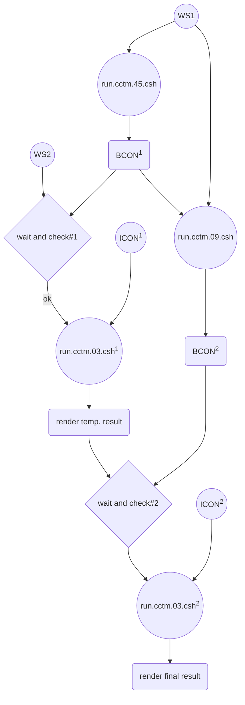

# CMAQ分工執行腳本

{: .no_toc }

  

    Table of contents
  

  {: .text-delta }
- TOC
{:toc}

---

## 背景

- 跨網多核心執行CMAQ並不如單機工作站有效率，因此需尋求更有效率的雙機協作方式。例如此處採用之「等候模擬條件充足-執行」模式。
- 此一邏輯仿照人工作業方式，不停檢查上層網格執行進度、待其結束後，經IC/BC等前處理程序、在另工作站啟動下層網格模式模擬及後處理。
- 此處為雙工作站版本，整體作業方式詳見[執行預報腳本之分段說明](5daysVersion/10.fcst.cs.md)，切換另見[單/雙工作站版本之切換](10daysVersion/14.WS1vsWS2.md)。

- 作業流程如圖所示

- CMAQ執行任務分工表

項目|工作站WS1|工作站WS2|說明
:-:|:-:|:-:|:-:
控制方式|循序執行|等候、檢查、執行|有2處檢查
空間範圍|東亞->中國東南|台灣X2|台灣範圍執行粗、細2次模擬
BCON後處理|有(批次)|有(逐日)|第1次在WS1執行、第2次在WS2執行
json後處理|有|有|個別執行
