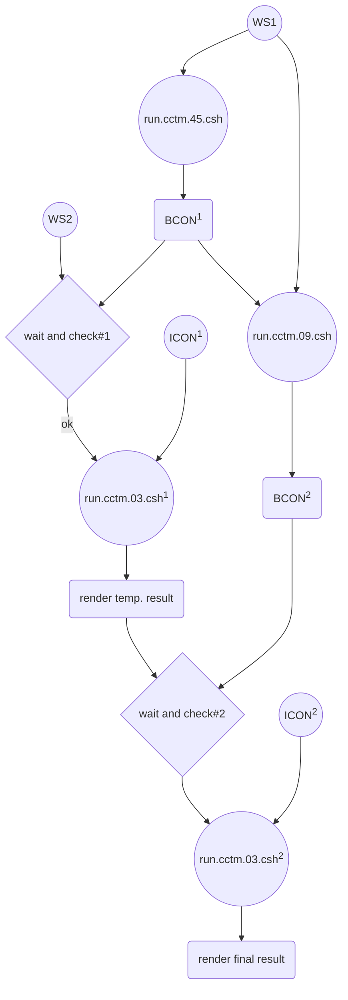
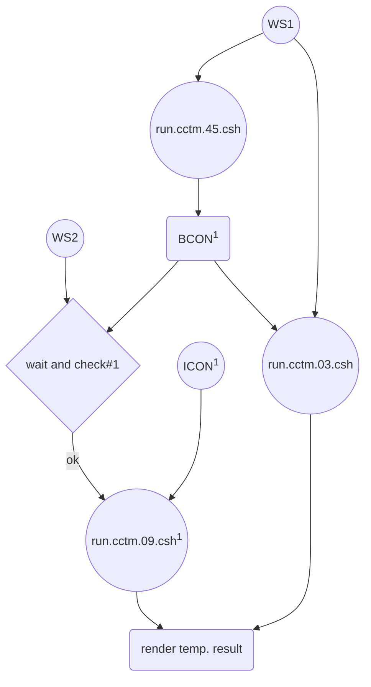
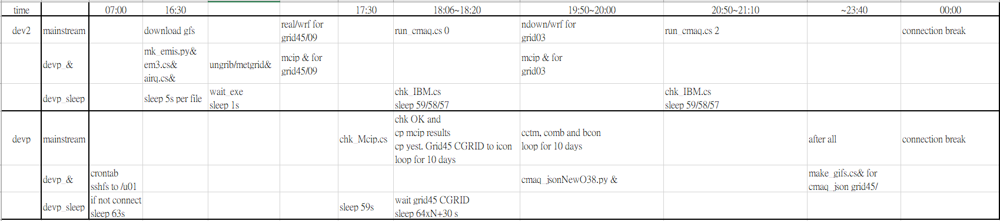

# CMAQ分工執行腳本

{: .no_toc }

<details open markdown="block">
  <summary>
    Table of contents
  </summary>
  {: .text-delta }
- TOC
{:toc}
</details>
---

## 背景

- 跨網多核心執行CMAQ並不如單機工作站有效率，因此需尋求更有效率的雙機協作方式。例如此處採用之「等候模擬條件充足-執行」模式。
- 此一邏輯仿照人工作業方式，不停檢查上層網格執行進度、待其結束後，經IC/BC等前處理程序、在另工作站啟動下層網格模式模擬及後處理。
- 此處為雙工作站版本，整體作業方式詳見[執行預報腳本之分段說明](../5daysVersion/4.fcst.cs.md)，切換另見[單/雙工作站版本之切換](3.WS1vsWS2.md)。

- 作業流程如圖所示(grid03執行2次、2023-01-30)



- grid03執行1次(2023-05、考量grid09的cmaq需時較久，切換至另一工作站執行較為合理)



### CMAQ執行任務分工表

項目|工作站WS1|工作站WS2|說明
:-:|:-:|:-:|:-:
控制方式|循序執行|等候、檢查、執行|有2處檢查
空間範圍|東亞->台灣|中國東南|d02的模擬需時較長。d03只能由d01給定邊界
BCON後處理|有(批次)|有(逐日)|第1次在WS1執行、第2次在WS2執行
json後處理|有|有|個別執行

### 按照時間順序列表



## 程式分段說明

```bash
kuang@DEVP /home/GFS
$ cat fcst_devp.cs
today=$(date -d -0day +%Y%m%d)
BEGD=$(date -d "$today -0days" +%Y-%m-%d)
test $(date +%H) -le 16 && BEGD=$(date -d "$today -1days" +%Y-%m-%d)
yestd=$(date -d "$BEGD -1day" +%Y%m%d)
begdp=$(date -d "$BEGD -0day" +%Y%m%d)
gfs=/home/GFS
fcst1=/nas3/cmaqruns/2022fcst
fcst2=/nas2/cmaqruns/2022fcst
ENDD=$(date -d "$BEGD  +11days" +%Y-%m-%d)
BEGJ=$(date -d $BEGD +%Y%j)
dates=();datep=()
for id in {0..11};do
  dates=( ${dates[@]} $(date -d "$BEGD +${id}days" +%Y-%m-%d) )
  datep=( ${datep[@]} $(date -d "$BEGD +${id}days" +%Y%m%d) )
done
sub=~/bin/sub
DOM=( 'CWBWRF_45k' 'SECN_9k' 'TWEPA_3k' 'tw_CWBWRF_45k' 'nests3')
RES=( 45 09 03 )
GRD=( 'grid45'     'grid09'  'grid03' )

cmd=fcst_devp.cs
n=$(ps -ef|grep $cmd |wc -l)
if [[ $n > 3 ]];then kill -9 $(ps -ef|grep $cmd |grep -v grep|awk '{print $2}');fi


#CMAQ stream

i=1;p=0;j=2
f=()
for id in {0..10};do
  nc=$fcst2/${GRD[$i]}/bcon/BCON_${datep[$id]}_${DOM[$i]}
  f=( ${f[@]} $nc )
done

if [[ -e $fcst1/chk_Mcip.cs ]];then
  $fcst1/chk_Mcip.cs $i
  for pth in mcip smoke;do
    cd $fcst2/${GRD[$i]}/$pth
    for nc in $(ls *.nc);do if ! diff $nc $fcst1/${GRD[$i]}/$pth/$nc &>/dev/null;then cp $fcst1/${GRD[$i]}/$pth/$nc .;fi;done
    test $pth == "mcip" && ~/bin/brk_day.py METBDY3D.nc
  done
else # wait untill nas3 is available
  echo $fcst1/chk_Mcip.cs is not available, maybe network is fail!
  sleep 63s
fi

icon=$fcst2/${GRD[$i]}/icon/ICON_yesterday_${DOM[$i]}
if ! [[ -e $icon ]];then $gfs/airq.cs;fi
cgrd=$fcst1/${GRD[$i]}/cctm.fcst/daily/CCTM_CGRID_v532_intel_${DOM[$i]}_${yestd}.nc
if ! [[ -e $cgrd ]];then cp $icon $cgrd;fi

for ((id=0;id <10; id+=1));do

  # wait grid45 running results at DEVP
  cgrd=$fcst1/${GRD[$p]}/cctm.fcst/daily/CCTM_CGRID_v532_intel_${DOM[$p]}_${datep[$id]}.nc
  while true;do
    curdate=$(date +%Y%m%d)
    if [[ -e $cgrd ]];then
      sleep 30 #in case of just generated
      cdate=$(~/bin/j2c $(ncdump -h $cgrd|grep CDATE|awk '{print $3}'))
      ctime=$(ncdump -h $cgrd|grep CTIME|awk '{print $3}')
      h=$(( 10#$ctime / 10000 ))
      d=$(LC_ALL='en_US.UTF-8' date -d "$cdate +8hours +${h}hours" +%s)
      YMD=$(date -d @$d +%Y%m%d)
      if [[ $YMD -eq $curdate || $YMD -eq $begdp ]];then break;fi
    fi
    sleep 64
  done

  # re-do the boundaries from grid45 results (regardless end-run or not)
  nc=$fcst2/${GRD[$i]}/bcon/BCON_today_${DOM[$i]}
  if [[ -e $nc ]];then rm -f $nc;fi #prevent re-run with same BCON file

  ac=$fcst1/${GRD[$p]}/cctm.fcst/daily/CCTM_ACONC_v532_intel_${DOM[$p]}_${datep[$id]}.nc
  csh $fcst2/run_bcon_NC.csh $ac >&/dev/null
  cp ${f[$id]} $nc
  ~/bin/add_lastHr.py $nc

  idp=$(( 10#$id - 1 ))
  if [[ $id -eq 0 ]];then
    yes=$yestd
  else
    yes=${datep[$idp]}
  fi
  cgrd=$fcst2/${GRD[$i]}/cctm.fcst/daily/CCTM_CGRID_v532_intel_${DOM[$i]}_${yes}.nc
  icon=$fcst2/${GRD[$i]}/icon/ICON_yesterday_${DOM[$i]}
  if ! [[ -e $cgrd ]];then echo '$cgrd not found!'; break;fi
  cp $cgrd $icon

  cd $fcst2
  YYYYJJJ=$(date -d ${dates[$id]} +%Y%j)
  mcip_start=${dates[$id]}
  mcip_end=$(date -d ${dates[$id]}+0days +%Y-%m-%d)
  cp project.config_loop project.config
  for cmd in 's/YYYYJJJ/'$YYYYJJJ'/g' \
           's/mcip_start/'$mcip_start'/g' \
           's/mcip_end/'$mcip_end'/g' \
           's/2400000/240000/g';do
    sed -ie $cmd project.config
  done

  ii=$(echo ${GRD[$i]}|cut -c5-)
  csh ./run.cctm.${ii}.csh

  nc=$fcst2/${GRD[$i]}/cctm.fcst/daily/CCTM_ACONC_v532_intel_${DOM[$i]}_${datep[$id]}.nc
  if [[ -e $nc ]];then $fcst2/combine.sh $nc;fi

  if [[ -e $nc ]];then csh $fcst2/run_bcon_NC.csh $nc;fi
  if [[ -e $fcst1 ]];then
    cp $fcst2/${GRD[$j]}/bcon/BCON_${datep[$id]}_${DOM[$j]} $fcst1/${GRD[$j]}/bcon;fi

  r=${RES[$i]}
  cd /nas2/Data/javascripts/D3js/earthFcst$r/public/data/weather/current
  ~/bin/sub ./cmaq_jsonNewO38.py ${dates[$id]}
  cd $fcst2

done

#make gifs
~/bin/sub $gfs/make_gifs.cs $i

for i in 0 2;do
  r=${RES[$i]}
  dir=/nas2/Data/javascripts/D3js/earthFcst$r/public/data/weather/current
  if [[ -e $dir ]];then
    cd $dir
    for id in {0..11};do
     ~/bin/sub ./cmaq_jsonNewO38.py ${dates[$id]}
    done
  fi
done

```