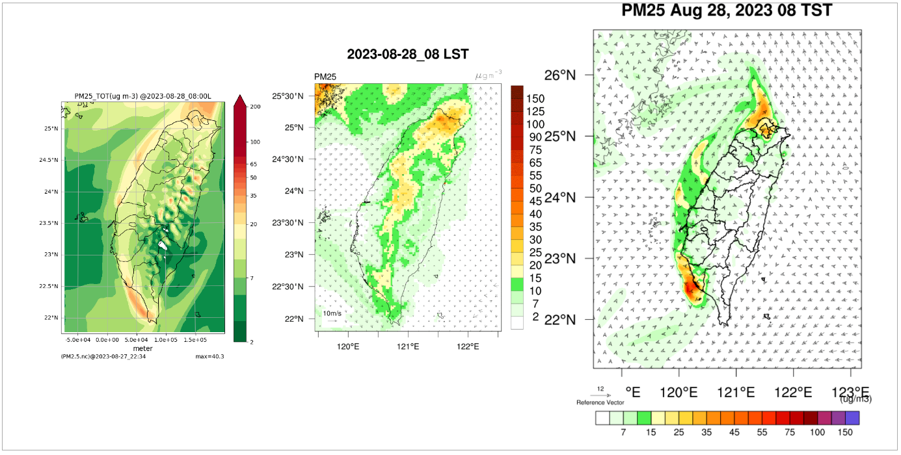

# D03預報結果比較討論

{: .no_toc }

  

    Table of contents
  

  {: .text-delta }
- TOC
{:toc}

---

## 背景

- 本文SES、中研院環變中心SNC、與中央大物所NCU未來3日PM2.5預報結果並列之作業方式，詳見[D03模擬結果並列播放](7.d03CF.md)，此處討論學理之比較。
- 本文除[高空點源](https://sinotec2.github.io/Focus-on-Air-Quality/ForecastSystem/5daysVersion/3.mk_em/#d03點源的處理)之外，其餘皆使用公版模式的設定方式，詳見[科學設定之比較](https://sinotec2.github.io/Focus-on-Air-Quality/GridModels/CCTM/science/)、[排放量檔案](https://sinotec2.github.io/Focus-on-Air-Quality/GridModels/TWNEPA_RecommCMAQ/IO_Files/#排放量檔案)之說明。
- 因未能取得其他單位模擬結果的數據檔案，以下討論僅限於定性探討。

### 結果

||
|:-:|
|本文SES(左),中研院環變中心SNC(中),中央大物所NCU(右)未來3日PM2.5預報結果之比較|

## CMAQ模式PM2.5預報結果比較表

## 風場對濃度場的效果

### 海面煙流梯度

- 從這各單位的海面上的濃度梯度來討論風場模擬結果。如果風速較大，濃度煙流會拉得較長、沿流方向得梯度會較小，反之，則較大、煙流看起來較短。
- 由此來看，不論是海上或陸上，SES模擬分布的變異度及梯度都是最大，NCU或SNC的梯度較小，模擬風速似乎較大。
- 造成模擬風速較大的原因很多。因SES大量使用FDDA，來使模擬值逼近給定風場，這可能是模擬風速較低的原因。
- 就空氣污染角度來說，風速大可能會得到較低的污染物濃度，因此會得到較不保守的結果，而SES則可能得到較保守的模擬結果。

### 山谷間PM2.5的濃度累積

- 夜間與清晨，SES模擬山谷內會發生PM2.5濃度累積的結果，可能因地面風速較低、垂直混合有限，也可能因為去除機制(包括地面沉降或雨水洗滌的效果)較其他單位為低，因此造成明顯濃度累積的斑塊花紋。
- 發生位置如花東縱谷中央山脈之間，以及南投縣、台中市的山區。
- 如果山區沒有降雨，隨著每天的日出，這一分布特徵會逐漸淡化均勻消失，而入夜之後再逐漸累積生成。倘若山區有降雨、雲霧等現象，也會將累積的較高濃度予以淨化。

## 沉降及洗滌效應

### 海面的PM2.5沉降量

- 一般來說SES在海面上的PM2.5濃度會最高，陸地煙流被環流帶出到海面上之後，濃度不會驟然下降，能夠維持較久，也因此旅行較大範圍，這顯示SES的公版模式設定在海面沉降損失最小。其次為NCU、SNC的沉降非常嚴重。
- 海面上的損失較小，使得回流至陸地的濃度就會較高，這也是SES模擬PM2.5濃度較高的重要原因之一。
- 早期的CMAQ模擬海面上的二次氣膠有顯著的低估情形，對污染模擬較不保守，這可能是學術單位對此仍有保留。SES模式採用公版模式之設定，而公版模式已將此一效應減到最低，以使結果有較大的保守性。

### 雨水對PM2.5的洗滌效應

- 雨水是氣象模式預報的重點項目，但在空氣污染卻為洗除效應，是使模式偏向不保守的因素之一。由陸域低濃度的分布特性來看，SES有較大片區域是濃度低於2&mu;g/m3以下的範圍，NCU為最大、其次為SNC，SES則為最低。
- 一者可能因為地表沉降的損失較低、再者可能因為降雨量的估計較低，也可能雨水對PM2.5的洗滌係數設定較低，造成SES低濃度範圍不如期他2各單位，這些也顯示公版模式設定會較為保守。

## 高空及地面污染表現

### 高空PM2.5煙流的模擬能力

- 台灣地區的大型電廠都位於濱海地區，其高空煙流在地面上的PM2.5濃度貢獻一直是大家關切的主題。此處乃由此一角度來檢討3各單位的模式預報結果。
- 由地面動態模擬結果來看，SES模擬的高空煙流濃度最高，其次為NCU，SNC模擬最低。影響高空煙流的設定除了前述海面的沉降係數、雨水的洗滌係數之外，也與大型煙流的排放位置有關，如果估計煙流排放高度較低，可能會造成地面濃度太高，反之則會造成地面濃度太低。由模擬結果來看，SNC估計的煙流高度最高、其次為NCU，而SES則最低。
- 由於公版模式一律將電廠高空煙流設定在第5(K4)層位置(詳見[高層排放量敏感性分析](https://sinotec2.github.io/Focus-on-Air-Quality/GridModels/TWNEPA_RecommCMAQ/emis_sens/5emis_KLayer/)的討論)，對於出口溫度較低的煙囪將會嚴重低估其濃度貢獻，而對出口溫度較高的煙囪，則為高估。
- 為解決此一問題，此處乃以系統性方式解決，以CMAQ點源內部線上計算程式自行計算每小時應存在的高度，而不是公版檔案固定高度的作法，以符合實際。
- 驗證結果，此一設定在其他2各單位的比較之下，仍顯得較為保守，可知此設定方式並不會損失保守性，同時也較為合理。

### 地面PM2.5煙團的模擬能力

- 造成地面PM2.5煙團(煙陣或煙流)的主要原因是地面排放源，包括高速公路的密集排放、以及都會區、工業區等原生性PM2.5之污染源。此處檢討這些污染源對PM2.5濃度的敏感特性。
- 此3單位模擬結果以NCU的敏感性最高，這些地面污染源很容易造成較高的濃度而向下游傳送。其次為SES。SNC為最不敏感。而因SES的沉降機制最低，因此傳送到下游的量是最高，由這些污染源造成的濃度分布看來較NCU均勻。
- 目前尚未得知其他2單位排放量處理的方法原則，無法進一步評論模式敏感性影響的變因。

