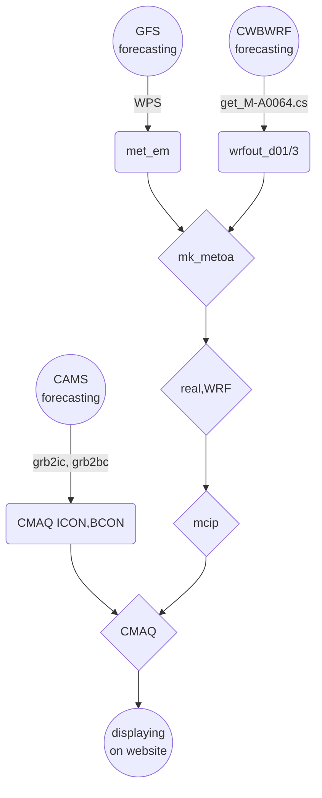

# 運用GFS/CWB/[CAMS][CAMS_desc]數值預報數進行台灣地區CMAQ模擬
{: .no_toc }

<details open markdown="block">
  <summary>
    Table of contents
  </summary>
  {: .text-delta }
- TOC
{:toc}
</details>
--- 

## 背景
- 以光化學網格模式進行高解析度空氣品質數值預報、對空品不良狀況的預告以及應變措施有重要的參考價值。確定性([deterministic][dtm])模式主要的特點與好處包括：
  - 提供基本的背景空氣品質預報
  - 區分境外與本土排放的貢獻
  - 可以區分背景與特定污染源的貢獻
  - 可以區分人為污染或天候因素
  - 分析緊急排放、或是假設性排放投入時之增量
- 背景預報的功能過去大多依靠統計模式、類型預報、類神經網路、機器學習等等模式系統，邏輯系統與因果關係模式較少，主要限制與解決對策列表如下：

### 高解析度空氣品質數值預報的限制與對策

項目|限制|對策|說明
-|-|-|-
大氣動力模式預報|現有GFS雖有3小時解析度但網格僅為1度</br>CWBWRF雖有3公里解析度但高度僅11層且項目不足以進行空品模擬</br>解析度與完整性均未達需求|就空品模擬範圍重新以WRF [FDDA][FDDA]進行模擬|除了風之外，大氣垂直穩定度、雲量及輻射量對光化學的模擬也非常重要。重跑有其必要。
邊界與初始濃度場|CAMS有0.4度的[預報][CAMS]，但只有27個物質項目|以CAMS做為[邊界][CAMS_bc]與[初始濃度場][CAMS_ic]重新進行東亞與中國等重要境外來源的空品模擬|東亞及南中國範圍模擬約需要1~2小時，還在允許範圍。
即時排放量|TEDS無法即時更新所有內容|部分污染源有即時數據如火力電廠、石化業或交通污染，可就部分排放進行增量模擬預報,如[範例](https://sinotec2.github.io/cpuff_forecast/)|預報應有主題污染源。不需(也無法)針對所有污染源進行更新
濃度場之展現|現有[earth][eth]套件的解析度1度並不足夠|已經[修改][CWBwrf_3Km2NWC]可以顯示任何解析度濃度場|除了[earth][eth]之外，也可以使用[wrf-python](https://sinotec2.github.io/Focus-on-Air-Quality/utilities/Graphics/wrf-python/4.m3nc2gif/)進行結果的GIF動態展示。
作業系統及網站平台|浮點計算速度、平行計算能力、網路上下載頻寬、網站穩定性等限制|1.超微工作站</br>2.光纖網路</br>3.github.io網站|每天僅進行1次下載、計算、上載更新循環，負荷應該不會太大。

### 整體作業流程


## 下載作業

項目|用途（處理方式）|檔案數量|說明
-|-|-|-
GFS預報|wrf的初始及邊界、FDDA</br>ungrib, metgrid, [mk_metoa][mk_metoa]||
[CAMS][CAMS_desc]預報|[邊界][CAMS_bc]與[初始濃度場][CAMS_ic]||
CWBWRF預報|[get_M-A0064.cs][get_M]||

### CWBWRF之下載
- CWBWRF的時間約與實際時間落差6~10小時，因此如需00Z（0800LST）起始的預報結果，則需在1800LST起動下載。
- CWB沒有提供下載選項、所幸變數、層數有限，也僅提供每6小時預報，檔案容量與個數並不多。
- CWB WRF程式結果每6小時更新，分別為每天的2/8/14/20時(LST)等4次。各次預報起始時間與安排如下：

檔案上架時間LST|模式起始UTC|用途|說明
:-:|:-:|:-|-
2:00|12:00|[earthCWB][CWBwrf_3Km2NWC]|只下載3Km結果、不存檔。
8:00|18:00|[earthCWB][CWBwrf_3Km2NWC]|只下載3Km結果、不存檔。
14:00|0:00|[earthCWB][CWBwrf_3Km2NWC]、推動CMAQ|CMAQ必須自00Z起始。需完整下載、不存檔。
20:00|6:00|[get_M-A0064.cs][get_M]、推動cpuff預報|午夜進行下載計算、避免干擾公司正常作息。完整下載存檔。

### GFS預報檔下載與分析
- GFS預報時間較長(384 hr)，層數、變數項目較完整，然而NOAA也提供了部分下載的功能，可供展示使用。
- GFS預報數據是否存檔的考量
  1. 畢竟是模式計算結果，仍有一定程度的不準度。
  1. 相同解析度另有[FNL再分析數據][fnl]，結合觀測及預報之三維場，有更高的正確性。只是稍晚才會上架，約延遲2天。
  1. 如果GFS一定要存檔，僅需渡過前述空窗期即可刪除。或可考慮下載模式起始所使用的分析檔。(https://nomads.ncep.noaa.gov/pub/data/nccf/com/gfs/prod/gfs.YYYYMMDD/HH/atmos/gfs.tHHz.pgrb2.1p00.anl)、YMDH分別為UTC之年月日時，約35M
  1. NOAA 也只開放下載最近10天內的預報作業結果。
- 下載的作業細節可以參考[GFS數據驅動WRF->GFS預報結果的下載](https://sinotec2.github.io/FAQ/2022/08/10/GFStoWRF.html#FS預報結果的下載)
- 下載安排如下：

檔案下載時間LST|模式起始UTC|用途|說明
:-:|:-:|:-|-
2:00|12:00|[GFS數據自動下載轉換][GFS]|只下載部分結果、不存檔。
8:00|18:00|[GFS數據自動下載轉換][GFS]|只下載部分結果、不存檔。
13:00|0:00|[GFS數據驅動WRF][gfs2wrf]、推動CMAQ|CMAQ必須自00Z起始，gfs最後一個需下載的檔案(014)與起始時間約延後4.25小時，加強時差8小時即當天12.25L。需完整下載、不存檔。
20:00|6:00|[get_M-A0064.cs][get_M]|只下載部分結果、不存檔。

- 下載後即按照WRF的執行流程進行準備。

執行檔|serial/parellel|所需檔案|重要檢核項目
:-:|:-:|-|-
ungrib|serial|GRIBFILE連結、geo_em檔|由於GFS檔名中含有日期，需每次更新連結
metgrid|serial|逐3小時之解壓縮檔|每日會產生新的分析檔，相同時間會覆蓋
mk_metoaD12|serial|[namelist.input][namelist]、met_em檔、CWB_wrfout_d01(d03)|需另預備CWB數據檔
mk_metoaT|parallel|(同上)|同步執行、需開啟wait監視程式
real|serial<sup>*</sup>|met_em、metoa_em|wait OK、且需檢視每3小時結果都已準備好

<sup>*</sup> real的執行本身是平行，但在整體腳本流程中只是一個動作，不會由腳本另外開啟需等候完成的程序。

## [CAMS][CAMS_desc]預報結果之下載
- 使用[get_All.py][get_All.py]
- 引數：
  1. dt：YYYY-MM-DD， `dt=$(date -d "now -20hours" +%Y-%m-%d)`
  1. hr:HH:00，`hr=$(date -d "now -20hours" +%H:00)`
  1. 1 ~ 3部分物質種類。詳見[CAMS_ic][CAMS_ic]
- 由於[CAMS][CAMS_desc]數據較實際時間晚12小時，再加上時差，因此差距為20小時。如要下載0時數據，只能
  1. 在前1天的20時(LST)，以預報第1天(第9筆)的結果來替代當天0時值。(get_All.py每3小時下載一筆)  
  1. 在8時下載前1天12:00起始的預報，以預報第5筆)的結果來替代當天0時值。

### [CAMS][CAMS_desc]預報數據之下載與分析
- [CAMS][CAMS_desc]預報數據除了[寫成CMAQ邊界檔][CAMS_bc]及[初始場][CAMS_ic]之外，也是[earth][CAMS]展示的重點項目。
- CAMS預報的更新頻率為12小時，上架時間較模式起始時間晚20個小時。如表所示：

檔案下載時間LST|模式起始UTC|用途|說明
:-:|:-:|:-|-
0:00|前日00:00|[earth套件貼上CAMS臭氧濃度][CAMS]、推動CMAQ|不儲存完整下載檔、儲存臭氧。
8:00|前日12:00|[earth套件貼上CAMS臭氧濃度][CAMS]|儲存臭氧。
20:00|當日0:00|[earth套件貼上CAMS臭氧濃度][CAMS]|儲存臭氧。

### 執行下載分析之腳本
- get_all.cs
  1. 0 ~ 120小時，每3小時下載
  1. 27項污染物質，分3批下載
  1. 下載後轉nc檔有較快的讀取速度
  1. 抽出第8筆，為當日0時之預報值作為CMAQ的初始值(注意ncks -O以覆蓋同一檔名)
  1. 執行橫向整合[merge][merge.cs]，後將做為CMAQ的初始檔。注意**必須**先刪除結果檔以利初始化。
  1. 執行[grb2icon.py][CAMS_ic]
  1. 執行[grb2bcon.py][CAMS_bc]

```bash
#kuang@node03 /nas1/ecmwf/CAMS/CAMS_global_atmospheric_composition_forecasts/2022
#$ cat get_all.cs
src=/nas1/ecmwf/CAMS/CAMS_global_atmospheric_composition_forecasts/2022
ncks=/usr/bin/ncks
cd $src
dt=$(date -d "now -1days" +%Y-%m-%d)
hr=$(date -d "now -20hours" +%H:00)
hr=00:00
for i in 1 2 3;do
  rm allEA_$i.grib
  ./get_All.py $dt $hr $i >& /dev/null
  PATH=/bin:/opt/miniconda3/envs/ncl_stable/bin ncl_convert2nc allEA_$i.grib -nc4c >& /dev/null
  if [[ -e allEA_$i.nc4 ]];then mv allEA_$i.nc4 allEA_$i.nc;fi
  $ncks -O -d forecast_time0,8 allEA_$i.nc allEA_$i.nc_0
done
if [[ -e AllEA.nc ]];then rm AllEA.nc;fi
./merge.cs
./grb2icon.py &
./grb2bcon.py &
```

### 自動定期執行
- crontab：每天0時執行，以配合CMAQ模擬之需求。

```bash
0 0 * * * /nas1/ecmwf/CAMS/CAMS_global_atmospheric_composition_forecasts/2022/get_all.cs
```
## 計算核心之分配與調整
- 短時間的計算需求，直接進行即，可此處特別處理需要較長時間的計算。
- 雖然大多數模式、次模式都可以平行運作，但因為各個模式使用的編譯器、mpi種類版本略有差異，因此需先個別調控(tuning)到最佳狀態，再行組合、納入到自動化作業流程之中。
- 目標及優先順序是
  1. 穩定計算達到正確的結果
  1. 使用到單機最多的計算核心
  1. 使用到跨機最多的計算核心

### REAL and WRF
- 注意要正確指定執行檔所需程式庫的路徑(`$LD_LIBRARY_PATH`)
- 執行腳本如[逐日WRF及CMAQ執行腳本][fcst.cs]所示
  1. real與wrf必須循序進行、採雙機多核心平行計算，
  1. 依序執行3個範圍的[mcip][run_mcip]、雖然考量穩定性採單機單核，效能還在可接受範圍。
  1. [mcip][run_mcip]執行完，隨後是執行CCTM、單機多核心方式。
- WRF的計算核心安排可以參考[GFS數據驅動WRF->執行核心數之考量](https://sinotec2.github.io/FAQ/2022/08/10/GFStoWRF.html#realwrf執行核心數之安排)的詳細說明，此處說明bash技巧。
- mpirun選項：儲存在環境變數序列` ${MPI[$i]}`之中，$MPI的定義及應用如下

```bash
MPI=( '-f machinefile -np 200' '-f machinefile -np 196' '-f machinefile -np 140' '-f machinefile -np 120')
...
  # real
  LD_LIBRARY_PATH=/nas1/WRF4.0/WRFv4.3/WRFV4/LIBRARIES/lib:/opt/intel_f/compilers_and_libraries_2020.0.166/linux/compiler/lib/intel64_lin:/opt/mpich/mpich-3.4.2-icc/lib /opt/mpich/mpich-3.4.2-icc/bin/mpirun ${MPI[$i]} /nas1/WRF4.0/WRFv4.3/WRFV4/main/real.exe >& /dev/null
  # wrf
  LD_LIBRARY_PATH=/opt/netcdf/netcdf4_gcc/lib /opt/mpich/mpich3_gcc/bin/mpirun ${MPI[$i]} /opt/WRF4/WRFv4.2/main/wrf.exe >& /dev/null
```
- 跨機核心數檔案：以相同名稱(`${DOM[$i]}/machinefile`)存放在每個Domain的目錄下，平均分配所有的負荷到2台超微工作站機器上。

```bash
kuang@master /nas1/backup/data/NOAA/NCEP/GFS/YYYY
$ for i in $(ls */machinefile);do echo $i;cat $i;done
CWBWRF_45k/machinefile
devp:100
dev2:100
SECN_9k/machinefile
devp:98
dev2:98
TWEPA_3k/machinefile
devp:70
dev2:70
```
- 總核心數***必須***等於[namelist.input][namelist]中[nproc_x與nproc_y](https://sinotec2.github.io/FAQ/2022/08/10/GFStoWRF.html#realwrf執行核心數之安排)的乘積，也***必須***小或等於machinefile中2台機器核心數的總合。

#### 2022-09-16 修正
- d02速度太慢的問題，可能出在FDDA太過強烈，系統不容易達成動力的平衡。將3層domain同時進行模擬(**t**wo **w**ay (**tw**) nesting)，似能解決此一問題。
- 3層套疊全部需時約1.5小時，較原先約3小時縮減一半時間。需修改：
  1. [namelist.input][namelist]中的max_dom，由1->3，相應網格數、起始網格位置、網格間距比值等等。
  1. 循序執行real_wrf的迴圈，只需執行一次。
  1. 新增網格定義與目錄。（./**tw**_CWBWRF_45k）
  1. **tw** 所需的核心數120，machinefile：

```bash
$ grep proc tw_CWBWRF_45k/namelist.input
 nproc_x                             = 10,
 nproc_y                             = 12,
$ cat tw_CWBWRF_45k/machinefile
devp:60
dev2:60
```
- 核心數大幅減少(受限於3層網格系統之公約數)，計算速率並沒有下降，似乎還有所提昇。應為網路傳輸速度造成瓶頸所致。

#### 2022-10-03 修正
- 將d01 ~ d02合併執行，d03個別執行。（詳[雙向巢狀網格風場模擬之檢討](https://sinotec2.github.io/FAQ/2022/09/25/twoway.html))

### 每日預報mcip
#### 腳本特色

項目|[傳統做法][oldmcip]|[預報系統做法][run_mcip]|說明
:-:|:-:|:-:|:-
日數|每批次約5天|預報5天|正好相同
STIME|10000|10000|同樣需要[補充0時數據][add0]
wrfout連結|每批次建立目錄|同一目錄每天覆蓋|由腳本控制不致錯誤
輸出檔名|含有日期批次名稱|不含任何日期|以利每天執行結果的覆蓋
平行運作|不啟動以保持穩定|啟動(詳下述)|以節省作業時間
METBDY3D檔案|無特殊處理|另外分割成逐日檔|配合[逐日執行bcon.exe][1dbcon]的需要

- 由於執行完CCTM後，會需要下一層的METBDY3D檔案，來產生下一層的邊界條件，因此在執行CCTM之前，將所有網格的mcip一次執行完，會是較好的作法。

#### mcip 執行的核心控制
- 相較WRF只檢討最高核心數，mcip對核心數的工作安排有較高的敏感性，如果不是能整除網格數的核心數，會導致計算的不穩定與錯誤。
- 加以mcip的腳本是csh指令，必須在腳本中逐一設定。
- 因mcip只是檔案轉換，並沒有實質的數值積分，所以此處僅安排以單機方式處理。

序號|GRID_NAME|wrf網格數|mcip網格數|核心數(NP<sup>#</sup>)
:-:|:-:|:-:|:-:|:-:
d01|CWBWRF_45k|221&times;129|218&times;126|64<sup>#2</sup>
d02|SECN_9k|206&times;206|200&times;200|50<sup>#2</sup>
d03|TWEPA_3k|103&times;142|92&times;131|46<sup>#1</sup>

1. 如前所述，不整除的核心數會導致計算不穩定。d03因公版模式設定NROW=131，是個質數，只能屈就使用46個核心。
1. 2022-09-16 修正：d01及d02會因為核心數太多造成寫出檔案錯誤，發生在較小的檔案如GRIDBDY2D.nc或GRIDCRO2D.nc，可能是輸出不同步所造成。將d01及d02的NP分別改成16及20
1. 2022-10-04 修正：經[測試](https://sinotec2.github.io/FAQ/2022/10/06/mcip_intel.html)，還是以NP=1/gcc為最佳方案組合。

### CCTM
- 與mcip類似的作法，cctm是每個domain有個別的腳本，其（雙機版本）NPCOL_NPROW設定如下：

序號|GRID_NAME|mcip網格數|核心數NPCOL&times;NPROW|總數
:-:|:-:|:-:|:-:|:-:
d01|CWBWRF_45k|218&times;126|11&times;16|176
d02|SECN_9k|200&times;200|92&times;131|192
d03|TWEPA_3k|92&times;131|8&times;23|184

- 跨機核心數檔案：以Domain網格間距識別名稱存放在CCTM的根目錄，平均分配所有的負荷到2台機器上。

```bash
kuang@dev2 /nas2/cmaqruns/2022fcst
$ for i in $(ls machinefile??);do echo $i;cat $i;done
machinefile03
devp:92
dev2:92
machinefile09
devp:98
dev2:98
machinefile45
devp:88
dev2:88
```
- 2022-09-20 修正：雙機並末達到時間減半的效能，還可能造成不穩定而停止計算。還是單機運作比較穩定。

## 自動執行腳本與執行時間
### 下載fcst.cs腳本
- 詳見[逐日WRF及CMAQ執行腳本][fcst.cs]

### 分段時間分析

序號|主題|所需時間Hr:Min|說明
:-:|:-:|:-:|:-
1|[CAMS][CAMS_desc]下載與icbc_d01|1:22|可以另外同步進行
2|GFS下載|0:10|注意NCEP網站會認定連續下載是同批存取網頁而timeout，下載一陣需休息一下。
3|WPS|0:08|
4|real</br>WRF_d01</br>mcip_d01|0:14</br>0:26</br>0:08|合計0:38
5|real</br>WRF_d02</br>mcip_d02|0:12</br>1:10</br>0:11|合計1:32。d02的設定似乎還需檢討一下。
6|real</br>WRF_d03</br>mcip_d03|0:12</br>0:26</br>0:08|合計0:38
7|CCTM_d1|0:45|
8|icbc_d02</br>CCTM_d2|0:06</br>2:30|合計2:36
9|icbc_d03</br>CCTM_d3|0:07</br>0:50|合計0:57

- 總計時間約需8小時

## 成果展示
- 動態展示以[earth][eth]套件，靜態則以[wrf-python](https://sinotec2.github.io/Focus-on-Air-Quality/utilities/Graphics/wrf-python/4.m3nc2gif/)。
- 不同解析度：個別建立自己的套件，以8084/6等3個port來展示(修改最少、最快上手)。
- 需發展cmaq_json.py來解讀wrfout與CCTM_ACONC檔案。
- 自動執行排程
  1. 每3小時連結current檔案
  1. 每天處理wrfout與CCTM_ACONC預報結果

### [cmaq_json.py][cmaq_json.py]
- 詳見[cmaq_json.py說明][cmaq_json.md]
- 下載[cmaq_json.py][cmaq_json.py]

### lnk_curr.cs
- 依序進行3個解析度結果的連結
- 因應伺服器重啟時並不會自動重啟node設定，將node執行情況納入每小時確認項目，如沒有在運作，則予以重啟。(2022-11-08 07:14:27)
- 連結wind, ozone等等污染物項目

```bash
now=$(date -v-8H -j  +%Y%m%d%H)
y=$(date -j -f "%Y%m%d%H" "${now}" +%Y)
m=$(date -j -f "%Y%m%d%H" "${now}" +%m)
d=$(date -j -f "%Y%m%d%H" "${now}" +%d)
h=$(date -j -f "%Y%m%d%H" "${now}" +%H)
h=$(( 10#$h / 3 * 3|bc -l ))
h=$(printf "%02d" $h) 
rrs=( 45 09 03) 
nod=( 8084 8085 8086 )
for i in 0 1 2;do
 res=${rrs[$i]}
 num=${nod[$i]}

# confirm the node is running
 n=$(ps -ef|grep node|grep $num |wc -l) 
if ! [ $n -eq 1 ];then
  cd /Users/Data/javascripts/D3js/earthFcst${res}
  node dev-server.js $num
fi

  weather=/Users/Data/javascripts/D3js/earthFcst${res}/public/data/weather
  path=$weather/$y/$m/$d
  for itm in wind ozone ozone8 so2 no2 vocs pm1 pm10 pm25;do
    lev=-surface-level
    fn=${h}00-${itm}${lev}-fcst-${res}.json
    cr=${fn/${h}00/current}
    if [ -e $path/$fn ]; then
      ln -sf $path/$fn $weather/current/$cr
    fi  
  done
done

```

## 預報結果比較
### 2022/09/01 1500空氣品質實測比較
- 時間：2022/09/01/06Z，模式起始時間9/1及[環保署空品監測網](https://airtw.epa.gov.tw/)1500(LST)AQI實測值

| {:width="360px"} |{:width="360px"}
|:--:|:--:|
| <b>CMAQ預報東亞範圍地面臭氧濃度結果</b>|<b>環保署AQI值</b>|


### 東南亞強颱「軒嵐諾」污染事件預報
- 時間：2022/09/03/06Z，模式起始時間8/30([CAMS][CAMS])及8/31([CMAQ][earth_imac])

| {:width="360px"} |{:width="360px"}
|:--:|:--:|
| <b>[CAMS][CAMS_desc]預報東南亞地面臭氧濃度結果</b>|<b>CMAQ預報東亞範圍臭氧濃度</b>|

- [CAMS][CAMS_desc]似乎對颱風的風速與位置有所低估。
- 對大陸東南沿海城市的臭氧煙陣也有低估。
- 由於[CAMS][CAMS_desc]預報時間不及第5天。CMAQ可補足此一部分，結果如下：

|  |
|:--:|
|<b>CMAQ預報2022/09/04 06Z東亞範圍臭氧濃度</b>|

### 東北季風境外影響
- 2022/09/06 1700臭氧8小時值之預報與觀測

| {:width="360px"} |{:width="360px"}
|:--:|:--:|
| <b>臺灣地區臭氧8小時值預報濃度</b>|<b>環保署AQI值</b>|

- 圖中顯示台灣本地的排放量已經比TEDS11減很多了，因為模式結果顯示有高估本地的傾向。

## 作業過程之問題與解決
### CCTM_CONC寫出時遇到的格式問題
- 發生時機：新日或換日，寫出CCTM_CONC時，發生在DEV2結點。grid09、grid03。
- 可能原因：跨機平行運作，因網路速度耽誤寫出時間差異
- 改善方式：避免跨機運作

### 東亞排放量REAS高/低估
- 經確認在[reas2cmaqD2.py][reas2cmaqD2.py]沒有做網格面積的校正，修正如下。
- REAS 0.25度網格面積的計算。原有網格系統與經緯度：

```python
  lon=list(set(lon+[float(i.split()[0]) for i in l[9:]]))
  lat=list(set(lat+[float(i.split()[1]) for i in l[9:]]))
# generate the x and y arrays for REAS datafile
# def nlat, nlon here
for ll in ['lon','lat']:
  exec(ll+'.sort()')
  exec('n'+ll+'=nn=int(('+ll+'[-1]-'+ll+'[0])/0.25)+1')
  exec(ll+'M=['+ll+'[0]+0.25*i for i in range(nn)]')
  exec(ll+'n={l:'+ll+'M.index(l) for l in '+ll+'M}')
lonm, latm = np.meshgrid(lonM, latM)
```
- 面積的計算
  1. 按照新網格系統的原點，將經緯度轉成直角座標系統
  1. 計算dx與dy。並假設最末行及最末列，與前一行及前一列相同。
  1. 面積即為dx與dy的乘積

```python
pnyc = Proj(proj='lcc', datum='NAD83', lat_1=nc.P_ALP, lat_2=nc.P_BET, lat_0=nc.YCENT, lon_0=nc.XCENT, x_0=0, y_0=0.0)
x,y=pnyc(lonm,latm, inverse=False)
dx,dy=np.zeros(shape=x.shape),np.zeros(shape=x.shape)
dx[:,:-1]=x[:,1:]-x[:,:-1];dx[:,-1]=dx[:,-2]
dy[:-1,:]=y[1:,:]-y[:-1,:];dy[-1,:]=dy[-2,:]
area=dx[:]*dy[:]
```
- 面積的應用，將REAS排放量單位轉成每m<sup>2</sup>。因為面積是2維，排放量nc檔案是5階，因此其他階必須加上`None`，見[矩陣階層numpy.newaxis(None)的用法][none]。

```python
var[:]*=1.E6/31/24/3600. #Ton/Mon to g/s
var[:,:,:,:,:]/=area[None,None,None,:,:] #change to g/s/m^2
```

- 面積的校正

```bash
 zz[t,:,: ] = griddata(xyc, c[:], (x1, y1), method='linear') *nc.XCELL*nc.XCELL
```
### TEDS與grid03結果高估
- (TEDS11, 2019待更新)

### d01 PM<sub>10</sub>低估問題與解決
- 2022-10-05 PM<sub>10</sub>事件模式嚴重低估。經檢討應為公版模式不建議開啟風吹砂機制所造成。經開啟後重新模擬，就可以得到較為合理的結果([download GIF](https://github.com/sinotec2/Focus-on-Air-Quality/raw/main/assets/images/PMT_SS.gif))。

[eth]: <https://github.com/cambecc/earth> "cambecc(2016), earth building, launching and etc on GitHub. "
[dtm]: <https://zh.wikipedia.org/zh-tw/确定性模型> "在數學、計算機科學和物理學中，確定性模型（Deterministic model）是指不包含任何隨機成份的模型。因此，確定性模型將始終從給定的起始條件或初始狀態產生相同的輸出。"
[GFS]: <https://sinotec2.github.io/FAQ/2022/08/05/earth_gfs.html> "GFS數據自動下載轉換"
[CAMS]: <https://sinotec2.github.io/FAQ/2022/08/03/wind_ozone.html> "earth套件貼上CAMS臭氧濃度"
[CWBwrf_3Km2NWC]: <https://sinotec2.github.io/FAQ/2022/07/26/CWBwrf_3Km2NWC.html> "earth套件讀取CWB_WRF數據"
[FDDA]: <https://zh.wikipedia.org/zh-tw/数据同化> "數據同化，或稱資料同化，是通過數學模型擬合觀測數據的一種漸進方式，通常用於複雜系統的建模和動態預報。"
[CAMS_bc]: <https://sinotec2.github.io/Focus-on-Air-Quality/AQana/GAQuality/ECMWF_CAMS/3.CAMS_bc/> "CAMS預報數據寫成CMAQ邊界檔"
[CAMS_ic]: <https://sinotec2.github.io/Focus-on-Air-Quality/AQana/GAQuality/ECMWF_CAMS/4.CAMS_ic/> "CAMS預報數據寫成CMAQ初始檔"
[get_M]: <https://sinotec2.github.io/Focus-on-Air-Quality/wind_models/cwbWRF_3Km/4.fil_grb_nc/> "wind models->cwb WRF_3Km->相同網格系統之grb2轉檔"
[fnl]: <https://rda.ucar.edu/datasets/ds083.2/> "NCEP FNL Operational Model Global Tropospheric Analyses, continuing from July 1999"
[gfs2wrf]: <https://sinotec2.github.io/FAQ/2022/08/10/GFStoWRF.html> "GFS數據驅動WRF"
[get_All.py]: <https://github.com/sinotec2/Focus-on-Air-Quality/blob/main/AQana/GAQuality/ECMWF_CAMS/get_All.py> "下載CAMS空品預報之程式"
[merge.cs]: <https://sinotec2.github.io/Focus-on-Air-Quality/AQana/GAQuality/ECMWF_CAMS/4.CAMS_ic/#污染項目間之橫向合併mergecs> "污染項目間之橫向合併(merge.cs): 三個nc檔案持續在變數維度方向進行疊加"
[fcst.cs]: <https://sinotec2.github.io/Focus-on-Air-Quality/GridModels/ForecastSystem/10.fcst.cs/> "逐日WRF及CMAQ執行腳本 "
[cmaq_json.py]: <https://github.com/sinotec2/Focus-on-Air-Quality/blob/main/utilities/Graphics/earth/cmaq_json.py> "解讀wrfout與CCTM_ACONC檔案轉換成json檔案之程式cmaq_json.py"
[CAMS]: <https://atmosphere.copernicus.eu/charts/cams/ozone-forecasts?facets=undefined&time=2022083000,102,2022090306&projection=classical_south_east_asia_and_indonesia&layer_name=composition_o3_surface> "Ozone at surface [ppbv] (provided by CAMS, the Copernicus Atmosphere Monitoring Service), Tuesday 30 Aug, 00 UTC T+102 Valid: Saturday 3 Sep, 06 UTC"
[CAMS_desc]: <https://ads.atmosphere.copernicus.eu/cdsapp#!/dataset/cams-global-atmospheric-composition-forecasts?tab=overview> "CAMS每天2次進行全球大氣成分的5天預報，包括50多種氣狀物和7種顆粒物(沙漠塵埃、海鹽、有機物、黑碳、硫酸鹽、硝酸鹽和銨氣溶膠)。初始條件為衛星及地面觀測數據同化分析結果，允許在地面觀測數據覆蓋率低、或無法直接觀測到的大氣污染物進行估計，除此之外，它還使用到基於調查清單或觀測反衍的排放估計，以作為表面的邊界條件。"
[earth_imac]: <http://125.229.149.182:8084> "earth display for WRF and CMAQ Forecastings"
[mk_metoa]: <https://sinotec2.github.io/Focus-on-Air-Quality/wind_models/cwbWRF_3Km/5.mk_metoa/> "將CWB數據填入WRF客觀分析場"
[1dbcon]: <https://sinotec2.github.io/Focus-on-Air-Quality/GridModels/BCON/1day_bc/> "逐日循序執行bcon.exe"
[namelist]: <https://esrl.noaa.gov/gsd/wrfportal/namelist_input_options.html> "WRF NAMELIST.INPUT FILE DESCRIPTION, U.S. Department of Commerce | National Oceanic and Atmospheric Administration, Earth System Research Laboratory | Global Systems Division"
[none]: <https://sinotec2.github.io/Focus-on-Air-Quality/utilities/netCDF/MatrixRankNone/> "矩陣階層numpy.newaxis(None)的用法。空值是python變數的一個特殊屬性，在pandas、numpy.array中經常應用到。此處是宣告一個空值之維度，其真實長度並不存在。"
[oldmcip]: <https://sinotec2.github.io/Focus-on-Air-Quality/GridModels/MCIP/> "Focus on Air Quality->CMAQ Model System->Met. Chem. Interface Proc."
[run_mcip]: <https://sinotec2.github.io/Focus-on-Air-Quality/GridModels/ForecastSystem/2.run_mcip_DM/> "逐日mcip之執行腳本"
[add0]: <https://sinotec2.github.io/Focus-on-Air-Quality/GridModels/MCIP/add_firstHr/> "CMAQ Model System->Met. Chem. Interface Proc.->mcip結果初始小時值的延伸"