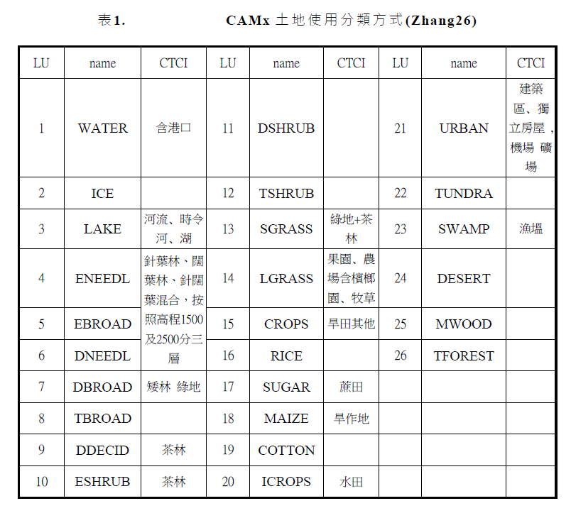

# 中鼎TEDS之土地使用
{: .no_toc }

<details open markdown="block">
  <summary>
    Table of contents
  </summary>
  {: .text-delta }
- TOC
{:toc}
</details>

---


## 背景

## 說明

### 輸入檔

- `land.txt`
  - 這個表示中鼎網格資料中每個土地使用類別所占的面積
  - D2~D108共23個變數
  - D2單位是人口、其餘是面積M<sup>2</sup>。
  - habitized area：D3+D103+D106
  - crop lands：D5A, D5B, D5C, D12, D99
  - forests 11~15：D7A, D7D
  - water bodies：D10, D13, D108


```bash
UTME UTMN DICT D2 D3 D5 D5A D5B D5C  D7   D7A  D7B  D7C  D7D D8 D9 D10 D11 D12 D13 D14 D18 D103 D106 D108 D99
```

- `taiwan1km.dat`：1公里地形檔
  - UTME、UTMN、與地形高程(m)

```bash
$head taiwan1km.dat
 39000.000 2880000.000    0.0
 40000.000 2880000.000    0.0
 41000.000 2880000.000    0.0
 42000.000 2880000.000    0.0
 43000.000 2880000.000    0.0
 44000.000 2880000.000    0.0
 45000.000 2880000.000    0.0
```

### 程式說明

這段 Fortran 程式碼主要是對土地使用和地形進行一些映射和處理。以下是主要的功能：

1. **定義參數和數據結構：**
   - 定義了格點範圍的常數，如 `minX`、`maxX`、`minY`、`maxY`，以及2維數組和變數，如 `Area`、`LandUse`、`ele` 等。
   - 創建了 `Kusgs24` 數組。
   - 創建了 `NX`、`NY`、`IDX`、`IX0`、`IY0` 數組。

2. **打開文件 land.txt 並讀取數據：**
   - 從 land.txt 文件讀取 UTME、UTMN、DICT 以及一系列的數值。
   - 計算 UTME 和 UTMN 的最小和最大值。

3. **初始化 Area 數組：**
   - 將 Area 數組中的某些元素初始化為零或特定值。

4. **地形映射：**
   - 從 taiwan1km.dat 文件讀取數據，進行地形映射，將地形數據填入 `Area(27,ii,jj)`。

5. **處理土地使用數據：**
   - 打開 land.txt 文件，讀取 UTME、UTMN、DICT 以及一系列的數值，並進行相應的計算。
   - 計算人口數據，不同類型的土地使用（如森林、水體、農地等）。

6. **進行一些統計和歸一化處理：**
   - 對人口數據進行統計，並進行歸一化處理。
   - 對 Area 數組進行一些處理，計算均值等。

7. **生成二進制文件和輸出文件：**
   - 生成 landuse26.bin 文件，保存土地使用和地形數據。
   - 生成 area.lu 文件，保存處理後的區域數據。
   - 生成 habitT.ctci.dat 文件（在某些條件下）。

8. **進行循環：**
   - 進行循環，一直到程序結束。

這段代碼的主要目的是處理土地使用和地形數據，並生成相應的數據文件。

