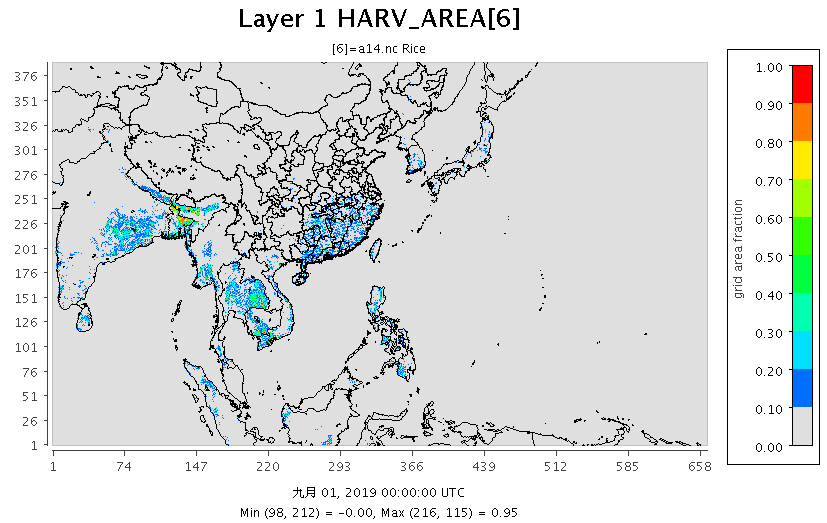
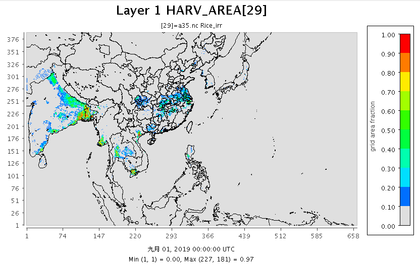

# 農作物
{: .no_toc }

<details open markdown="block">
  <summary>
    Table of contents
  </summary>
  {: .text-delta }
- TOC
{:toc}
</details>

---

## 背景
- 農作物是CCTM雙向氨氣排放模式所需要的檔案，USEPA對美國大陸本土提供有資料庫及取用軟體，其他地區則須自行建置。
- [Our World in Data](https://ourworldindata.org/land-use)全球長期的土地使用、農業、肥料與作物土地面積等數據。解析度為國家。
- Ramankutty, N., Evan, A.T., Monfreda, C., and Foley, J.A. (2008). **Farming the planet: 1. Geographic distribution of global agricultural lands in the year 2000**. [Global Biogeochemical Cycles](https://onlinelibrary.wiley.com/doi/abs/10.1029/2007GB002952) 22 (1). doi:10.1029/2007GB002952.
  - Data distributed by the Socioeconomic Data and Applications Center, NASA ([SEDAC](https://sedac.ciesin.columbia.edu/data/set/aglands-croplands-2000/data-download))
  - 數據為2000年基準，單位為農地面積比例，解析度為5分~10Km。資料格式為geoTiff、ESRI gridfile。
  - Data presented as five-arc-minute, 4320 x 2160 cell grid, Spatial Reference: GCS_WGS_1984, Datum: D_WGS_1984, Cell size: 0.083333 degrees, Layer extent: Top : 90, Left: -180, Right: 180, Bottom: -90 [earthstat.org](http://www.earthstat.org/cropland-pasture-area-2000/)
  - Harvested Area and Yield for 175 Crops, [earthstat.org](http://www.earthstat.org/harvested-area-yield-175-crops/)

- Smith, W.K., Zhao, M., and Running, S.W. (2012). **Global Bioenergy Capacity as Constrained by Observed Biospheric Productivity Rates**. [BioScience](https://academic.oup.com/bioscience/article/62/10/911/238201) 62 (10):911–922. doi:10.1525/bio.2012.62.10.11.

## Reading the earthstat tiff's
### Crop names Dict
- CCTM系統中的種穀物詳[亞洲土地使用檔案>背景](https://sinotec2.github.io/Focus-on-Air-Quality/GridModels/LAND/CWBWRF_15k/#背景)
- 175種穀物為解開[earthstat>壓縮檔](http://www.earthstat.org/harvested-area-yield-175-crops/)之結果
- 可食豆：包括175種穀物中所有含有bean之種類
- earthstat沒有乾草(straw)或其他畜牧用草等名稱，只有mixedgrass比較接近。
- grain/silage之分，前者為穀粒、人類食物或種子，後者為畜用。
- other_crop，經查[wiki](https://zh.wikipedia.org/wiki/谷物)，21種穀物中漏了**雜穀**，將其列為other_crop
- [春麥/冬麥](https://read01.com/zh-tw/mmPJxE.html#.YeiuDdXP2po)在earthstat無法區分，只能依照**長城**所在緯度(略以40度)為界區別之，再按區分結果群聚之現象詳細界定(IY=320)。

|spec in CCTM sys 21 kinds|175 spec in earthstat database|中文名稱|
|-|-|-|
|beans|bean|豆|
|beansedible|broadbean,greenbean,greenbroadbean,stringbean]|可食豆|
|canola|rapeseed|油菜|
|corngrain|popcorn|玉米粒|
|cornsilage|greencorn|玉米青貯飼料|
|hay|mixedgrass|乾草|
|other_crop|millet|[雜穀](https://zh.wikipedia.org/wiki/谷物)|
|other_grass|grassnes|未標示草|
|peanuts|groundnut|落花生|
|potatoes|potato|馬鈴薯|
|sorghumgrain|sorghum|高粱粒|
|sorghumsilage|sorghumfor|高粱粒粉貯飼料|
|soybeans|soybean|大豆|
|wheat_spring|wheat(lat>40)|春麥、長城以北|
|wheat_winter|wheat(lat<=40)|冬麥|


### tif2nc
- 這支副程式需要3個引數：tiff檔名、nc檔名、以及lev層數
  - tiff檔：全球為範圍，解析度1~10Km，高於nc檔案，採取aggregation整併到nc網格系統
  - nc檔：東亞範圍(CWBWRF_15Km網格系統)
- lev層數：0~20共21層
  - lev=3時，nc檔將會累加tiff檔的內容，因此要記得先在主程式將nc檔清空。(lev其他值會在副程式內清空)
  - lev=19或20時(c='wheat')，只會將tiff檔內容的一部分轉移到nc檔內，以iy=320為界

```python
def tif2nc(tif_name,nc_name,lev):
  import numpy as np
  import netCDF4
  from pyproj import Proj
  import rasterio
  import numpy as np

  img = rasterio.open(tif_name)
  nx,ny,nz=img.width,img.height,img.count
  if nz!=1:return -1
  dx,dy=360./(nx-1),180./(ny-1)
  lon_1d=[-180+dx*i for i in range(nx)]
  lat_1d=[90-dy*i for i in range(ny)]
  data=img.read()
  lonm, latm = np.meshgrid(lon_1d, lat_1d)
  DD={'lon':lonm.flatten(),'lat':latm.flatten(),'val':data.flatten()}
  df=DataFrame(DD)
  boo=(df.lon>=60)&(df.lon<=180)&(df.lat>=-10)&(df.lat<=50)
  df=df.loc[boo].reset_index(drop=True)
  
  nc = netCDF4.Dataset(nc_name, 'r+')
  pnyc = Proj(proj='lcc', datum='NAD83', lat_1=nc.P_ALP, lat_2=nc.P_BET,lat_0=nc.YCENT, lon_0=nc.XCENT, x_0=0, y_0=0.0)
  V=[list(filter(lambda x:nc.variables[x].ndim==j, [i for i in nc.variables])) for j in [1,2,3,4]]
  nt,nlay,nrow,ncol=(nc.variables[V[3][0]].shape[i] for i in range(4))

  #d00範圍：北緯-10~50、東經60~180。'area': [50, 60, -10, 180,],
  x,y=pnyc(list(df.lon),list(df.lat), inverse=False)
  x,y=np.array(x),np.array(y)
  df['ix']=np.array((x-nc.XORIG)/nc.XCELL,dtype=int)
  df['iy']=np.array((y-nc.YORIG)/nc.YCELL,dtype=int)
  df=df.loc[(df.ix>=0)&(df.ix<ncol)&(df.iy>=0)&(df.iy<nrow)].reset_index(drop=True)
  df['ixy']=[str(i)+'_'+str(j) for i,j in zip(df.ix,df.iy)]
  pv=pivot_table(df,index='ixy',values='val',aggfunc=np.sum).reset_index()
  pv['ix']=[int(i.split('_')[0]) for i in pv.ixy]
  pv['iy']=[int(i.split('_')[1]) for i in pv.ixy]
  var=np.zeros(shape=(nrow,ncol))
  var[pv.iy,pv.ix]=pv.val
  if lev==3: #beansedible
    nc[V[3][0]][0,lev,:,:]+=var[:,:]
  else:
    nc[V[3][0]][0,lev,:,:]=0.
    if lev==19: #wheat_spring
      nc[V[3][0]][0,lev,320:,:]=var[320:,:]
    elif lev==20: #wheat_winter
      nc[V[3][0]][0,lev,:320,:]=var[:320,:]
    else:
      nc[V[3][0]][0,lev,:,:]+=var[:,:]
  nc.close()
  return 0
```
### 主程式
- 轉錄各種穀物在網格範圍內的總種植面積(hectare)，存到0~20層

```python
nc_name='temp.nc'
fnameO='d21_175.json'
with open(fnameO,'r') as jsonfile:
  d21_175=json.load(jsonfile)
crop21=list(d21_175)
crop21.sort()
#18項1對1
s=set([d21_175[i] for i in crop21 if i not in ['wheat_spring','wheat_winter','beansedible']]) 
d175_21={d21_175[i]:crop21.index(i) for i in s}
fn1,fn2,fn3='HarvestedAreaYield175Crops_Geotiff/','_HarvAreaYield_Geotiff/','_HarvestedAreaHectares.tif'
for c in s:
  tif_name=fn1+c+fn2+c+fn3
  i=tif2nc(tif_name,nc_name,d175_21[c])
#crop21.index('beansedible')=3，多對1
for c in ['broadbean', 'greenbean', 'greenbroadbean', 'stringbean']:
  tif_name=fn1+c+fn2+c+fn3
  i=tif2nc(tif_name,nc_name,3)
#1對多
c='wheat' 
tif_name=fn1+c+fn2+c+fn3
for lev in [19,20]:
  i=tif2nc(tif_name,nc_name,lev)
```
- 區分灌溉與旱作(rainfed)

```python
fname='irr28.nc'
nc = netCDF4.Dataset(fname, 'r')
V=[list(filter(lambda x:nc.variables[x].ndim==j, [i for i in nc.variables])) for j in [1,2,3,4]]
irr=nc[V[3][0]][0,0,:,:] #28種灌溉形式之總合(area fraction)

fname='temp.nc'
nc = netCDF4.Dataset(fname, 'r+')
V=[list(filter(lambda x:nc.variables[x].ndim==j, [i for i in nc.variables])) for j in [1,2,3,4]]
v=V[3][0]
nt,nlay,nrow,ncol=(nc.variables[v].shape[i] for i in range(4))
km2=nc[v][0,:21,:,:]*0.01
for lev in range(21,42):
  nc[v][0,lev,:,:]=irr[:,:]*km2[lev-21,:,:]
for lev in range(21):
  nc[v][0,lev,:,:]=(1-irr[:,:])*km2[lev,:,:]
svar=np.sum(nc[v][0,:,:,:],axis=0)
a=np.where(svar<255,255,svar)
nc[v][0,:,:,:]=nc[v][0,:,:,:]/a[None,:,:]
nc.close()
```
### Results

|  |
|:--:|
| <b>圖 d01範圍大米種植面積的網格佔比(%)</b>|  
|  |
|:--:|
| <b>圖 d01範圍大米(灌溉)種植面積的網格佔比(%)</b>|  

## Reference
- W. J. Rawls, D. L. Brakensiek, K. E. Saxtonn (1982). **Estimation of Soil Water Properties**. Transactions of the ASAE. 25, 1316–1320. https://doi.org/10.13031/2013.33720
  - [lookup table](https://www.researchgate.net/figure/The-RA-soil-hydraulic-property-look-up-table-Rawls-et-al-1982_tbl3_254240905)
- Aliku, O., Oshunsanya, S.O. (2016). **Establishing relationship between measured and predicted soil water characteristics using SOILWAT model in three agro-ecological zones of Nigeria**. Geosci. Model Dev. Discuss. https://doi.org/10.5194/gmd-2016-165
  - Field Capacity moisture (33 kPa), %v

