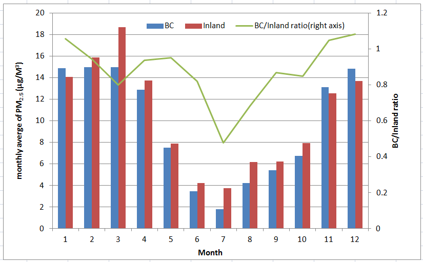

# 境外PM<sub>2.5</sub>佔台灣平均值比例之計算
{: .no_toc }

<details open markdown="block">
  <summary>
    Table of contents
  </summary>
  {: .text-delta }
- TOC
{:toc}
</details>
---

## 前言/背景
### 假設
- 由於單向巢狀網格計算過程，D2(中國東南)部分濃度切出後是做為D4(台灣本島)邊界濃度用途的，因此可以假設為境外濃度，以邊界濃度取點位置平均之。
- 而台灣地區之平均值則取陸地上的平均值，以縣市fraction加總後為1.0者取點平均之。二者的比值，在意義上可視為境外之濃度佔比。

### 方法檢討
- 境外(或特定類別污染來源)對本地污染濃度貢獻的計算，在網格模式中為來源分配模組，除了
  - 傳統的關閉敏感性，之外
  - CAMx模式的OSAT/PSAT、
  - CMAQ的ISAM
- 等等模組方法，均能完成本項目標。然這些方法勢必都要重新進行排放量的敏感性模擬，耗時太多。
- 如果只是要有一個數量級的概念，這些方法似乎也太過繁瑣。

## 程式設計重點
- 目前程式是為讀取CAMx結果設計。CMAQ結果亦可以適用，只需將uamiv()改成netCDF4.dataset()即可。

### D2切出做為D4邊界濃度的位置index

    讀取並產生D2之X及Y座標值
    讀取D4的原點(及邊界)座標值
    利用bisect來定位4個頂點(line 16~19)
    In [160]: ib,ie,jb,je
Out[160]: (27, 39, 24, 42)

    形成邊界線上所有位置的index備用
    共(39-27)*2+(42-24)*2=60點

```python
$ cat -n bc_PMmean.py
...
    8  path='/nas1/camxruns/2016_v7/outputs/'
    9  fname=path+'con01/1601baseT.S.grd02'
    10  newf2 = uamiv(fname,'r')
    11  x=[newf2.XORIG+i*newf2.XCELL for i in range(newf2.NCOLS)]
    12  y=[newf2.YORIG+i*newf2.YCELL for i in range(newf2.NROWS)]
    13
    14  fname=path+'con01/1601baseEF3.S.grd01'
    15  newf4 = uamiv(fname,'r')
    16  ib=bisect(x,  newf4.XORIG)-1
    17  ie=bisect(x, -newf4.XORIG)+1
    18  je=bisect(y, -newf4.YORIG)+1
    19  jb=bisect(y,  newf4.YORIG)-1
    20  idx=[]
    21  for i in range(ib,ie+1):
    22    idx.append((jb,i))
    23    idx.append((je,i))
    24  for j in range(jb+1,je):
    25    idx.append((j,ib))
    26    idx.append((j,ie))
    27  idx.sort()
    28  idx=np.array(idx)
    29  idd=(idx[:,0],idx[:,1])
```
### 讀取台灣本島位置index

- 主要以CNTY_TWN_3X3.nc的縣市fraction為對象，除去53海上點
- 進行縣市加總，只留下陸上且總合為1.0的點(共3268點)，其餘不足1.0會造成平均值的誤差(稀釋)
- 組index以dict形式儲存(idx)，方便後續呼叫

```python
    31  fname='/nas1/cmaqruns/2016base/data/land/epic_festc1.4_20180516/gridmask/CNTY_TWN_3X3.nc'
    32  nc = netCDF4.Dataset(fname,'r')
    33  V=[v for v in nc.variables if v[-2:]!='53']
    34  nv=len(V)
    35  f=np.zeros(shape=(nv,nc.NROWS,nc.NCOLS))
    36  for v in V:
    37    iv=V.index(v)
    38    f[iv,:,:]=nc.variables[v][0,0,:,:]
    39  fs=np.sum(f,axis=0)
    40  idfs=np.where(fs==1.0)
    41  idx={2:idd,4:idfs}
```
### 建立檔案名稱系統

- 因2組巢狀網格模擬結果共有24個檔案，檔案名稱需要簡潔的設計，在此以序列的dict來簡化及方便呼叫

```python
    44  root={2:'baseT.S.grd02',4:'baseEF3.S.grd01'}
    45  ms=['{:02d}'.format(m+1) for m in range(12)]
    46  fnames={i:[path+'con'+ms[m]+'/16'+ms[m]+root[i] for m in range(12)] for i in [2,4]}
```

### 執行檔案迴圈
- 前述idx必須分開寫成1維序列，newf才會予以降階
- newf.variables必須先取np.array，再取平均。否則平均結果還會掛著newf的其他屬性。
- 寫成csv格式方便後續處理

```python
    48  with open('pm25_rat.csv','w') as fn:
    49    fn.write('pm25_2,pm25_4,pm25_2/pm25_4\n')
    50    for m in range(12):
    51      for d in [2,4]:
    52        newf = uamiv(fnames[d][m],'r')
    53        pm25.update({d:np.mean(np.array(newf.variables[v][:,0,idx[d][0],idx[d][1]]))})
    54      fn.write('{:7f},{:7f},{:5f}\n'.format(pm25[2],pm25[4],pm25[2]/pm25[4]))
```

## 後處理
- 區分冬夏半年進行均化，以減少個別月份奇異值

```python
    55  df=read_csv('pm25_rat.csv')
    56  a=np.array(df['pm25_2/pm25_4'])
    57  print(np.mean(a))
    58  print(np.mean(a[2:8])) #march to august
    59  print(np.mean([a[i] for i in [0,1,8,9,10,11]]))
```

## 結果討論
### 逐月結果
- 由於此處台灣地區的PM<sub>2.5</sub>值是取所有陸地上的平均，而非代表人口密集的測站值，因此平均結果接近邊界值是比較合理的。
- 1、11、12月因大陸濃度較高，即使加上海上邊界稀釋，平均濃度仍然高於台灣地區，台灣因山林茂密，對PM<sub>2.5</sub>也有涵容的效果。
- 夏半年值因風向相反，大陸濃度也較低，因此比例上境外貢獻最低會低於5成(7月0.478)。

```python
In [161]: df
Out[161]:
      pm25_2    pm25_4  pm25_2/pm25_4
0  14.885291  14.075246      1.057551
1  14.958995  15.880019      0.942001
2  14.978031  18.699181      0.800999
3  12.877620  13.731896      0.937789
4    7.512025  7.899702      0.950925
5    3.444429  4.202571      0.819600
6    1.796730  3.754998      0.478490
7    4.213194  6.170565      0.682789
8    5.391090  6.212652      0.867760
9    6.735334  7.935111      0.848801
10  13.138980  12.544965      1.047351
11  14.819545  13.698520      1.081836
```
bc_PMmean.PNG

|  |
|:--:|
| <b>2016年邊界及臺灣陸地PM<sub>2.5</sub>月平均濃度值與比例</b>|

### 整體結果

- 全年0.88。夏季較低0.78、冬季較高0.97。
- 此值較過去約0.3~0.5(測站、事件或月)為高，可能原因除上述空間上的平均範圍較為廣大之外，平均時間範圍可能也會有所差異，平常日本地濃度不高，濃度趨於背景值，為較合理的結果。

```python
In [159]: run bc_PMmean.py
0.8763243333333334
0.778432
0.9742166666666666
```

## bc_PMmean.py程式下載



