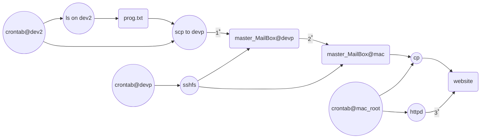

# 全年執行批次job.cs
{: .no_toc }

<details open markdown="block">
  <summary>
    Table of contents
  </summary>
  {: .text-delta }
- TOC
{:toc}
</details>
---

## 國網上執行的困難（未解決）

1. 排序受到限制
2. 執行檔mpirun無法啟動fabric
3. 以下批次仍以本地工作站進行

## job.cs@dev2

### 前期準備

1. 解壓縮
   公版模式系統包括初始、邊界條件、氣象(mcip結果)、排放量檔案(臺灣本島生物源與TEDS人為污染、東亞排放在模擬範圍之分量等3個檔案)、為分月壓縮儲存，需逐一、逐層解開。
2. 每個月的ocean檔案：產生方式詳見[runocean.sh](exec.md#runoceansh)，檔案不會辨認時間、各月可以相同，連結即可。
3. 逐月執行dTZPP.py、準備情境排放量。詳見[剔除特定位置之排放量](https://sinotec2.github.io/Focus-on-Air-Quality/GridModels/TWNEPA_RecommCMAQ/emis_sens/4dTZPP/#剔除特定位置之排放量)之說明。

```python
$ cat dTZPP.py
import netCDF4
import sys
fname=sys.argv[1]
nc = netCDF4.Dataset(fname,'r+')
V=[list(filter(lambda x:nc[x].ndim==j, [i for i in nc.variables])) for j in [1,2,3,4]]
for v in V[3]:
    nc[v][:,4,87,39]=0.
    nc[v][:,4,86,39]=0.
nc.close()
```

### 目標

- 這個執行批次除了逐月執行背景模擬([_teds](#base-run-scripts))之外，也執行去除TZPP([_dTPZZ](#dtzpp-run-scripts))之情境，以便進行全年減量敏感性測試。(或見[剔除特定位置之排放量](./emis_sens/4dTZPP.md#剔除特定位置之排放量)說明)

### 腳本內容

- 公版模式將原來USEPA提供的[run_cctm.csh][epa]腳本拆分成專案時間設定([project.config](exec.md#2-模擬案例與時間projectconfig))、控制專案名稱及排放量的[主程式][1]、以及[科學設定][3]等3個部分。因此全年模擬只需更改前二者即可。
- 專案時間設定：以mk_conf.cs及引數月份來控制
- 主程式：以2個分開的腳本([run.cctm.03.csh_teds](#base-run-scripts)、[run.cctm.03.csh_dTPZZ](#dtzpp-run-scripts))依序執行

```bash
for m in {01..12};do
./mk_conf.cs $m
./run.cctm.03.csh_teds
./run.cctm.03.csh_dTZPP
done
```

### mk_conf.cs

- 每個月套用起訖日期、執行長度等等變數，來形成新的[project.config](../TWNEPA_RecommCMAQ/exec.md#2-模擬案例與時間projectconfig) 檔。
  - 引數：月份，`mm=01~12`
  - `$nc`:排放檔案名稱。因為公版模式系統將模擬日數寫在檔案名稱之中，直接讀取可免計算。
  - [./project.config_loop](#projectconfig_loop)：執行專案起訖時間之模板，以`sed`進行置換（說明如下）

```bash
mm=$1
nc=$(ls /nas2/cmaq2019/download-20221018/input/2019$mm/grid03/smoke/egts_l*.ncf)
ymd=$(echo $nc|cut -d'.' -f2)
nd=$(echo $nc|cut -d'.' -f3)
HHH=$(( $nd * 24 )) 
YYYYDDD=$(ncdump -h $nc|grep SDATE|awkk 3)
BEGD=$(date -d "$ymd" +%Y-%m-%d)
ENDD=$(date -d "$ymd + ${nd}days" +%Y-%m-%d)
cp ./project.config_loop project.config
for cmd in 's/MM/'$mm'/g' 's/BEGD/'$BEGD'/g' 's/ENDD/'$ENDD'/g' 's/HHH/'$HHH'/g' 's/YYYYDDD/'$YYYYDDD'/g';do sed -ie $cmd project.config ;done
```

## 附屬檔案

### project.config_loop

- `./project.config_loop`為一通用各月的模版，以`sed`置換其中的：
  - `MM`:月份，用以指定儲存目錄位置(`$cmaqproject`)
  - YYYYDDD：起始年[儒略日][jday]，起始日即為排放檔案之全域屬性`SDATE`。不另計算。
  - HHH：執行總時數，即為總日數 &times; 24
  - BEGD：`$BEGD`，起始年月日，起始日鑲嵌在排放檔案名稱之中、不另計算。
  - ENND：即`$BEGD + ${nd}days`

```bash
#!/bin/csh -f

#for total settings:
 set cmaqproject = /u01/cmaqruns/2019TZPP/output/2019-MM
 set startdate = YYYYDDD	# YYYYDDD
 set runlen    = HHH0000	# HHH0000

#for MCIP start and end time
 set MCIP_START = BEGD-00:00:00.0000  # [UTC]
 set MCIP_END   = ENDD-23:00:00.0000  # [UTC]

#for BC startdate
 set cmaqbcdate = ${startdate}

#for IC startdate
 set cmaqicdate = ${startdate}

#for CCTM 請配合 MCIP 的時間即可！
 set START_DATE   = "BEGD" 
 set END_DATE     = "ENDD" 
```

### base run script

- 基準模擬(`_teds`)，原始腳本詳見[run.cctm.03.csh](https://github.com/sinotec2/Focus-on-Air-Quality/blob/main/GridModels/TWNEPA_RecommCMAQ/run.cctm.03.csh.TXT)
- 注意事項
  1. 執行檔：適用DEV2工作站專用版本。
  2. `NPCOL_NPROW`及`NPROCS`，調整以適應工作站核心數。
  3. 背景排放檔案名稱（生物與東亞分量）：由於檔名冗長難以規則化(參見[mk_emis.py](../ForecastSystem/3.mk_em.md#公版模式排放檔案命名規則))，此處乃採`ls`方式產生。然需保持目錄內檔案的單純性，否則將發生錯誤。
  4. 情境排放檔案(TEDS部分)：更名為cmaq.ncf及cmaq.ncf_dTZPP

```bash
$ cat run.cctm.03.csh_teds 
#!/bin/csh -f
# VBird settings
set compilerString = intel 
set mydomain    = grid03
set mympi       = yes
set sfile       = ./project.config
set sourcefile  = ./cctm.source.v5.3.1.ae7
set CMAQ_HOME   = /nas2/cmaq2019/download/model/cmaq_recommend_intelDEV2
setenv PATH /opt/mpich/mpich-3.4.2-icc/bin:/usr/bin:$PATH
setenv LD_LIBRARY_PATH ${PWD}/Libs

echo ${sfile}
source ${sfile}
set cmaqproject = ${cmaqproject}/${mydomain}

set NY = 131
set NX = 92

# VBird settings
# ===================================================================

 setenv NPCOL_NPROW "8 12"; set NPROCS   =  96
 set myjob   = TEDS

# ===================================================================
 set OUTDIR    = ${cmaqproject}/cctm.${myjob}          #> Output Directory

#> Gridded Emissions files
 set B3GTS = `ls ${cmaqproject}/smoke/b3gts*.ncf`
 set EGTS = `ls ${cmaqproject}/smoke/egts*.ncf`
 setenv N_EMIS_GR 3
 setenv GR_EMIS_001    ${B3GTS}
 setenv GR_EMIS_LAB_001  bio3taiwan
 setenv GR_EMIS_002    ${cmaqproject}/smoke/cmaq.ncf
 setenv GR_EMIS_LAB_002  basetaiwan
 setenv GR_EMIS_003    ${EGTS}
 setenv GR_EMIS_LAB_003  egtstaiwan

 echo "force11:240" > machines8

 source ${sourcefile}
```

### dTZPP run script

```bash
$ diff run.cctm.03.csh_teds run.cctm.03.csh_dTZPP
30c30
<  set myjob   = TEDS
---
>  set myjob   = dTZPP
41c41
<  setenv GR_EMIS_002    ${cmaqproject}/smoke/cmaq.ncf
---
>  setenv GR_EMIS_002    ${cmaqproject}/smoke/cmaq.ncf_dTZPP
```

## 遠端監視執行進度

### 原理

- 運用3台工作站的`crontab`每分鐘將最新執行成果(`prog.txt`)接連傳送到mac的網頁，以利掌握即時進度。
- 更新頻率
  - 檔案傳送頻率為每分鐘
  - mac httpd檢查頻率為每小時

```bash
#report the prog of CMAQ
*/1 * * * * ls -lhrt /u01/cmaqruns/2019TZPP/output/2019-??/grid03/cctm.*/daily/CCTM_AC*|tail > ~/prog.txt;scp ~/prog.txt devp:~/mac/kuang/master_MailBox
```

- 注意事項
  1. 結果檔案是儲存在dev2工作站，並不是共用的nas上，因此需保持scp能夠連線(1<sup>*</sup>)。`ls`與`scp`皆有`crontab`予以控制。
  2. dev2與mac的連線不良（待解決），需要將prog.txt結果複製到devp上(1<sup>*</sup>)，以利傳送到mac。
  3. 注意devp與mac的連線(2<sup>*</sup>)，有`crontab`定期檢查。
  4. mac上的網頁內容是root權限，必須另以`crontab`定期將prog.txt複製到網頁指定目錄。
  5. 注意確保mac上的`httpd`正常運作(3<sup>*</sup>、`crontab`定期檢查)。

### 網頁畫面結果


### 流程及工作站關係圖

（如未能正常顯示，請至[此處](https://github.com/sinotec2/Focus-on-Air-Quality/blob/main/GridModels/TWNEPA_RecommCMAQ/job_cs.md#流程及工作站關係圖)）



[epa]: https://github.com/USEPA/CMAQ/tree/main/CCTM/scripts " USEPA / sCMAQ / CCTM /scripts"
[1]: exec.md#1-主程式runcctm03csh "runcctm03csh"
[3]: exec.md#3-科學設定檔cctmsourcev531ae7 "科學設定檔"
[jday]: https://sinotec2.github.io/Focus-on-Air-Quality/utilities/DateTime/c2j "月曆日轉儒略日(c2j)"
