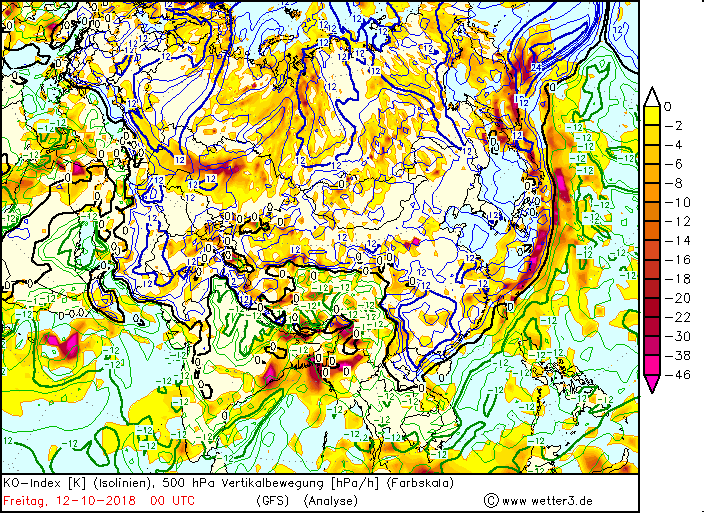
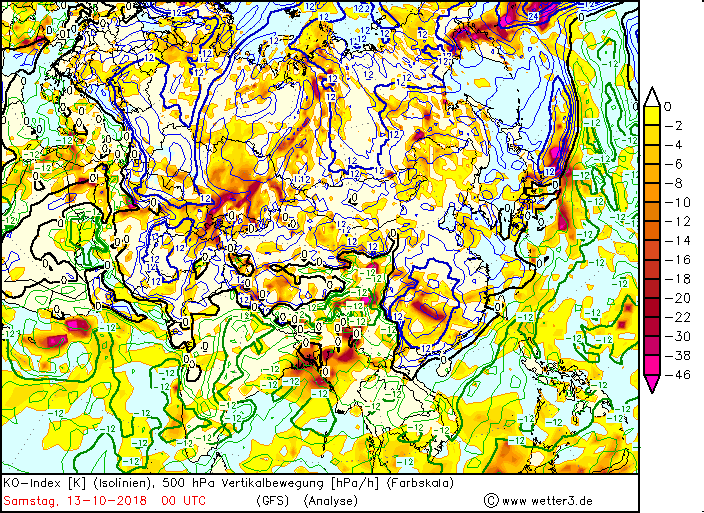
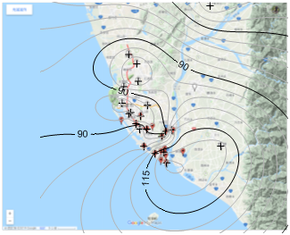
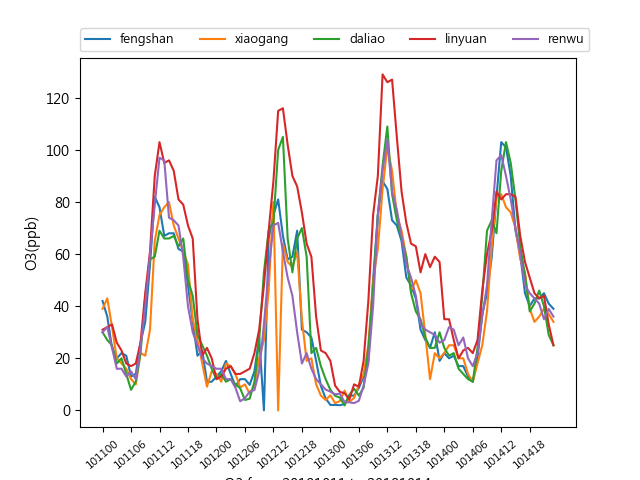
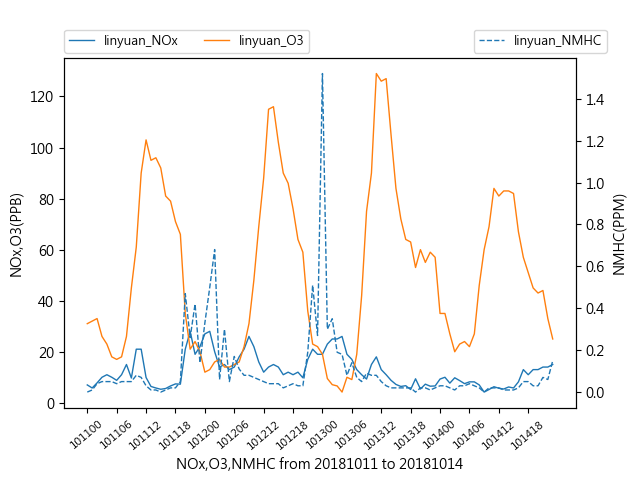
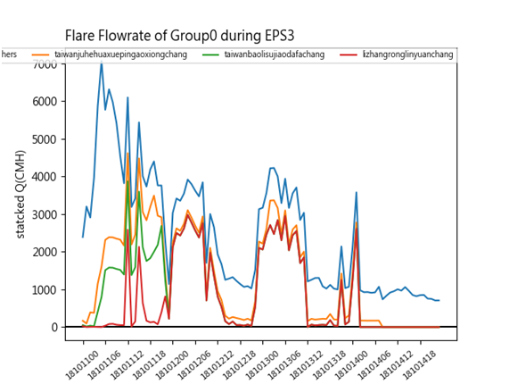
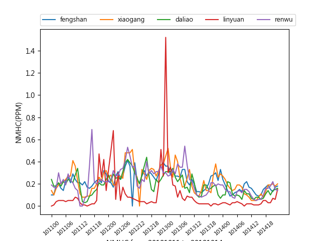
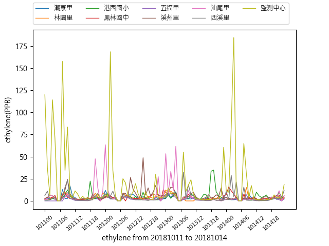
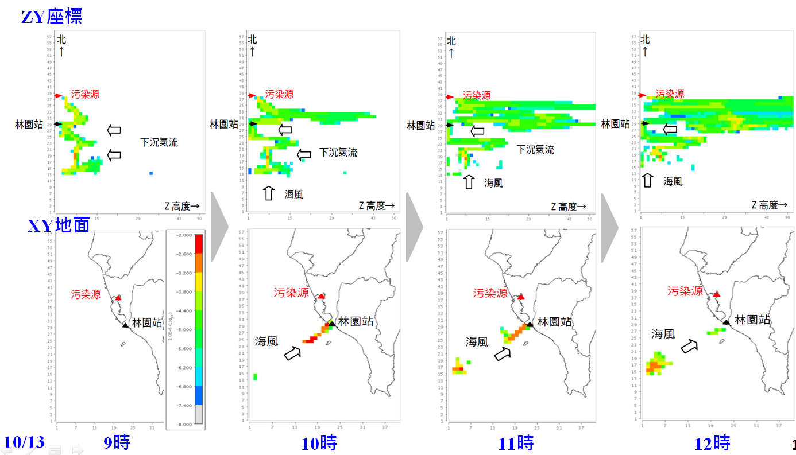
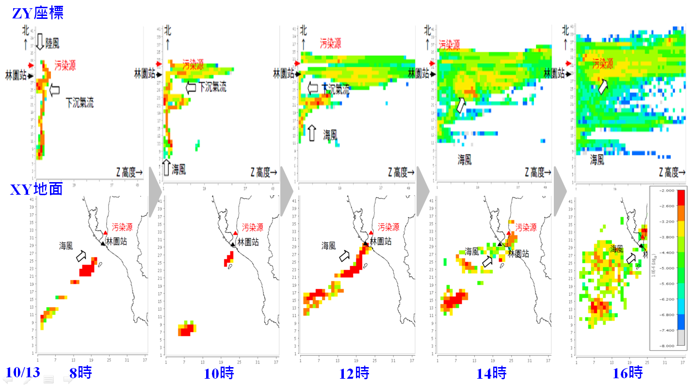

# 林園地區臭氧事件分析
{: .no_toc }

  

    Table of contents
  

  {: .text-delta }
- TOC
{:toc}

---

## 背景
臺灣地區秋冬季節空氣品質不良率偏高，即使排除境外因素污染仍以高屏較差(詳[臺灣地區空品不良日數逐月變化](https://sinotec2.github.io/Focus-on-Air-Quality/PaperReview/LargeSSPtSrcEIA/3TerrainEffect/#臺灣地區空品不良日數逐月變化))。

本研究針對高屏雄地區空氣品質自動監測站歷史資料，分析空氣污染物空間及時間序列特性，探討特殊性工業區污染現象與臭氧事件日煙流三維軌跡分析。相關成果可作為規劃減量策略及未來管制重點之參考。

## 林園臭氧事件
- 林園工業區分析過程，發現多次出現非本地污染特徵之高值(如乙、丙烯、NMHC及NOx同時之高值)，因此進一步分析更大範圍影響的可能性。
- 藉由WRF建立地區風場，分析林園站2018/10/13臭氧事件日煙流三維軌跡分析，測試北、南高雄高空污染源夜間的煙流行為，以檢討林園地區臭氧污染成因。
### 事件日之綜觀天氣與地面風速風向
- 氣流線與空氣品質，可以參考[Nullschool][NS20181013]之歷史檔案。為典型鋒面通過之東北季風天氣，並沒有明顯的境外污染現象。
- [https://www1.wetter3.de/Archiv/](https://www1.wetter3.de/Archiv/)可以查到[GFS](https://www.ncei.noaa.gov/products/weather-climate-models/global-forecast)模擬這2天鋒面通過臺灣高低層虛位溫差異([KO-index](http://www.eumetrain.org/data/2/20/Content/theory_ko.htm)、等值線)及高層垂直運動(hPa/h以色塊標示)的分布與變化
  - 事件日當天KO指標0值正好通過高雄地區，海面為負值、陸地為正值，如圖所示：

| ||
|:-:|:-:|
| <b>2018101200</b>|<b>2018101300</b>|

[NS20181013]: <https://earth.nullschool.net/#2018/10/13/0400Z/chem/surface/level/overlay=cosc/orthographic=-238.92,24.73,2066> "https://earth.nullschool.net/#2018/10/13/0400Z/chem/surface/level/overlay=cosc/orthographic=-238.92,24.73,2066"

- 以中央氣象局地面風速風向測值分析當日地面之二維正、反軌跡
  - 環保署林園站中午O3尖峰時間反軌跡(白色) vs. 當天2時北高雄某廠燃燒塔之正軌跡(紅色)
  - 參考[林園臭氧事件與氣流軌跡線](https://sinotec2.github.io/Focus-on-Air-Quality/PaperReview/LargeSSPtSrcEIA/3TerrainEffect/#林園臭氧事件與氣流軌跡線)
  - 作法詳[由CWB數據計算軌跡](https://sinotec2.github.io/Focus-on-Air-Quality/wind_models/CODiS/5.traj/)

| |
|:-:|
| <b>中央氣象局風速風向數據繪製2018/10/13/12:00時林園測站之反軌跡(白色)與北高雄污染源正軌跡(紅色)，林園站O3=126ppb</b>|

### 空氣品質數據分析
- 事件日中午高屏地區臭氧濃度之空間分布如圖所示
  - 合併所有特工站及環保署測站尖峰臭氧濃度，以解析度1公里進行Kriging內插。Surfer繪圖。
  - 林園特工站之間的間距約為2Km，以南方濱海的3個測站具有相同特性，而其他測站測值較低，由此可以推斷此一臭氧煙流超標範圍在本市範圍的空間尺度僅約2Km。然而對潮州站與下游大範圍，都有可能是超標的狀況。

| |
|:-:|
| <b>2018/10/13 高屏地區環保署測站(白點)及特工測站(紅點)臭氧尖峰濃度之分布，林園測站測值尖峰濃度為126 ppb</b>|

- 事件日前後、環保署林園站及鄰近其他4站之臭氧歷線如下圖所示。
  - 林園站之高濃度確實有其空間的獨立性
  - 而NOx/NMHC前驅物濃度來看，符合地區週變化的特性(週四 ~ 週日)，唯10/12及13日零時皆出現NMHC及NOx之異常高值。
  - 由特工區測站顯示為乙烯，除鄰近污染源排放，亦可能來自北方仁大工業區)。夜間同時排放NMHC及NOx之污染源很可能是燃燒塔。

| ||
|:--:|:--:|
|<b>2018/10/13事件日前後、林園站及鄰近其他4站之臭氧歷線</b>|<b>同時段林園站NOx及NMHC與臭氧歷線</b>|

### 林園地區O3事件燃燒塔流量變化歷線
- 下圖為高雄市工業區燃燒塔在事件前2天至後1天的流量變化歷線CEMS數據。
  - 流量數據採計前三大廠及其它之事件總排氣量、依續累計堆疊
  - 因此最上面的歷線即為工業區總流量之小時變化
  - 數據來源：[環保署空保處固定污染源CEMS廢氣燃燒塔一小時監測紀錄值](https://data.epa.gov.tw/dataset/detail/AQX_P_493)

| |
|:-:|
| <b>2018/10/13臭氧事件高雄市所有工業區燃燒塔流量</b>|

- 圖中顯示此次事件各工業區都有大量的排放
  - 10/11凌晨由大林煉油廠開始排放
  - 10/11白天~10/12子夜大寮地區台灣寶理塑膠大發廠與仁大台聚的排放有非常相似的波形，其間似乎存在密切的關連性
  - 10/13子夜則以李長榮林園廠為主
  - 研判應與大林廠歲修有關，上游供料停止導致中下游廠也停止操作，半成品與管線中之石化原料遂由燃燒塔排放，造成空污事件。
  - 相較這些廠過去排放歷史而言，本次事件的排氣量規模並不低。

- 比較林園站所觀察到10/12與10/13子夜時的NMHC尖峰現象
  - 由各工業區燃燒塔CEMS可知，以林園工業區李長榮化工廠排氣量最有關連
  - 然而2天子夜的排氣量多能維持12小時，在林園測站上出現的時間卻1~2小時。
  - 可能與地面風向的轉變有關。
### NMHC與特工站乙烯濃度
- 數據及測站位置：詳[特殊性工業區空氣品質監測管制資訊網](https://aqmsopen.epa.gov.tw/)
- 林園站NMHC與其他環保署測站差異
  - 夜間有超高值
  - 日間濃度較低
- 林園特工站乙烯濃度也有夜間較高(尖峰濃度)的趨勢，監測中心站最高，其次為汕尾站。濃度值振盪幅度較大，為窄煙流特性。
- 林園站NMHC高值與汕尾里乙烯值較為相關，與其他特工站之變化差異較大

| |
|:-:|
| <b>2018/10/13臭氧事件林園站NMHC濃度變化</b>|
| |
| <b>2018/10/13臭氧事件林園特工站乙烯濃度變化</b>|

## 林園臭氧事件污染源三維正軌跡分析
### 三維正軌跡累積頻率分析方法
- 三維風場來自WRF模式D4範圍模擬結果、水平解析度3公里、垂直40層。開啟FDDA。
- 軌跡線通過網格之累積頻率函數作法可以參考[林等1998][林等1998]。
- 分析程式參考[WRF三維軌跡分析](https://sinotec2.github.io/Focus-on-Air-Quality/TrajModels/traj3D/)。
- 繪圖軟體使用[VERDI](https://sinotec2.github.io/Focus-on-Air-Quality/utilities/Graphics/VERDI)。

[林等1998]: <http://mopl.as.ntu.edu.tw/web/ASJ/26/26-3-3.pdf> "林能暉、彭啟明、陳進煌(1998) 東亞硫化物之長程輸送: 氣流軌跡線之應用, 大氣科學26:3, 265-280."

### 北高雄污染源三維正軌跡累積頻率
- 正軌跡來自仁大工業區，高度125M。
- 網格水平解析度為 3 Km、垂直為等間距 50 M 共 51 格。
- 污染粒子自子夜開始，每 15 秒釋放、逐一追蹤其通過網格位置，每小時結算其出現機率。

| |
|:-:|
| <b>2018/10/13北高雄污染源三維正軌跡累積頻率之ZY、XY平面分布圖(上：ZY平面，X向加總。下：XY平面，地面第1層)</b>|

結果顯示北高雄污染源煙流在夜間北風作用下向南發展到達林園地區，而地區的下沉氣流則會將煙流帶至地面造成污染。

### 南高雄污染源三維正軌跡累積頻率
- 污染源位於大發工業區，同樣自子夜開始釋放

| |
|:-:|
| <b>2018/10/13南高雄污染源三維正軌跡累積頻率之ZY、XY平面分布圖(上圖：ZY側面圖，X方向加總結果。下圖：XY平面圖，地面第1層)</b>|

南高雄污染源煙流的流布情形則呈現不同樣態，海面上受到下沉氣流作用，煙流垂直運動確實受到抑制，將可以維持較高濃度而不會被擴散稀釋，而在海風的帶動下中午到達林園站造成較高污染。

## 結語及未來發展
### 氣流機制
- 不論是GFS預報模式、或是較高解析度WRF的FDDA，都顯示秋季鋒面過後高雄地區海面上的高層與地面，發生嚴重的氣流下沉現象，不單影響垂直擴散，也讓濱海地區的高空排放被帶到地面上。
- 偏北之陸風將污染帶到海面上，而日間海風再將其帶回陸地。
### 污染排放機制
- 此次事件與大林廠歲修有關，上游供料停止導致中下游廠也停止操作，半成品與管線中之石化原料遂由燃燒塔排放，造成空污事件。
- 北高雄與南高雄燃燒塔大多在夜間排放，不單在特工站也在環保署一般站上被觀測到。
### 反應機制
- 污染源(燃燒塔)排放大量高反應性之NMHC成份(乙烯)以及燃燒過程所生之氮氧化物，且未經垂直擴散稀釋，提供高濃度的臭氧前驅物。
- 因鋒面過後，且因位於東北季風的背風面、下游區，天氣穩定、日照強烈，光化反應激烈生成較高濃度臭氧。
### 未來發展
- 排放定量分析：由於燃燒塔CEMS未設有濃度監測，因此無法由其計算確切的排放量。建議由高斯模式或原生性之擴散模式進行倒推，以空氣品質測值推估可能排放量
- 光化模式模擬：對於下游其他地區、對於其他類似異常排放進行臭氧濃度值之計算。
- 污染防制規劃：針對煉油石化業歲修、停產、不預期停供等因應對策進行研討、規劃、進行法制程序。
## Source
- 計畫名稱：1289C-高市107年空品惡化防制計畫審查
- 原文發表於[第26屆國際氣膠科技研討會ICAST26th](http://www.taar.org.tw/uploads/conference/1016/2019ICAST手冊_0925r1.pdf)，經摘錄及補充
  - 曠永銓、簡誌良、李其霈、郭子豪、宋國安、陳金瀛, 2019, 高雄屏地區空氣污染物的空間及時間序列差異特性分析, 26屆國際氣膠科技研討會, 中原大學, 10/4 ~ 5, 2019.
