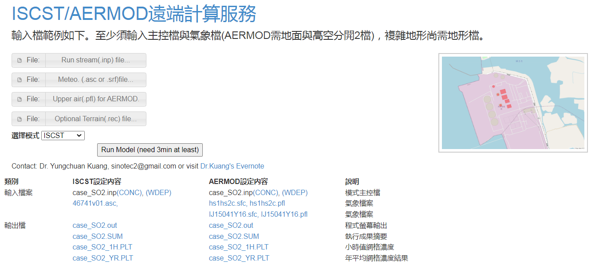

# ISCST/AERMOD 主程式
{: .no_toc }

<details open markdown="block">
  <summary>
    Table of contents
  </summary>
  {: .text-delta }
- TOC
{:toc}
</details>
---

## 背景
### instance
- 煙流模式主程式的[遠端計算](http://sinotec24.com/AERMOD.html)網頁。
- 主要服務那些已經準備好各項輸入檔案的使用者，Javascripts將會讀取使用者提供的檔案存到伺服器上(至少2個檔案、最多4個檔案)，並啟動CGI_Python程式進行煙流模式的遠端計算與監看。
  - 如果需要前處理([氣象](http://sinotec24.com/mmif.html)、[地形](http://sinotec24.com/terrain.html)等)、或後處理([kml](http://sinotec24.com/Leaflet/docs/index.html)、[NCL](http://sinotec24.com/NCLonOTM.html))，可以回到[遠端模擬首頁](http://sinotec24.com/aermods.html)
  - 監看網頁
    - iMacKuang:[http://sinotec24.com/status.html](http://sinotec24.com/status.html)
    - aermod：[http://sinotec24.com/isc_results/arem_RAND/prog.html](http://sinotec24.com/isc_results/arem_RAND/prog.html)
    - iscst：[http://sinotec24.com/isc_results/isc3_RAND/prog.html](http://sinotec24.com/isc_results/isc3_RAND/prog.html)
  - 服務僅限模式計算，後處理部分讓使用者視需要自行下載結果檔案，再啟動其他程式進行處理、繪圖。
- 服務僅限模式計算，後處理部分讓使用者視需要自行下載結果檔案，再啟動其他程式進行處理、繪圖。

### 計算時間超過網頁停等容許時間的策略
- 此處不採取bash scripts定期檢視郵寄結果策略，一般郵件伺服器會認為沒有domain name的ip是垃圾信。而是
- 直接限制總執行緒
  - 讓工作站優先服務先提出submit的使用者，
  - 使用者可以經由短暫的等待得到結果、或由網頁提供的連結，自行檢視工作站的執行進度。
### 檔案架構
- $web/AERMOD.html
- $cgi/isc/AERMOD.py
- models:
  - `AERMOD='/Users/1.PlumeModels/AERMOD/aermod_source/aermod.exe'`
  - `ISCST3='/Users/1.PlumeModels/ISC/short_term/src/iscst3.exe'`
  - `DAT2KML=/opt/local/bin/dat2kml.py`
- wait and see
  - $web/isc_results/waitc.cs
  - $web/isc_results/demo/
    - refresh.html
    - done.html
- working directories
  - aermod: $web/isc_results/arem_ **RAND**
  - iscst: $web/isc_results/isc3_ **RAND**
  - **RAND**為隨機產生之6碼文字
## HTML
### 設計
- 使用[filepicker](https://github.com/benignware/jquery-filepicker)開啟使用者指定上傳的檔案
- 以表格方式整理模擬過程、各程序之程式版本、內容、IO及範例、檢核方式以及筆記。
- 提交CGI_python物件
  - `4個檔案`：**依序**為run stream、氣象檔(AERMOD會需要獨立的高空數據檔)、以及(或)複雜地型時需要的地形檔。
  - `model`：模式之選項，ISCST或AERMOD二擇一
### 畫面
| |
|:--:|
| <b>isc_aermod主程式[遠端執行](http://sinotec24.com/AERMOD.html)界面</b>|

### 執行成果範例

```
pid= 79669(check progress)

Model_results: The Model process should be ended in 3 min. After that You may click:
AERTEST_ERRORS.OUT
linko_CO.out
isc.out
AER_CO_01H.PLT
AER_CO_Y.PLT
AER_CO.SUM
AER_CO_01H.PLT.kml
AER_CO_Y.PLT.kml
AER_CO_01H.PLT.grd
AER_CO_Y.PLT.grd
```
- 工作完成提示網頁中提醒可以使用免費的[Leaflet](http://sinotec24.com/Leaflet/docs/index.html)服務進行檢視(詳[地圖貼板](https://sinotec2.github.io/Focus-on-Air-Quality/utilities/GIS/digitizer/#地圖貼板))
- 事實上 Visual Code也提供了預覽KML檔案的[插件](https://marketplace.visualstudio.com/items?itemName=jumpinjackie.vscode-map-preview)，效果也還不錯。

### Coding
- [AERMOD.html](https://github.com/sinotec2/CGI_Pythons/blob/main/isc/AERMOD.html)
- [autorefresh.html](https://sinotec2.github.io/Focus-on-Air-Quality/utilities/Graphics/HTML/autorefresh/)

## CGI_PYTHON
- [AERMOD.py](https://github.com/sinotec2/CGI_Pythons/blob/main/isc/AERMOD.py)
- [程式設計說明](https://sinotec2.github.io/Focus-on-Air-Quality/utilities/CGI-pythons/AERMOD/)
