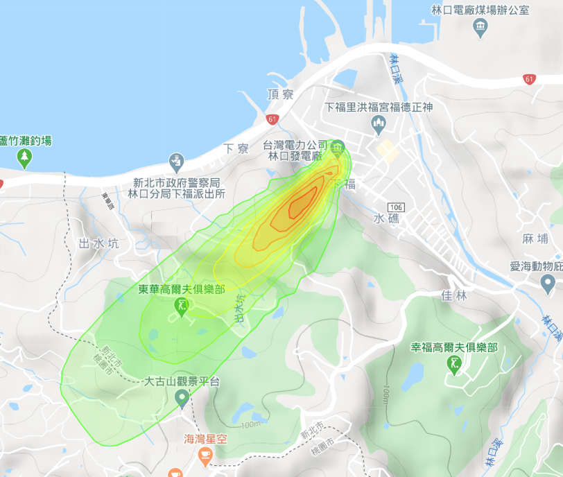

# AERMAP之執行與效果
{: .no_toc }

  

    Table of contents
  

  {: .text-delta }
- TOC
{:toc}

---

## 背景

- [AERMAP][1]是[AERMOD][2]地形檔案的前處理程式，執行複雜地形中的煙流模擬必經的程序。背景地形數據之擷取、aermap.inp之產生、及aermap之執行等等技術細節，都包裝在[gen_inp.py](gen_inp.md)內，也寫了遠端計算服務網站[aermap_caas](../../utilities/CGI-pythons/aermap_caas.md)可供使用。此處討論環工應用面角度之效果。

## 個案一：平坦與複雜地形煙流模擬結果比較

### 新北市某電廠附近地形

- 解析度50m、範圍取5公里、共10,000個接受點。
- 切出之地形tiff檔經處理成kml貼在google map結果如下

|  |
|:--:|
| <b>圖 林口電廠周邊地形[KML檔案](../../utilities/GIS/wr_kml.md)輸出結果範例</b>|  

### 地形圖檢查項目

- [範圍]()
  - 是否以污染源排放為中心、東西、南北具有對稱性。
  - 是否包括重要接受點
  - 海面範圍可視情況減少
  - 模式在山後是沒有模擬能力的，模擬範圍是否予以排除
- [高值]()部分
  - 是否符合地圖（鄉鎮區界線、稜線道路、山峰位置等）
  - 煙流大致會在2倍煙囪高度之等高線，產生高值。
  - 有群峰之地形範圍，煙流會在第一個碰觸點產生高值。
- [解析度]()
  - 太低→地形特徵會消失。煙流本身會模糊化，
  - 解析度太高會增加執行時間，沒有必要。
  - 此處取50m。內政部數據可以提供至20m。
- 等高線：一般公路設計會平行於等高線，可藉地圖中公路的走向，檢視地形數據結果的正確性
- 低值位置：一般地圖上是河流、住家村落、陂塘、農地等。
- 海岸線：等高線是否與地圖之海岸線平行

### 電廠周邊地形檔輸入aermod模擬結果範例

- mmif氣象1/21\~31
- 有建築物

|  ||
|:--:|:--:|
| <b>無地形，煙流偏西南方，為東北季風影響</b>|有地形，煙流方向偏南，擴散範圍受到限制，集中在河谷低地。受限於80\~100M等高線範圍。最大值較高51\~754&mu;/M3|
