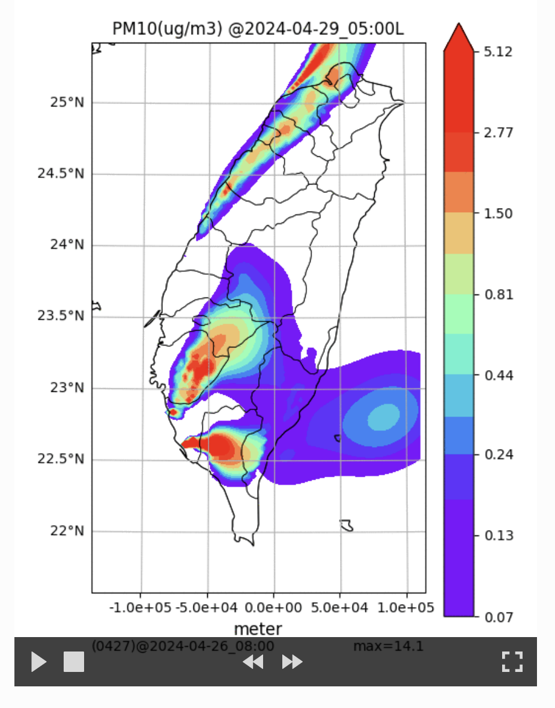

# 使用預報場wrfout來推動CPUFF
{: .no_toc }

<details open markdown="block">
  <summary>
    Table of contents
  </summary>
  {: .text-delta }
- TOC
{:toc}
</details>
---

## 背景

- 自從2023/9/5起，不知什麼原因，氣象署在open data的WRF預報檔案不再更新了。需要改用[GFS-WRF](../../wind_models/GFS/2.GFS2WRF.md)的預報結果。
- 除了m3d檔案是由[calwrf](../CALMET/calwrf.md)所產生之外，座標系統與時間框架需要做一些微調、後處理也要因應改變。
- 大體上仍然依循[Run.sh](./Forecast.md#download-runsh)的架構內容，新增`$runCALWRF`的開關來控制。
- calwrf的完整說明，可以詳見[CALMET/calwrf](../CALMET/calwrf.md)。

## calwrf的控制

- 在master工作站上已經有很多`calwrf`的編譯結果與執行經驗，大多數是全月、全年度的批次工作，此處只需要執行4～5天即可，算是比較單純的作業。
- 新增`CALPUFF_INP/calwrf_template.inp`模版檔案，如下：

```bash
kuang@master /home/cpuff/UNRESPForecastingSystem/CALPUFF_INP
$ cat calwrf_template.inp
Create 3D.DAT file for WRF output
calwrf.lst          ! Log file name
/home/cpuff/UNRESPForecastingSystem/CWB_data/processed/met_?BEGD?.dat ! Output file name
-1,-1,-1,-1,1,15  ! Beg/End I/J/K ("-" for all)
?BEGDH?          ! Start datetime (UTC yyyymmddhh, "-" for all)
?ENDDH?          ! End   datetime (UTC yyyymmddhh, "-" for all)
4                   ! Number of WRF output files
```

- 注意
  - 這個模板沒有列出指定的wrfout路徑檔名，是等著附加的。因此模板的最後一行必須保持是檔案個數(`4`)
  - 結果檔案的位置，也是跟著預報系統而定。
  - 模擬空間與時間範圍：是跟著wrfout的內容而定，如為低解析度、大範圍之wrfout檔案，須另行設定。

### 日期時間

- `data/proceeded/met_?rundate?.dat`：結果檔名
- `?BEGDH?`起始日期時間（GMT）
- `?ENDDH?`結束日期時間（GMT）
- `?...?`用`sed`指令來替換每一天不同的內容。

### 網格範圍

- 水平方向：所有網格
- 垂直方向：地面與15層以下範圍
  - 公版wrf模式有24層，calpuff用不到太高層的範圍，需要檢討縮減範圍，來降低結果檔案的大小。

### wrfout檔案路徑

- 從過去一日到未來3日，共5日的預報結果
- 用`echo ... >> calwrf.inp`指令，將檔案路徑依序附加在控制檔`calwrf.inp`內。

## 時間間距

- 影響所及檔案：`CALPUFF_INP/calmet_template.inp`、
- model input data   (ISTEPPG)：[CWB WRF](../../wind_models/cwbWRF_3Km/1.get_M-A0064.md)是6小時間距，[GFS-WRF](../../wind_models/GFS/2.GFS2WRF.md)預報是1小時。

## 座標與垂直網格

### 中心點

- `m3d`檔案的範圍必須比`calmet`範圍大，不能相同。此處wrfout與calpuff濃度檔採取相同的系統，會造成執行困難。
- 檢討後將中心點向西移動0.11度約8公里。
- 網格數、間距、原點等等不改變。
- 影響所及檔案：`CALPUFF_INP/calmet_template.inp`、`CALPUFF_INP/calcpuff_template.inp`檔案，點源座標計算程式、geo.dat檔案、繪圖模版`wrfout_d04`

### 垂直網格的各層高度

- 影響所及檔案：`CALPUFF_INP/calmet_template.inp`、`CALPUFF_INP/calcpuff_template.inp`檔案
- 變數：`NZ`、`ZFACE`
- 參考[公版模式wrf](../../GridModels/TWNEPA_RecommCMAQ/IO_Files.md#氣象檔案)的設定值。
- 近地層（前2層）必須是`0,20`，後面則與wrf的設定相同。

## 結果

