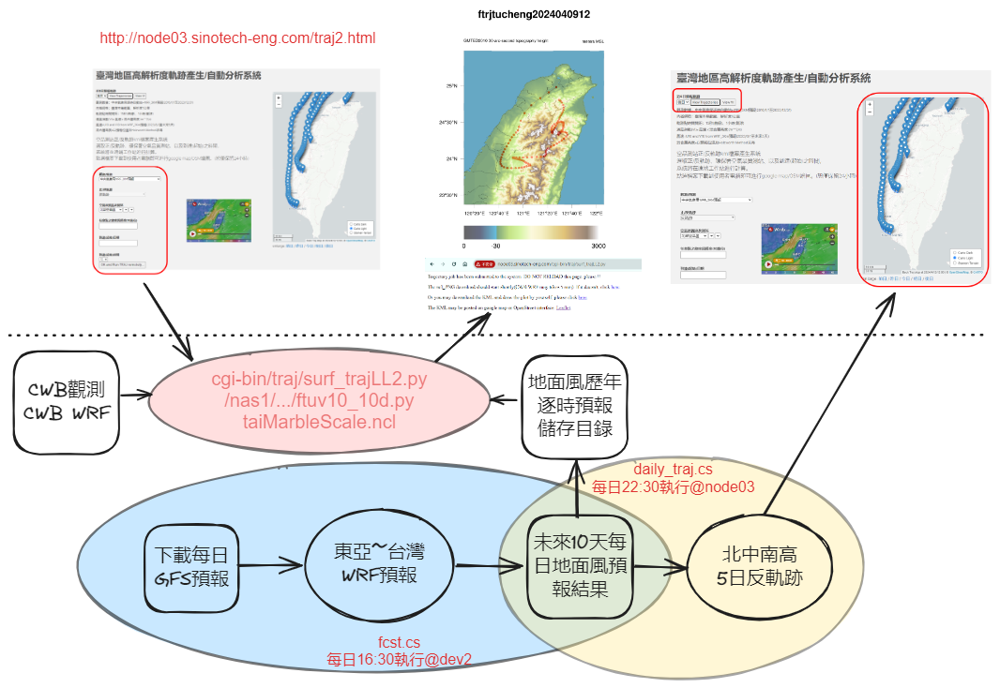
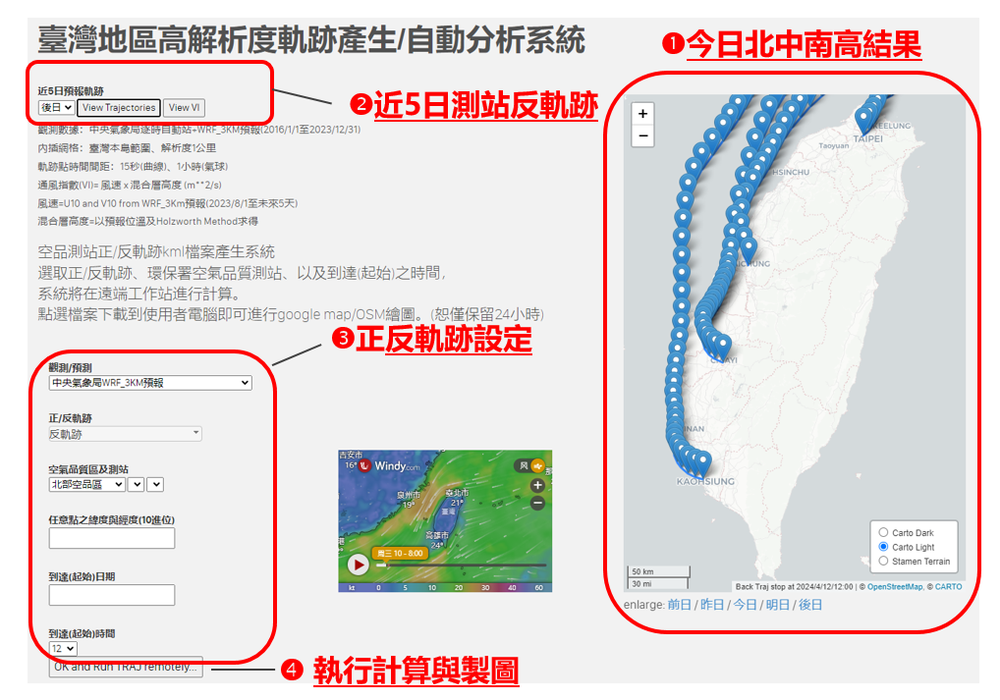
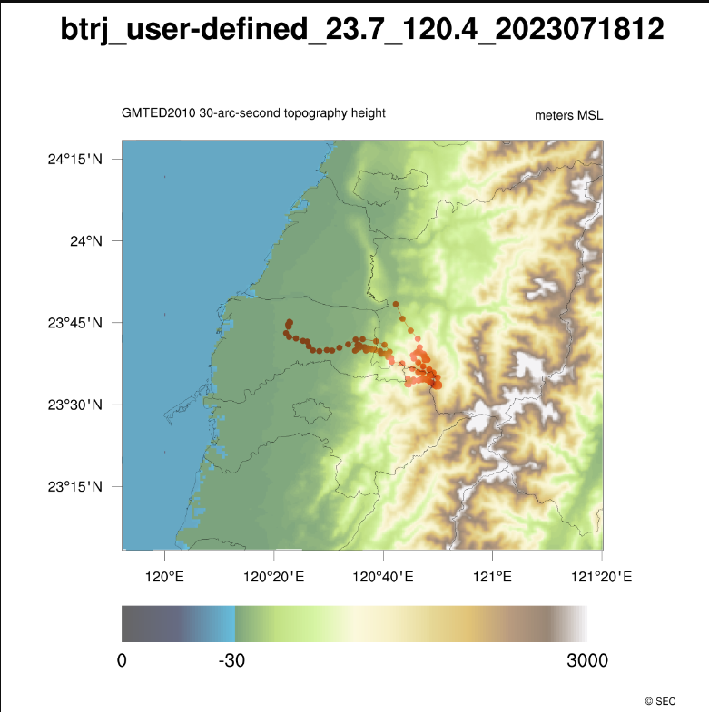

# 地面二維軌跡分析服務網站搬遷至公司內網暨功能提升
{: .no_toc }

<details open markdown="block">
  <summary>
    Table of contents
  </summary>
  {: .text-delta }
- TOC
{:toc}
</details>
---

## 背景

- 臺灣地區高解析度軌跡產生/自動分析系統近5日預報軌跡：[go](http://200.200.31.47/traj2.html)
- [daily_traj.cs][daily_traj.cs]的系統架構、程式設計、以及運作情形詳見[程式說明](./daily_traj_cs.md)，此處針對內網版本的調修、以及新增**任意點功能**加以說明。

### 系統架構



### 版本大要

- IP位置與伺服器
  1. node03(200.200.31.47)
  2. [網址](http://200.200.31.47/traj2.html)
  3. httpd:apache 2.4
- 地面氣象站
  1. 點數484
  2. 使用預內插權重檔：`R414_252_484.bin`
  3. 資料路徑`/nas1/backup/data/cwb/e-service/$yyyy`
  4. 每日中午12時由kuang@master更新。詳見`/home/backup/data/cwb/e-service/get_cwb.sh`([CODiS日報表下載整併](../../wind_models/CODiS/1.cwb_daily_download.md))
- fcst WRF模擬結果
  1. WRF4.0+GFS 10天預報版本
  2. 資料路徑`/nas2/backup/data/NOAA/NCEP/GFS/YYYY/tw_CWBWRF_45k`
- html
  1. `/var/www/html/traj2.html`
  2. 新增[任意點之緯度與經度(10進位)](#任意點之緯度與經度(10進位))
- cgi python
  1. `/var/www/cgi-bin/traj/surf_trajLL2.py`
  2. 程式路徑之修正與版本確認
  3. python版本：`/usr/bin/python`(py27)

### 畫面及使用


- 畫面與使用上並沒有太大的差異



- 近5日預報軌跡線分析結果
  - 點選**今日**會出現下拉選單，可選擇前日~後日。每天到達時間都是在正午12時。
  - 點選日期後可以點選檢視軌跡線或通風指數VI
- 空品測站正/反軌跡kml檔案產生系統
  - 依序點選數據來源、正/反軌跡、測站或位置座標、到達(起始)日期與時間
  - 按下**OK and Run TRAJ remotely**、即可啟動程式。

## 程式修改

|程式名稱|修改說明|centos版本|mac版本
|:-:|:-|:-|-|
|[daily_traj.cs][daily_traj.cs]|crontab執行的主程式，修改詳[下]()||
|surf_trajLL2.py|(詳[下](#surf_trajll2py))||
|[ftuv10_5dN.py][ftuv10]|地面風檔案路徑|`uvPath='/nas2/backup/data/NOAA/NCEP/GFS/YYYY/tw_CWBWRF_45k/U10V10_d0'`|`uvPath='/Users/Data/cwb...`
|(由wrfout計算軌跡)|軌跡程式路徑|`path='/nas1/backup/data/cwb/e-service/surf_trj/'`|`path='/Users/Data/cwb...`
|-|程式位置|`os.system('/usr/kbin/csv2kml.py...`|`os.system('/opt/local/bin/csv2kml.py...`
|-|程式位置|`os.system('/usr/kbin/csv2bln.cs...`|`os.system('/opt/local/bin/csv2bln.cs...`
|[daily_trajSt.cs][daily_trajSt.cs]|主要核心作業。需讓root及apache都能讀且執行|新增根目錄WEB|...
|[csv_to_geojson][cj]|需重新安裝(pip)| 0.0.1| 0.0.1
|addVI.py|python版本及位置|`#!/opt/miniconda3/envs/py37/bin/python`|`#!/opt/anaconda3/bin/python`
|(計算通風指數)|行星邊界層檔案位置|`path='/nas2/backup/data/NOAA/NCEP/GFS/YYYY/TWEPA_3k/'`|`path='/Users/Data...'`
|-|csv_to_geojson需重新安裝(pip)|`os.system('/opt/miniconda3/envs/py37/bin/csv_to_geojson '+fnameO)`|`os.system('/opt/anaconda3...`
|[taiMarbleScale][ncl1]|檔案來源路徑|`a = addfile("/nas1/WRF4.0/WPS/geo_em/geo_em.d04_333m.nc","r")`|`a = addfile("/Users/...`
|(繪圖程式)|shp檔|`filename="/var/www/html/taiwan/TWN_COUNTY.shp"`|`filename="/Library/WebServer/Documents/...`
|git|夜間(17:30以後)防火牆開啟無法更新|(不執行)|發佈到sinotec2.github.io.git

### daily_traj.cs

- 此腳本程式是crontab定期要執行的內容，會執行每天的軌跡計算。
- 因應系統環境的設定，主要的修改包括
  1. date指令的差異
  2. 本機磁碟機、轉換成網路磁碟機
  3. 半夜執行(一日之首)、 改成上半夜執行(一日之末)
  4. 取消sinotec2.github.io.git之更新

- date指令的差異

```bash
kuang@node03 ~
$ diff daily_traj.cs /var/www/html/trj_results/daily_traj.cs
2c2
< yesd=$(date -v-1d +%Y%m%d)
---
> yesd=$(date -d -0day +%Y%m%d)
4,6c4,6
<   ymd=$(date -v+${i}d -j -f "%Y%m%d" "${yesd}" +%Y%m%d)
<   y=$(date -v+${i}d -j -f "%Y%m%d" "${yesd}" +%Y)
<   ddd=$(date -v+${i}d -j -f "%Y%m%d" "${yesd}" +%Y-%m-%d)
---
>   ymd=$(date -d "${yesd} +${i}day" +%Y%m%d)
>   y=$(date -d "${ymd}" +%Y)
>   ddd=$(date -d "${ymd}" +%Y-%m-%d)
23,25c24,26
< today=$(date -v+0d +%Y%m%d)
< Tomorr=$(date -v+1d -j -f %Y%m%d "${today}" +%Y%m%d)
< AftTmw=$(date -v+2d -j -f %Y%m%d "${today}" +%Y%m%d)
---
> today=$(date -d +1day +%Y%m%d)
> Tomorr=$(date -d +2day +%Y%m%d)
> AftTmw=$(date -d +3day +%Y%m%d)
```

- 檔案路徑之修正
  - 新增一個根目錄的變數，讓以後系統搬遷更加方便。

```python
16,19c16,20
< PY=/Users/Data/cwb/e-service/btraj_WRFnests/ftuv10_5dN.py #using fcst wrfout_d1,2,3
< CJ=/opt/anaconda3/bin/csv_to_geojson
< VI=/Users/kuang/bin/addVI.py
< GT=/usr/local/bin/git
---
> WEB=/var/www/html
> PY=/nas1/backup/data/cwb/e-service/btraj_WRFnests/ftuv10_5dN.py #using fcst wrfout_d1,2,3
> CJ=/opt/miniconda3/envs/py37/bin/csv_to_geojson
> VI=$WEB/trj_results/addVI.py
> GT=/bin/git
27c28
< cd /Library/WebServer/Documents/trj_results
---
> cd $WEB/trj_results
34c35
< cd /Library/WebServer/Documents
---
> cd $WEB
60,61c63,64
< cd /Users/kuang/GitHub/sinotec2.github.io/traj/trj_results
< for i in 00 m1 m2 p1 p2;do cp -r /Library/WebServer/Documents/trj_results/$i .;done
---
> cd /home/kuang/GitHubRepos/sinotec2.github.io/traj/trj_results
> for i in 00 m1 m2 p1 p2;do cp -r $WEB/trj_results/$i .;done
```

- 核心執行循環
  - 在centos上執行wait.cs，雖然也是停等1秒，但似乎程式仍然停不下來，或檔案有時間差。也可能是cat指令不具有覆蓋能力。造成的效果是3個時間的軌跡線都完全相同。
  - 此處多停等5秒，以便讓所有程式都確認停下來。
  - 每次在執行cat之前先刪除暫存檔`today.csv`，避免重複造成錯誤。

```bash
36c37
<   ~/bin/sub /Library/WebServer/Documents/trj_results/daily_trajSt.cs  $PY $t ${d}
---
>   ~/bin/sub $WEB/trj_results/daily_trajSt.cs  $PY $t ${d}
38a40
> sleep 5
40c42,43
< cd /Library/WebServer/Documents/trj_results
---
> cd $WEB/trj_results
> if [ -e today.csv ];then rm -f today.csv;fi
```

- 不執行git發布

```python
63c66,70
< cd /Users/kuang/GitHub/sinotec2.github.io
---
> exit
> exit
>
>
> cd /home/kuang/GitHubRepos/sinotec2.github.io
65c72
< GT=/usr/local/bin/git
---
> GT=/bin/git
69c76
< TOKEN=$(cat /Users/kuang/bin/git.token)
---
> TOKEN=$(cat /home/kuang/bin/git.token)
```

### surf_trajLL2.py

- 這支程式乃html會呼叫的cgi-python，所有權必須設成`apache:apache`，且擁有者要能執行(python27)，詳細說明見[地面2維軌跡線計算服務](../../utilities/CGI-pythons/surf_trajLL2.md)
- 程式及資料都放在網路磁碟機
- 

```python
$ diff surf_trajLL2.py /var/www/cgi-bin/traj/surf_trajLL2.py
10,17c10,18
< JSON='/Users/Data/cwb/e-service/surf_trj/sta_list.json'
< TRJs={'forc':'/Users/Data/cwb/e-service/btraj_WRFnests/ftuv10.py','obsv':'/Users/Data/cwb/e-service/surf_trj/traj2kml.py'}
< WEB='/Library/WebServer/Documents/'
< CGI='/Library/WebServer/CGI-Executables/'
< INI='/opt/local/bin/conda_ini'
< NCL='/opt/anaconda3/envs/ncl_stable/bin/ncl '
< MBLs={'obsv':'/Library/WebServer/Documents/taiwan/taiMarbleScale.ncl',\
<       'forc':'/Library/WebServer/Documents/taiwan/chnMarble.ncl'}
---
> root='/nas1/backup/data'
> JSON=root+'/cwb/e-service/surf_trj/sta_list.json'
> TRJs={'forc':root+'/cwb/e-service/btraj_WRFnests/ftuv10.py','obsv':root+'/cwb/e-service/surf_trj/traj2kml.py'}
> WEB='/var/www/html/'
> CGI='/var/www/cgi-bin/'
> INI='/var/www/html/trj_results/conda_ini3'
> NCL='/opt/miniconda3/envs/ncl_stable/bin/ncl '
> MBLs={'obsv':WEB+'taiwan/taiMarbleScale.ncl',\
>       'forc':WEB+'taiwan/chnMarble.ncl'}
```

- cgi結果網頁檔頭
  - 移到前面，以便寫出偵錯訊息。

```python
21a23,24
> print 'Content-Type: text/html\n\n'
> print open(CGI+'header.txt','r')
42,43d59
< print 'Content-Type: text/html\n\n'
< print open(CGI+'header.txt','r')
```

- 新增[輸入任意點座標](#新增輸入任意點之緯度與經度10進位)

```python
25,28c28,38
< try:
<   ist=int(nam)
< except:
<   AQ=nam
30,32c40,50
<   fn = open(JSON)
<   d_nstnam = json.load(fn)
<   AQ=d_nstnam[nam]
---
```

- 主要執行命令列。修正成可以接受經緯度之輸入。(詳[下](#cgi-python之修改))

```python
62c78
<   cmd+= TRJ+' -t '+AQ+' -d '+dat+num+' -b '+TF+OUT+';'
---
>   cmd+= TRJ+' -t '+AQll+' -d '+dat+num+' -b '+TF+OUT+';'
```

- 避免複製到錯誤的結果

```python
67c83
<   cmd+='cp topo.png '+fn+'.png;'
---
>   cmd+='mv -f topo.png '+fn+'.png;'
```

## 新增輸入任意點之緯度與經度(10進位)

- 基本上這項功能在命令列版本的[traj2kml.py][traj2kml.py]就已經設計好了，測站的引數可以是
  - 英文的測站名稱(單一站)
  - 前述名稱序列、以分號(`';'`)區隔
  - 緯度與經度(2個實數、以逗號`','`區隔)
- 只需要修改html及cgi-python即可  

### html之修改

- 只需在測站選擇之下及日期選擇之前，插入文字輸入框即可

```html
...
    <select name="AQSname" id="AQSname"></select>

    <label for="latlon">
        任意點之緯度與經度(10進位)
        </label><p> <input type="text" name="latlon" id="ll"></p>

    <label for="date">
...
```

- 將名稱(`name`)令為`latlon`，以便cgi-python可以呼叫。

- 新增功能之輸入列畫面


### cgi-python之修改

- 修改邏輯
  1. 測站及經緯度二者只能選一個，如果要選測站， `latlon`欄位必須空白
  2. 如果欄位有任何文字，程式會優先解讀成`latlon`
  3. 過去以測站名稱作為檔名的前綴、以及[traj2kml.py][traj2kml.py]的輸入引數，此2者必須區分，以因應`latlon`的輸入

```python
...
nam = form.getvalue('AQSname')
ll = form.getvalue('latlon')
if len(ll)==0:
  try:
    ist=int(nam)
  except:
    AQ=nam
  else:
    fn = open(JSON)
    d_nstnam = json.load(fn)
    AQ=d_nstnam[nam]
  AQll=AQ
else:
  lls=ll.split()
  if len(lls)<2:
    for delt in ',;':
      if delt in ll:
        if ll.count(delt)>1:sys.exit('number of delimiters must be one')
        ll=ll.replace(' ','')
        lls=ll.split(delt)
  lls=[i.replace(',','').replace(';','') for i in lls]
  llo=[str(round(float(i),1)) for i in lls]
  AQ='user-defined'+'_'+llo[0]+'_'+llo[1]+'_'
  AQll=lls[0]+','+lls[1]
os.system('echo '+AQ+OUT)
...
```

1. `AQll`為[traj2kml.py][traj2kml.py]的測站引數，可以是測站英文名稱、或`latlon`(修改成無空格、以逗號`','`區隔)
2. `AQ`為檔名前綴，測站名稱、或`user-defined_..._...`，出現在檔名以及圖面title。實數取小數點1位約略之。
3. 輸入文字之分隔字元：優先以空格進行區隔，如果同時又參雜了逗號或分號，則另予以去除。如果沒有空格，則分別試以逗號或分號進行區隔。

[traj2kml.py]: https://sinotec2.github.io/Focus-on-Air-Quality/wind_models/CODiS/5.traj/#軌跡程式說明 "traj2kml.py"

### 結果



[ncl1]: <https://sinotec2.github.io/Focus-on-Air-Quality/utilities/Graphics/NCL/taiMarbleScale/> "軌跡線貼在Marble底圖上"
[ftuv10]: https://sinotec2.github.io/Focus-on-Air-Quality/TrajModels/ftuv10/ftuv10 "ftuv10.py程式說明"
[daily_trajSt.cs]: <https://sinotec2.github.io/Focus-on-Air-Quality/TrajModels/ftuv10/daily_traj_cs/#背景執行批次daily_trajstcs內容> "背景執行批次daily_trajstcs內容"
[cj]: <https://sinotec2.github.io/Focus-on-Air-Quality/TrajModels/ftuv10/daily_traj_cs/#程式說明> "執行csv_to_geojson"
[daily_traj.cs]: ./daily_traj_cs "daily_traj.cs程式說明"