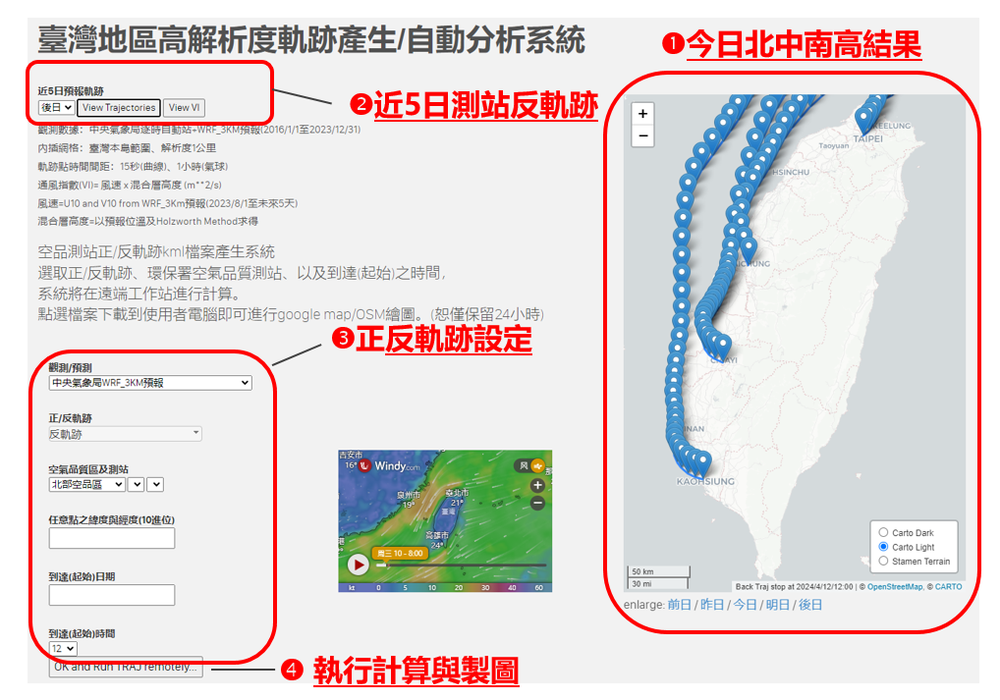

# 臺灣地區高解析度軌跡產生/自動分析系統

{: .no_toc }

<details open markdown="block">
  <summary>
    Table of contents
  </summary>
  {: .text-delta }
- TOC
{:toc}
</details>

---

## 前言

或參自動版：[臺灣地區高解析度軌跡產生/自動分析系統](surf_trajLL2.md)

## 實例

- 以下皆更新至traj2.html版本

### 網頁計算服務網址

- http://sinotec24.com/traj.html @iMacKuang[^9]
- http://node03.sinotech-eng.com/traj2.html @node03

### html畫面



- 今日12時北(中山)、中(忠明)、南(嘉義)、高(前金)測站反軌跡
- 近5日測站反軌跡選項
  - 
- 畫面左側的9個物件
  - 主要是6個下拉選單(selectmenu)、
  - 一個日期選單(datepicker)、以及一個button submit物件做為整體提交並呼叫cgi_python(traj/surf_traj3.py)的觸發。
- 右方
  - traj.html：一典型計算結果範例，說明模式計算能力(軌跡會繞山)。
  - traj2.html：今日12時北、中、南、高空品測站反軌跡計算結果
- 選單都是jquery套件，其中測站較為複雜，是連動下拉選單，主要應用append方法，按照前一選擇結果，依序帶出後一選單的內容。
- 提供cgi_python的變數4項變數
  - dirFB(正/反軌跡的方向選擇)
  - AQSname(測站代碼)、
  - date(日期)、
  - number(小時)。


### traj.html

- traj2.html說明詳見[node03](https://node03.sinotech-eng.com/traj2.html_程式說明.html)或[boostnote](https://boostnote.io/shared/05cd78db-c218-49dc-8864-46c8e77fd2c6)，

### surf_traj3.py

    主要為地面軌跡計算程式負責計算(traj2kml.py)，在程式中以os.system()呼叫，立即執行。主要理由是因為:
        程式執行時間較短，很快會有結果，再加上...
        系統會尋找過去執行成果，如果已經計算過了，將會直接提交結果，不再另行計算，以減省需要時間。
    此處以測站代碼，而非測站名稱進行計算，traj2km.py有因而進版。
    調用jquery的data-auto-download，直接下載成果檔案到客戶端的「下載」目錄。
    提供Leaflet連結，讓客戶可以馬上檢視成果，自行研判是否合理。
        Leaflet的設定在index.js裏(詳下)
        surf_traj3.py
        2.1 KB

```html
$ cat -n surf_traj3.py
    1  #!/usr/bin/python
    2  # -*- coding: UTF-8 -*-
    3
    4  import cgi, os, sys
    5  import cgitb
    6  import tempfile as tf
    7  import json
    8
    9  form = cgi.FieldStorage()
    10  dirTJ={'b':'T','f':'F'} #back->true; foreward->false
    11  nam = form.getvalue('AQSname')
    12  try:
    13    ist=int(nam)
    14  except:
    15    AQ=nam
    16  else:
    17    fn = open('/Users/Data/cwb/e-service/surf_trj/sta_list.json')
    18    d_nstnam = json.load(fn)
    19    AQ=d_nstnam[nam]
    20  os.system('echo '+AQ+'>&/tmp/trj.out')
    21  DIR = form.getvalue("dirFB")
    22  TF=dirTJ[DIR[0]]
    23  num = form.getvalue("number")
    24  dat = form.getvalue("date")
    25  message='../../trj_results/'+DIR+AQ+dat+num+'.csv'
    26  print """\
    27  Content-Type: text/html\n\n
    28    <html>
    29    <head>
    30      <title>TRAJ KML result</title>
    31      <meta name="viewport" content="width=device-width, initial-scale=1">
    32          <script src="http://code.jquery.com/jquery-3.2.1.min.js"></script>
    33          <script>
    34          $(function() {
    35                  $('a[data-auto-download]').each(function(){
    36                          var $this = $(this);
    37                          setTimeout(function() {
    38                          window.location = $this.attr('href');
    39                          }, 2000);
    40                  });
    41          });
    42          </script>
    43    </head>
    44  """
    45  if os.path.isfile('/Library/WebServer/Documents/'+message[6:]):
    46    print """\
    47    <body>
    48    <p>The assigned KML file has been created and maybe downloaded in your Downloads directory.</p>
    49    <p>You may re-download by clicking this <a href="%s">link</a>, or...</p>
    50    <p> submit the KML file at Google Maps or OpenStreet interface at the
    51    <a href=http://114.32.164.198/Leaflet/docs/index.html>Leaflet</a>.</p>
    52    <p> return to the previous page and redefine the trajectory.</p>
    53    </body>
    54    </html>
    55    """  % (message+'.kml')
    56  else:
    57    os.system('cd /Library/WebServer/Documents; \
    58    /Users/Data/cwb/e-service/surf_trj/traj2kml.py -t '+AQ+' -d '+dat+num+' -b '+TF+ '>>/tmp/trj.out')
    59    print """\
    60    <body>
    61    <p>The KML download should start shortly. If it doesn't, click
    62    <a data-auto-download href="%s">here</a>.</p>
    63    <p>The KML may be posted on google map or OpenStreet interface:
    64    <a href=http://114.32.164.198/Leaflet/docs/index.html>Leaflet</a>.</p>
    65    </body>
    66    </html>
    67    """  % (message+'.kml')
```

index.js

    此js檔為調用D3js(Leaflet提供)的橋梁，主要使用者設定都在此一檔案內，包括了：
        起始值中心點的位置(line 11)
        起始地圖的縮放比例(line 12)
        貼圖的顏色、透明度等(line 15~17)
        起始站的標籤與文字內容(line 37~45)，由layer第1個物件中提取。

```java
$ cat -n index.js 
    1  (function (window) { 
    2      'use strict'; 
    3      var L = window.L; 
    4 
    5      function initMap() { 
    6          var control; 
    7          var osm = L.tileLayer('http://{s}.tile.openstreetmap.org/{z}/{x}/{y}.png', { 
    8              attribution: 'Map data &copy; 2013 OpenStreetMap contributors' 
    9          }); 
    10          var map = L.map('map', { 
    11              center: [23.6, 120.9,], 
    12              zoom: 7 
    13          }).addLayer(osm); 
    14          var style = { 
    15            color: 'blue', 
    16              opacity: 0.5, 
    17              fillOpacity: 0.3, 
    18              weight: 1, 
    19              clickable: false 
    20          }; 
    21          L.Control.FileLayerLoad.LABEL = ''; 
    22          control = L.Control.fileLayerLoad({ 
    23              fitBounds: true, 
    24              layerOptions: { 
    25                  style: style, 
    26                  pointToLayer: function (data, latlng) { 
    27                      return L.circleMarker( 
    28                          latlng, 
    29                          { style: style } 
    30                      ); 
    31                  } 
    32              } 
    33          }); 
    34          control.addTo(map); 
    35          control.loader.on('data:loaded', function (e) { 
    36              var layer = e.layer; 
    37                          var kk=Object.keys(layer._layers); 
    38                          var i=kk[0]; 
    39                          var lat0=layer._layers[i]["_latlng"]["lat"]; 
    40                          var lon0=layer._layers[i]["_latlng"]["lng"]; 
    41                          var ymd=layer._layers[i]["feature"]["properties"]["description"]; 
    42              console.log(layer._layers[i]["feature"],layer._layers[i]["_latlng"]); 
    43                  L.marker([lat0, lon0]).addTo(map) 
    44      .bindPopup(ymd) 
    45      .openPopup(); 
    46          }); 
    47      } 
    48 
    49      window.addEventListener('load', function () { 
    50          initMap(); 
    51      }); 
    52  }(window));
```

[^9]: 125.229.149.182為Hinet給定，如遇機房更新或系統因素，將不會保留。敬請逕洽作者：sinotec2@gmail.com.
