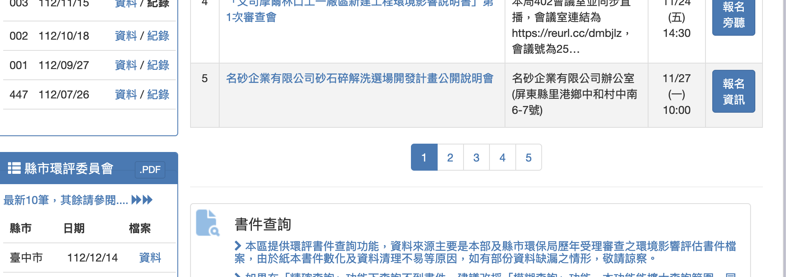
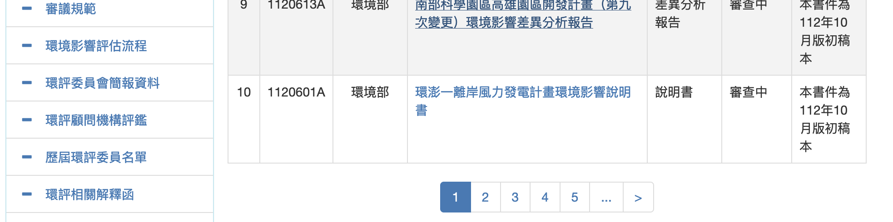
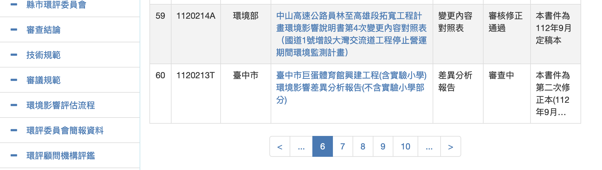

# 環評書件書目表之全部下載與整理
{: .no_toc }

<details open markdown="block">
  <summary>
    Table of contents
  </summary>
  {: .text-delta }
- TOC
{:toc}
</details>
---

## 背景

- 環境部環評書件共儲存了7500多本中央與地方審查的環評相關文件，為環評過程的重要參考依據。
- Sizing
  - 下載一本報告約需10分鐘、全部下載約需52天。
  - 一本報告約230MB，全部估計1.7T
- 由於報告索引的建立並不是很完整，最直覺的「計畫類別」不單有前後對照不一的問題，也有很多案件並未給定類別，導致搜尋時的嚴重落差。需自行重建索引。
  - 按照各個「計畫類別」分別下載的[程式](./get_html.py)與[說明](./get_html.md)
  - 按照書目`csv`檔案內容分批下載，可以詳見[環評書件章節附錄之下載](./get_eia4.md)
- 位詳細介紹在此分兩個段落說明。此處先介紹索引表格的建立，再進一步介紹下載的爬蟲程式。
- 因網頁設有防爬蟲的隨機驗證碼，只能藉由`selenium`的點擊動作來觸發網站程式。還好一頁有10條書目內容，經重複750次可以完整下載索引表，需時約2個小時多一些。

## 程式說明

### IO's

- 這支程式使用到`chromedriver`來訪問網站
- 網頁內容(`Id`、選項、`LINK_TEXT`等等)是否一致，每次使用時還是需要再次確認
- 將畫面全部傳回本機，命名為`all_pageNNN.html`，NNN由1~750。

### 主程式邏輯

[rd_allPages.py](./rd_allPages.py)程式碼使用了 `Selenium WebDriver` 來自動化地瀏覽和抓取一個網頁的內容。 它的主要功能是遍歷指定網站的多個頁面，並將每個頁面的 HTML 內容儲存到本機檔案中。 以下是這段程式碼的詳細解釋：

1. **導入必要的庫**：
    - 從 `selenium` 庫匯入 `webdriver`，用於控制瀏覽器。
    - 導入 `Select`，用於處理下拉選擇選單。
    - 導入 `time` 和 `os`，用於處理時間和作業系統相關的功能。
    - 匯入 `WebDriverWait` 和 `expected_conditions`（別名 `EC`），用於等待頁面元素達到某種狀態。

2. **定義點選等待函數 (`click_wait`)**：
    - 這個函數接受一個元素路徑和項，執行點擊操作，然後等待直到頁面重新整理。
    - 使用 `WebDriverWait` 來確保點擊操作後頁面已經更新。

3. **初始化 WebDriver 和開啟網頁**：
    - 使用 `webdriver.Firefox()` 建立一個 Firefox 瀏覽器實例。
    - 開啟指定的 URL（台灣環境部的環境影響評估文件頁面）。

4. **選擇項目類別**：
    - 透過 `Select` 物件選擇頁面上的一個下拉式選單，這裡的目標是選定「計畫類別」為「null」。

5. **準備檔案名稱清單和頁面遍歷**：
    - 建立一個檔案名稱列表，用於儲存不同頁面的內容。
    - 檢查文件是否已存在，如果不存在則抓取頁面內容。
    - 使用循環遍歷網站的多個頁面，頁數上限設定為 `npage`（750）。
    - 對於每一頁，使用 `click_wait` 函數點擊頁面上的連結或按鈕，然後抓取並儲存目前頁面的 HTML 內容。
    - 詳下述說明

6. **儲存頁面內容**：
    - 將每個頁面的 HTML 內容寫入對應的文件中。
    - 在抓取每個頁面後暫停 10 秒，以減少對伺服器的壓力。

### 迴圈詳解

最後一個 for 迴圈中，目的是遍歷網頁並保存每個頁面的內容。 以下是這段程式碼的詳細解釋：

```python
for i in range(2,npage):
    ii=str(i);pth=By.LINK_TEXT
    if i<=4: #skip the meeting pages selection
        pth=By.XPATH;ii='(//a[text()="'+ii+'"])[2]'
    if (i-1)%5==0:
        if i<=6:
            ii="...";pth=By.LINK_TEXT
        else:
            pth=By.XPATH;ii='(//a[text()="..."])[2]'
    else:
        if os.path.exists(fnames[i]):continue
    result=click_wait(pth,ii)
    if os.path.exists(fnames[i]):continue
    with open(fnames[i], "w") as f:
        f.write(driver.page_source)   
    time.sleep(10)
```

1. **循環遍歷**:
    - `for i in range(2, npage):` 循環從 2 開始，直到 `npage`（定義為 750），用於遍歷網站的多個頁面。

2. **確定如何選擇頁面**:
    - `ii` 和 `pth` 變數用於決定如何選擇頁面連結。
    - `ii=str(i); pth=By.LINK_TEXT`：預設情況下，使用頁面上的連結文字來定位元素。
    - 情況1:閃避選到環評會議。一般可能有4～5頁。
      - 如果`i<=4`,則 `pth` 改為 `By.XPATH`，`ii='(//a[text()="'+ii+'"])[2]'`第2個數字的 `LINK_TEXT` 。
    - 情況2:如果 `(i-1) % 5 == 0`，表示每隔五頁，頁面的選擇邏輯會改變。
      - 如果 `i <= 6`，只會有一個`"..."`（用於網頁中的「下一批」連結），則 `ii` 設定為`"..."` ，`pth` 保持為 `By.LINK_TEXT`。
      - 如果 `i > 6`，會有2個省略符號`"..."`第一個是「上一批」、第2個是「下一批」，則 `pth` 改為 `By.XPATH`，並且選取第2個省略符號，以點擊正確的物件。

||
|:-:|
|<br>環評會議表。一頁有5個會議，可能有4～5頁，與書目表同樣是數字的`LINK_TEXT`</br>|
||
|<br>環評書件列表。一頁有10本書件，與前述會議表同樣是數字的`LINK_TEXT`</br>|
||
|<br>第6筆以後的環評書件列表。會出現2個省略符號`"..."`第一個是「上一批」、第2個是「下一批」</br>|


1. **檢查文件是否已存在**:
    - `if os.path.exists(fnames[i]): continue`：這行程式碼檢查對應的檔案是否已經存在。 如果存在，那麼跳過目前迭代，不再重新下載該頁面。

2. **點擊並等待頁面更新**:
    - `result = click_wait(pth, ii)`：呼叫 `click_wait` 函數，根據上述邏輯決定的元素（透過連結文字或 XPath），點選頁面上的連結或按鈕。

3. **再次檢查文件是否已存在**:
    - 點擊操作後，再次檢查檔案是否存在。 這是為了確保不重複寫入同一頁內容。

4. **儲存頁面內容**:
    - 如果文件尚未存在，使用 `with open(fnames[i], "w") as f` 開啟文件，並寫入 `driver.page_source`的內容，即目前瀏覽器頁面的原始碼。
    - `time.sleep(10)`：處理完一個頁面後暫停 10 秒。 這是一種防止過快請求網站而可能被伺服器封鎖的措施。

### 後處理解讀程式

- 下載完成後，將所有`all_page*.html`檔名存成`fnames.txt`(用`ls all_page*.html >fnames.txt` 指令)
- 以下這支程式([htm2csv.py](./html2csv.py))將`html`轉成`csv`資料表

本程式使用了 `Pandas` 和 `Beautiful Soup` 函式庫來解析一系列HTML文件，並從中擷取表格數據，最後將這些資料合併為一個 `Pandas DataFrame`。 以下是對程式碼的詳細解釋：

1. **導入所需庫**:
    - 導入Pandas（用於資料處理）、Beautiful Soup（用於解析HTML）和os（用於作業系統功能，如檔案路徑）。

2. **初始化DataFrame**:
    - `df0 = pd.DataFrame({})`：建立一個空的DataFrame，用於之後儲存所有合併的資料。

3. **定義列名**:
    - `col = ['cat', 'id', 'gov', 'name', 'book', 'prog', 'desc']`：定義了一個列名列表，但在後續代碼中並未直接 使用。

4. **讀取檔名列表**:
    - 從"fnames.txt"檔案讀取HTML檔案的名稱，存入清單`fnames`。

5. **遍歷並解析每個HTML檔**:
    - 透過循環`for fname in fnames:`遍歷檔案清單。
    - 使用`with open(fname, 'r') as html`開啟每個HTML檔案。
    - `soup = BeautifulSoup(html, 'html.parser')`：使用Beautiful Soup函式庫解析HTML內容。

6. **擷取並解析表格**:
    - `table = soup.find('table', {'id': 'cphContent_gvAbstract'})`：在HTML中找到具有特定ID的表格。
    - `header = [th.text.strip() for th in table.find_all('th', {'class': 'gridHeader'})]`：擷取表頭資訊。
    - 在每一行中提取單元格資料並加入`data`清單。

7. **建立DataFrame並合併資料**:
    - `df1 = pd.DataFrame(data, columns=header)`：使用擷取的資料和表頭建立一個新的DataFrame。
    - `combined_df = pd.concat([df0, df1], ignore_index=True)`：將新建立的DataFrame與先前的DataFrame合併。
    - `df0 = combined_df`：更新df0為合併後的DataFrame。

程式碼的最終結果是一個包含所有 `HTML` 檔案表格資料的 `Pandas DataFrame`，其中每個檔案的資料都會附加到這個 `DataFrame` 中。 需要注意的是，這段程式碼假設每個 `HTML` 檔案中的表格結構和列名是一致的。 如果結構不一致，可能需要額外的邏輯來處理不同的情況。

## 給定計畫類別索引

### 「計畫類別」代碼及名稱對照表之讀取

- 從`html`檔案中的`<select>`片段中讀取選項代碼(`B01`~`B99`)與其顯示的名稱，建立`proj_class.json`對照表備用，詳見[proj_class.py](./proj_class.py)的[程式說明](./proj_class.md)。須注意：
  - 代碼並非連續
  - 中文名稱可能也有版本的差異
  - 需調用`json`

```python
with open('proj_class.json','r') as f:
    pc=json.load(f)
```

### 從「計畫類別」下拉選單建立書目類別

- 指定類別所得到的書目，自然就可以帶有該類別的屬性。這部分的工作雖然只涵蓋了7500本中的2000多本，然而也算是幫了不少的忙。
- 建立類別書目可以使用[get_htmlCat.py](./get_htmlCat.py)，詳見[程式說明](./get_html.md)
- 因為書目中文件的名稱是唯一的，可以建立文件名稱與計畫類別的對照表，在將此對照表應用在7500本的書目表，即可有效減少無類別的本數。
  - `df0`為7500本的書目表，`df`為2000多本書目表

```python
st=set(df0.name)-set(df.name)
a=df0.loc[df0.name.map(lambda x:x not in st),"name"]

nam_cat={i:j for i,j in zip(df.name,df.cat)}
df0.loc[a.index,'cat']=[nam_cat[i] for i in list(a)]
```

### B27_能源或輸變電工程之開發

- 這類的特徵還蠻顯著的，關鍵詞為：`kw=['電廠','風力','發電','電力']`

```python
for i in kw:
    a=df0.loc[(df0.cat.map(lambda x:x[0]!='B')) & (df0.name.map(lambda x:i in x and '和平水泥廠計畫' not in x))]
    df0.loc[a.index,'cat']='B27'
```

- 值得注意的是和平水泥廠使用和平電廠飛灰來資源化，計畫的主體是和平水泥，是屬於工廠設立類別，不是電廠，所以要排除該項計劃。

### B05_大眾捷運系統之開發

- 這項計畫有別於鐵道計畫，以城內交通之捷運、輕軌為主。不包括高鐵。
- 機場捷運有點不太清楚，此處還是歸類在B05
- 要注意捷運站有共構計畫，主體為商辦計畫，不算在B05之內。

```python
a=df0.loc[(df0.name.map(lambda x:x in st)) & (df0.name.map(lambda x:'捷運' in x and '富邦人壽' not in x and '冠德建設' not in x)) & (df0.cat.map(lambda x:x[0]!='B'))]
df0.loc[a.index,'cat']='B05'
a=df0.loc[(df0.cat.map(lambda x:x[0]!='B')) & (df0.name.map(lambda x:'輕軌' in x ))]
df0.loc[a.index,'cat']='B05'
```

### B02_園區之開發

- 由於計畫名稱中有園區的非常多，此處的園區是集合性的工廠性質、生產服務過程具有非生活污染排放的可能性。`kw=['創新園區','軟體園區','科技商務園區','林口園區','醫學園區','科學城','工業區','工商綜合專用區','研發科技中心','產業園區','工業園區','智慧園區','科技園區',]`

```python
for i in kw:
    a=df0.loc[(df0.cat.map(lambda x:x[0]!='B')) & (df0.name.map(lambda x:i in x))]
    df0.loc[a.index,'cat']='B02'
```

### 結果輸出

- 定義年代：環評書件的`id`是以民國年代為前3碼，因此可將其選取、轉成數字加上判斷，便可選擇所要年代的書件
    - 近5年：`near0=(df0.id.map(lambda x:int(x[:3])>=107))`
- 定義計畫類別：`bs=['B02','B05','B27']`
- 定義程序：`(df0.prog!='審查中')`
- 將類別代碼後面加上中文名稱，方便歸檔。

```python
a=df0.loc[(df0.cat.map(lambda x:x in bs)) & (df0.prog!='審查中') & near0].reset_index(drop=True)
a.cat=[i+'_'+pc[i] for i in a.cat]
a.set_index('cat').to_csv('cat4all.csv')
```

- 按照書目`csv`檔案內容分批下載，可以詳見[環評書件章節附錄之下載](./get_eia4.md)
