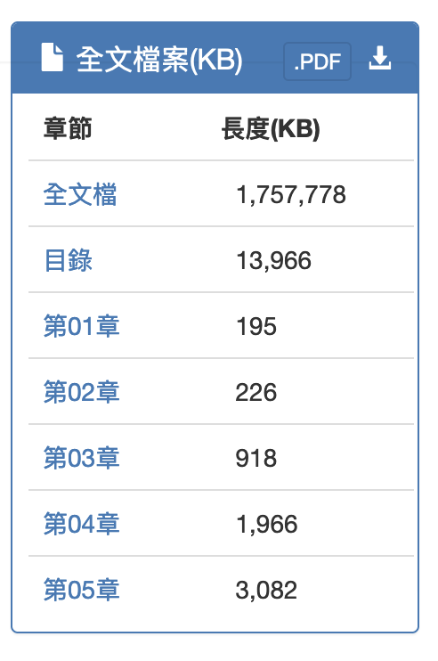

# 環評書件章節附錄之下載
{: .no_toc }

<details open markdown="block">
  <summary>
    Table of contents
  </summary>
  {: .text-delta }
- TOC
{:toc}
</details>
---

## 背景

- 此處介紹特定書目之章節與附錄檔案的下載。書目的產生參考[按照計畫類別下載環評書件書目表](./get_html.md)及[環評書件書目表之全部下載與整理](./download_EIA_report.md)。
- 由於環評書件(環說書、環評報告書)的章節是固定且各自存檔的、各個附錄也都切割成一個個的檔案，按照順序編列C00~C13、A01~A99。
- 環評書件查詢系統(本系統)是以類似[REST][rest]指令方式提供檔案。檔案url雖然不能以`wget`或是`curl`等指令直接下載，卻可以用`selenium`的`webdriver`連線取得。
  - `url`內含了2個程式的引數：書目的`id`(`shcode`)、以及PDF檔案名稱(`sFileName`)。
  - `url`通式：

```python
iend={'C':14,'A':31}
...
      url_root='https://eiadoc.epa.gov.tw/eiaweb/DownloadFiles.ashx?shcode='+id+'&sFileName='
      for ac in 'CA':
        pdf_files=[ac+'{:02d}'.format(i)+'.PDF' for i in range(1,iend[ac])]
        urls = [url_root+p for p in pdf_files] # 循环遍历 URL 列表并下载文件
```

- 因此程式設計的重點就是正確給定這2個引數，並將結果搬移到正確的目錄下(因`PDF`檔案名稱沒有計畫或`id`的訊息)



## 程式說明

### 重要IO與參數

[get_eia4.py](./get_eia4.py)程式碼主要是用來從環評書件網站(eiadoc.epa.gov.tw)上自動下載指定環評報告的 `PDF` 檔案。

主要參數說明:

1. `df`: 從 `CSV` 檔案讀入的待下載報告基本資訊
2. `id`: 報告編號
3. `cat`: 報告分類
4. `nam`: 報告名稱  
5. `target_directory`: 儲存下載檔案的目錄
6. `url_root`: 報告下載鏈接的根網址
7. `pdf_files`: 分卷 PDF 檔案名稱清單
8. `urls`: 組合而成的完整下載鏈接清單

主要邏輯:

1. 讀取 `CSV`,提取下載清單資訊 
2. 迴圈逐一下載報告:
   - 組合目標儲存路徑及檔案名
   - 判斷檔案是否已存在
   - 組合下載鏈接
   - 以 `WebDriver` 開啟鏈接下載檔案
   - 移動下載的檔案到指定目錄
3. 關閉瀏覽器結束

輸入:

1. 報告分類與編號區間參數
2. 報告基本書目資訊 `CSV` 

輸出:
下載的 `PDF` 報告檔案

### 程式說明

您的腳本 [get_eia.py](./get_eia4.py) 用於從網站上下載 `PDF` 檔案並將它們移至特定的目錄中。 這是一個自動化的資料收集腳本，使用了`Selenium`庫來模擬瀏覽器行為。 以下是對您腳本的逐行解釋：

1. **導入必要的庫**:
    - 匯入了`webdriver`用於控制瀏覽器，`Options`用於設定瀏覽器選項，以及`pandas`、`os`、`sys`、`time`、`random`、`glob`和`shutil` 等常用函式庫。

2. **讀取CSV檔**:
    - 透過`sys.argv[1]`取得命令列參數指定的CSV檔名(一般指得是類別ID)，讀取並存入資料表`df`中。

3. **設定Chrome驅動程式和選項**:
    - 設定Chrome驅動的路徑和啟動選項（無頭模式）。

4. **循環遍歷CSV檔案中的行**:
    - 從命令列參數取得起始和結束的索引（`ib`和`ie`），遍歷CSV檔案中的對應行。
    - 使用Chrome驅動程式建立一個新的瀏覽器實例。

5. **為每個專案建立目標目錄**:
    - 根據計畫類別（`cat`）和計畫編號（`id`）及計畫名稱（`nam`）建立目標目錄。

6. **建構並存取URL以下載PDF檔**:
    - 根據給定的項目編號和檔案名稱構造URL。
    - 存取URL以下載PDF檔案。

7. **處理文件下載**:
    - 透過`time.sleep`新增隨機等待時間，以模擬使用者行為。
    - 檢查檔案是否已下載，如果未下載，則進行下載。

8. **移動下載的檔案到目標目錄**:
    - 使用`glob`尋找下載的PDF文件，然後使用`shutil.move`將其移至目標目錄。

9. **關閉瀏覽器**:
    - 下載完成後，關閉瀏覽器實例。

腳本中有幾個重要的設計注意點：

- 此腳本依賴 `Selenium` `WebDriver` 和 `Chrome` 瀏覽器的特定版本。
- 使用無頭瀏覽器模式以便能夠在背景運行。
- 使用隨機等待時間以模擬人類使用者的行為，是為了防止被伺服器識別為自動化腳本。
- 腳本處理了檔案已存在的情況，以避免重複下載。
- 腳本在下載檔案後關閉瀏覽器實例，以釋放內存資源。
- 腳本透過命令列參數接收輸入，以便為了分批下載增加其靈活性。

## 批次運作

- 為避免造成遠端系統的負荷，並且配合大樓夜間斷網的作業週期，此處以天為作業週期，將`cat4all.csv`內的350筆書目，分成4天進行下載

```bash
0 7 23 11 * cd /XXX2/sespub/epa_reports/works;./get_eia4.py cat4all 1 90
0 7 24 11 * cd /XXX2/sespub/epa_reports/works;./get_eia4.py cat4all 90 180
0 7 25 11 * cd /XXX2/sespub/epa_reports/works;./get_eia4.py cat4all 180 270
0 7 26 11 * cd /XXX2/sespub/epa_reports/works;./get_eia4.py cat4all 270 350
```

[rest]: https://chat.openai.com/ "REST(Representational State Transfer)是一種網路軟體架構風格,被廣泛用於客戶端和伺服器互動類別的軟體系統設計。主要的特徵有:1. 資源導向(Resource) - REST 面向的資料單元是資源,每個資源都有一個唯一識別碼。2. 對資源的操作 - 主要透過HTTP動詞表示對資源的操作行為,如 GET、POST、PUT、DELETE。3. 狀態lessness - 服務端不保留客戶端請求的上下文資訊,從客戶端請求單獨判斷回應。4. 統一介面 - 採用統一的介面與資源進行互動,最典型的是HTTP介面。5. 分層系統 - 系統分為客戶端、伺服器、快取等層,層間互動遵循分散式架構原則。REST架構風格倡導以資源為中心,使用HTTP作為傳輸協定,無狀態,軟體介面一致化的設計概念,被許多網路服務採用,是建構高效網路應用的重要方式。 它簡化了軟體介面的設計,而與具體實現解耦。"