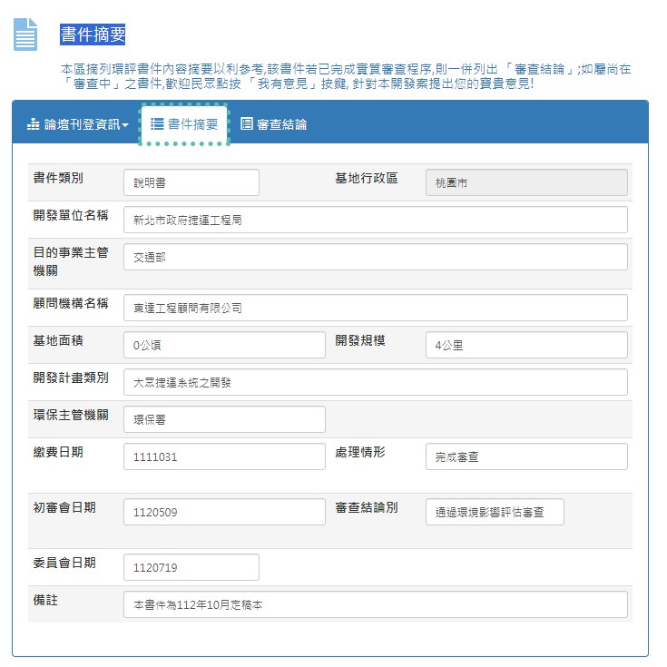

# 環評書件摘要內容之下載
{: .no_toc }

<details open markdown="block">
  <summary>
    Table of contents
  </summary>
  {: .text-delta }
- TOC
{:toc}
</details>
---

## 背景

- 因為專案的目標是環評書件的全文搜索，下載解讀檔案、完成搜索之後，發現還是會希望在畫面上能夠看到摘要資訊，來確認文章內容的正確性。
- 考量到下載的便捷性，最後還是以使用requests模組來連線比較方便

## 環評書件「摘要內容」HTML的畫面與內容範例



- 基本上有2個頁面(`<table ...>`)，一個是「摘要內容」(範例如上)、一個是「審查結論」，2個頁面的內容都要讀取、下載、解析
- 

```html
<!-- 書件摘要 -->
<div role="tabpanel" class="tab-pane active" id="divTabAbstract">
    <div class="table-responsive" style="margin: 2px 2px 2px 2px;">
        <table class="table table-condensed table-hover">
            <tbody>
                <tr class="active">
                    <th id="a" style="width: 15%;">
                        <label for="lbDOCTY">書件類別</label>
                    </th>
                    <td headers="a">
                        <span id="lbDOCTYP" tabindex="700" Name="lbDOCTY" class="form-control input-sm" style="width: 150px;">說明書</span>
                    </td>
                    <th id="l" style="width: 15%;">
                        <label for="[[2023-12-21]]">基地行政區</label>
                    </th>
                    <td headers="l">
                        <input name="ctl00$txDST" type="text" value="高雄市" readonly="readonly" id="txDST" tabindex="711" Name="txDST" class="form-control input-sm" />
                    </td>
                </tr>
                <tr>
                    <th id="b">
                        <label for="txDEPN">開發單位名稱</label>
                    </th>
                    <td headers="b" colspan="3">
                        <input name="ctl00$txDEPN" type="text" value="國巨股份有限公司" id="txDEPN" tabindex="701" Name="txDEPN" class="form-control input-sm" />
                    </td>
                </tr>
                <tr class="active">
                    <th id="c">
                        <label for="txDIRORG">目的事業主管機關</label>
                    </th>
                    <td headers="c" colspan="3">
                        <input name="ctl00$txDIRORG" type="text" value="高雄市政府經濟發展局" id="txDIRORG" tabindex="702" Name="txDIRORG" class="form-control input-sm" />
                    </td>
                </tr>
                <tr>
                    <th id="d" style="width: 15%;">

                        <label id="lbCONSULTI" for="txCONSULTI">顧問機構名稱</label>
                    </th>
                    <td headers="d" colspan="3" id="d1">
                        <input name="ctl00$txCONSULTI" type="text" value="傳閔工程顧問有限公司" id="txCONSULTI" tabindex="703" Name="txCONSULTI" class="form-control input-sm" />
                    </td>
                </tr>
                <tr class="active">
                    <th id="e">
                        <label for="txDAREA">基地面積</label>
                    </th>
                    <td headers="e">
                        <input name="ctl00$txDAREA" type="text" value="0.1582公頃" id="txDAREA" tabindex="704" Name="txDAREA" class="form-control input-sm" />
                    </td>
                    <th id="m">
                        <label for="txDSIZE">開發規模</label>
                    </th>
                    <td headers="m">
                        <input name="ctl00$txDSIZE" type="text" value="1582平方公尺" id="txDSIZE" tabindex="712" Name="txDSIZE" class="form-control input-sm" />
                    </td>
                </tr>
                <tr>
                    <th id="f">
                        <label for="txDECAL">開發計畫類別</label>
                    </th>
                    <td headers="f" colspan="3">
                        <input name="ctl00$txDECAL" type="text" value="工廠之設立" id="txDECAL" tabindex="705" Name="txDECAL" class="form-control input-sm" />
                    </td>
                </tr>
                <tr class="active">
                    <th id="g">
                        <label for="txDSTNAME">環保主管機關</label>
                    </th>
                    <td headers="g">
                        <input name="ctl00$txDSTNAME" type="text" value="高雄市" id="txDSTNAME" tabindex="706" Name="txDSTNAME" class="form-control input-sm" />
                    </td>
                    <th id="n">                              
                    </th>
                    <td headers="n">                              
                    </td>
                </tr>
                <tr>
                    <th id="h">
                        <label for="txSEDAT">繳費日期</label>
                    </th>
                    <td headers="h">
                        <input name="ctl00$txSEDAT" type="text" value="0831215" id="txSEDAT" tabindex="707" Name="txSEDAT" class="form-control input-sm" />
                    </td>
                    <th id="o">
                        <label for="txPORCS">處理情形</label>
                        <label for="txMSNO" style="color: white; opacity: 0.1;">處理情形</label>
                    </th>
                    <td headers="o">
                        <input name="ctl00$txPORCS" type="text" value="辦理結案" id="txPORCS" tabindex="714" Name="txPORCS" class="form-control input-sm" />                              
                    </td>
                </tr>
                <tr class="active">
                    <th id="i">
                        <label for="txTRIA">初審會日期</label>
                    </th>
                    <td headers="i">
                        <input name="ctl00$txTRIA" type="text" value="-" id="txTRIA" tabindex="708" Name="txTRIA" class="form-control input-sm" />
                    </td>
                    <th id="p">
                        <label for="txEXTP">審查結論別</label>
                        <label for="Comment2" style="color: #f5f2f2; opacity: 0.1;">我有意見</label>
                    </th>
                    <td headers="p">
                        <div>
                            <div class="FloatLeft">
                                <input name="ctl00$txEXTP" type="text" value="通過環境影響評估審查" id="txEXTP" tabindex="716" Name="txEXTP" class="form-control input-sm" />
                            </div>
                            <div class="pull-right">
                                <p>
                                    <a id="Comment2" href="#" class="btn btn-primary" data-toggle="modal" data-target="#modalComment2" tabindex="717">
                                        <span class="glyphicon glyphicon-envelope"></span>&nbsp;&nbsp;我有意見
                                    </a>
                                </p>
                            </div>
                        </div>
                    </td>
                </tr>
                <tr>
                    <th id="j">
                        <label for="txCOMIT">委員會日期</label>
                    </th>
                    <td headers="j" colspan="3">
                        <input name="ctl00$txCOMIT" type="text" value="-" id="txCOMIT" tabindex="709" Name="txCOMIT" class="form-control input-sm" style="width: 150px;" />
                    </td>
                </tr>
                <tr class="active">
                    <th id="k">
                        <label for="txNOTES">備註</label>
                    </th>
                    <td headers="k" colspan="3">
                        <input name="ctl00$txNOTES" type="text" value="定稿本 84.10" id="txNOTES" tabindex="710" Name="txNOTES" class="form-control input-sm" />
                    </td>
                </tr>
            </tbody>
        </table>
    </div>
</div>
<!-- 審查結論 -->
<div role="tabpanel" class="tab-pane" id="divTabExct">
    <div class="table-responsive" style="margin: 5px 5px 5px 5px;">
        <table class="table table-condensed table-hover">
            <tbody>
                <tr class="active">
                    <td>
                        <div>
                            <label for="txEXCT" style="color: #f5f2f2; opacity: 0.1;">審查結論</label>
                        </div>
                        <div>
                            <textarea name="ctl00$txEXCT" rows="2" cols="20" id="txEXCT" tabindex="717" Name="txEXCT" class="form-control input-sm" style="height:245px;width:99%;">
「國巨股份有限公司高雄廠毗鄰地變更擴建計畫環境影響說明書」審查結論

發文日期:中華民國85年9月7日
發文字號:(85)府環一字第172491號

一、請補充開發前後廢棄物（含污泥、廢液、溶劑）之排放量及其比較表，並說明處理方案，以不增加污染排放量為原則。
二、圖3.3-1 請將基地現況（含警衛室、廠內之道路、增建廠房部分）明確標示。
...
十六、本案於取得目的事業主管機關核發之開發單位許可後，逾三年始實施開發行為應依環境影響評估法施行細則第四十二條規定辦理。</textarea>
                        </div>
                    </td>
                </tr>
            </tbody>
        </table>
    </div>
</div>                                                
```

## 核心讀取程式

- 因表格分成2頁(大多數狀況、即使有超過2頁的情況，數據也會存在最先的2頁)，因此需先找出全部頁面的表格，再仔細耙梳
- 可以使用中文或英文作為表頭，此處選擇以英文(`{'input':'id'}`)
- 第1頁表格的值位在`value`，類似dict，可以使用`.get()`來取得其數值。
- 第2頁表格的值為整段文字(`<textarea ...>`)，因此用`.text`

```python
from bs4 import BeautifulSoup
import pandas as pd

soup = BeautifulSoup(html_content, 'html.parser')
# Find the table within the HTML content
table = soup.find_all('table', {'class': 'table-condensed'})
# Extract table data into a list of dictionaries
ids=table[0].find_all({'input':'id'})
dd={}
for i in ids:
    dd.update({i.get('id'):[i.get('value')]})
ids=table[1].find_all({'textarea':'id'})
dd.update({ids[0].get('id'):[ids[0].text]})
df=pd.DataFrame(dd)
```

## 整體程式說明

**程式說明：**

[get_eiaDetail.py](./get_eiaDetail.py)這個程式的目的、是從特定網站上爬取與環評書件的摘要資訊，並將資訊存儲到一個 CSV 檔案中。以下是程式的說明：

1. **輸入：**
   - 使用命令列參數 `sys.argv` 來獲取輸入。使用 `sys.argv[1]` 作為檔案名稱的一部分，這取決於命令列傳遞的參數。
   - 讀取名為 `sys.argv[1]+'.csv'` 的 CSV 檔案，這個檔案包含了環評相關的資訊，例如 `id`、`cat`、`name` 等。

2. **程式組織：**
   - 使用 `pandas` 來處理資料。首先，程式讀取 CSV 檔案成為`dfi`，然後過濾掉 `cat` 等於 'cat' 的資料行。(連接多個csv時將會重複出現表頭)
   - 建立一個空的 DataFrame `df`，用於存儲爬取的資料。

3. **爬取資料：**
   - 程式通過迴圈遍歷 DataFrame `dfi` 中的每一行資料，獲取 `id`、`cat` 和 `name`。
   - 透過這些資訊構建特定網址 `url`。
   - 使用 `requests` 發送 GET 請求獲取網頁的 HTML 內容。

4. **解析 HTML：**
   - 使用 `BeautifulSoup` 解析 HTML 內容。
   - 在 HTML 內容中找到 `class` 為 `'table-condensed'` 的表格，該表格包含所需的資訊。
   - 從表格中提取 `id` 屬性為 'input' 的元素，構建一個字典 `dd`。
   - 從表格中提取 `id` 屬性為 'textarea' 的元素，將其加入 `dd`。

5. **資料處理：**
   - 將字典 `dd` 轉換為 DataFrame。
   - 將每次迴圈獲得的 DataFrame 與先前的 DataFrame 進行合併。
   - 如果是第一次迴圈，則直接將 `df` 設置為當前的 DataFrame。

6. **資料寫入：**
   - 將最終的 DataFrame `df` 寫入 CSV 檔案，檔案名稱為 'detail.csv'。

7. **時間控制：**
   - 在每10次迴圈結束後，程式會暫停一段時間，隨機選擇介於 5 到 20 秒之間的時間，以模擬人的操作，同時減少對目標伺服器的訪問次數。

