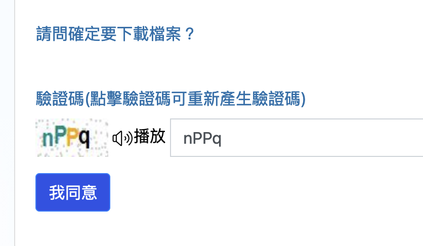
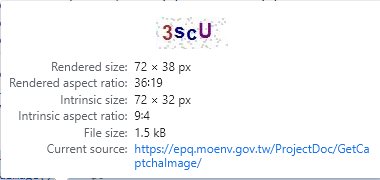
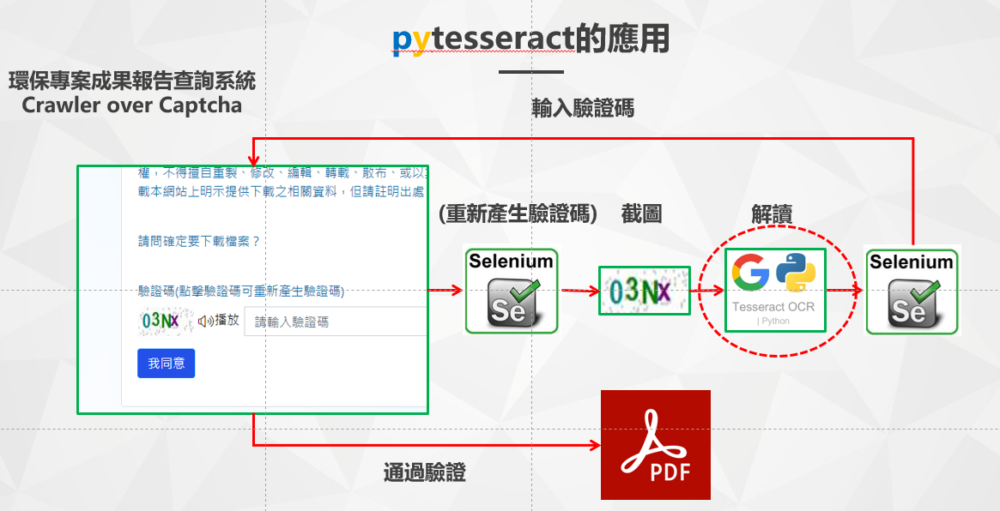

# 環保專案成果檔案之下載
{: .no_toc }

<details open markdown="block">
  <summary>
    Table of contents
  </summary>
  {: .text-delta }
- TOC
{:toc}
</details>
---

## 背景

- 本文處理[環境部環保專案成果報告查詢系統網站][epq](下稱[網站][epq])下載檔案最核心的關鍵：填入驗證碼並取得檔案。
- 工作流程：連結網頁、[截圖](#截圖切割驗證碼方案)、[解讀](#英數驗證碼之圖形辨識)、填入空格、下載檔案、重新命名。
- 如何有效的截圖：因[網站][epq]驗證碼是當使用者連結時隨機產生，如果先得到驗證碼圖檔後，再連結[網站][epq]，此時已經錯過原來的網頁，因此必須使用selenium啟動webdrive來控制整個程序。這部分的嘗試錯誤歷程詳見[驗證碼圖檔之取得](#驗證碼圖檔之取得)
  


## 驗證碼圖檔之取得

### 檔案來源

- 「成果下載」分頁url樣式：https://epq.moenv.gov.tw/ProjectData/ResultDetail?proj_id=1111161182&proj_recno=6&keyword=水質保護&group_id=5407&log=C#
- 由「成果下載」分頁中目標檔案之連結網址：https://epq.moenv.gov.tw/ProjectDoc/FileDownload?proj_id=1111161182&group_id=5407
- 點進後、在網頁原始碼中可以找到直接下載圖像的連結



- 圖像的連結:	https://epq.moenv.gov.tw/ProjectDoc/GetCaptchaImage/

### 分頁HTML內容

```html
<form method="post" action="/ProjectDoc/FileDownload">
    
    <input type="hidden" id="proj_id" name="proj_id" value="1111161182">
    <input type="hidden" id="group_id" name="group_id" value="5407">
    <input type="hidden" data-val="true" data-val-required="The fid field is required." id="fid" name="fid" value="0">
    <input type="hidden" data-val="true" data-val-required="The doc_kind field is required." id="doc_kind" name="doc_kind" value="0">
    <div class="input-group">
        <label for="CaptchaCode">驗證碼(點擊驗證碼可重新產生驗證碼)</label>
    </div>
    <div class="input-group">
        <a href="javascript:void(0);" title="重新顯示新的驗證碼" onclick="resetCaptchaImage()"></a>
        <button style="border:0;background:none;text-align:center" title="驗證碼語音播放" onclick="VoicePlay()" type="button">
            <i class="lnr lnr-volume-high" style="font-size: 1.3rem; line-height: 2rem; vertical-align: middle;"></i><span>播放</span>
        </button>
        <input type="text" class="form-control" placeholder="請輸入驗證碼" maxlength="4" data-val="true" data-val-length="驗證碼(點擊驗證碼可重新產生驗證碼)超過字數4" data-val-length-max="4" id="CaptchaCode" name="CaptchaCode" value="">
        <span class="text-danger field-validation-valid" data-valmsg-for="CaptchaCode" data-valmsg-replace="true"></span>
    </div>
    <div class="form-group">
        <input type="submit" value="我同意" class="btn btn-primary" title="我同意，下載檔案" style="background-color: #2351e8;"/>
    </div>
    <input name="__RequestVerificationToken" type="hidden" value="CfDJ8FcpIWJ4KcdOpTwzRpJW0LMApSTsXE44DRdry4qwrFf0HMhzgwnArmNKNxEyiI8zyogUSfpLJssfBUKyKLGRb8t1elGrulKqhQik9eW_OqhJUmOeYjl8XRTWfrPUZqEoGeuPovyH0BfNURvaRj7jpZE" />
</form>
```

### get the keys and values

GPT建議可以使用 BeautifulSoup 库来解析 HTML 并提取 `<form>` 元素内部的 `<input>` 标签的 `name` 属性和 `value` 属性。以下是一个示例代码：

```python
from bs4 import BeautifulSoup

html_content = """
<form method="post" action="/ProjectDoc/FileDownload">
    ...
</form>
"""

soup = BeautifulSoup(html_content, 'html.parser')

# 找到所有的 <input> 元素
input_elements = soup.find_all('input')

# 创建一个空的字典用于存储键值对
payload = {}

# 遍历每个 <input> 元素，提取 name 和 value，并存储到字典中
for input_element in input_elements:
    input_name = input_element.get('name')
    input_value = input_element.get('value')
    if input_name is not None and input_value is not None:
        payload[input_name] = input_value

# 打印提取的键值对
print(payload)
```

此代码将在字典 `payload` 中存储每个 `<input>` 元素的 `name` 和 `value`。请注意，对于没有 `name` 或 `value` 属性的 `<input>` 元素，将不会包含在结果字典中。

### fill the input and get file

GPT建議可以使用 Python 的 `requests` 模块来模拟提交表单的请求。以下是一个简单的示例代码：

```python
import requests

url = "https://epq.moenv.gov.tw/ProjectDoc/FileDownload"  # 替换成实际的目标网址

# 替换成实际的参数值
payload = {
    "proj_id": "1111161182",
    "group_id": "5407",
    "fid": "0",
    "doc_kind": "0",
    "CaptchaCode": "nPPq",
    "__RequestVerificationToken": "CfDJ8FcpIWJ4KcdOpTwzRpJW0LMApSTsXE44DRdry4qwrFf0HMhzgwnArmNKNxEyiI8zyogUSfpLJssfBUKyKLGRb8t1elGrulKqhQik9eW_OqhJUmOeYjl8XRTWfrPUZqEoGeuPovyH0BfNURvaRj7jpZE"
}

response = requests.post(url, data=payload)

# 检查请求是否成功
if response.status_code == 200:
    print("表单提交成功")
else:
    print("表单提交失败，HTTP 状态码：", response.status_code)
    print("服务器响应内容：", response.text)
```

请确保替换 `url` 变量中的网址和 `payload` 变量中的参数值为实际的值。此外，如果目标网站使用了验证码保护，您可能需要查看网站的相关规则，并使用适当的方法来处理验证码。

### request.post的問題

- 驗證碼圖檔和token雖然已經有配對，但它們基本上都有即時性，每次連結都會更換。所以request結果都會是200(無效的url)。
- 必須讓網頁停留在連線的狀態、擷取畫面中的驗證碼範圍、另行辨識，再填入原網頁的對話框內，才能保持token和驗證碼的即時性、同步性。

### 截圖、切割驗證碼方案

- 這個方案使用selenium將網頁停留在下載畫面、截圖、切割出驗證碼範圍、另存新檔。
- 詳細參閱[captcha.py](captcha.py)副程式`get_captcha`的內容
- 切割驗證碼的起點(左上角)、寬、高等像素值，可以經由試誤(二分)法慢慢調整。
- 要注意linux版本及macOS版本的firefox像素有倍數的關係，後者是前者的一倍，原因不明，可能與電腦的顯示卡的解析度有關。

項目|linux|macOS
:-:|:-:|:-:
原點X|100|200
原點Y|750|1500
寬度W|80|160
高度H|50|100


## 英數驗證碼之圖形辨識

### AI 辨識

- 這項作業主要依循[Dr. Mahdi Rezaei][dr]的[Deep-CAPTCHA](https://github.com/DrMahdiRezaei/Deep-CAPTCHA)作法，從70萬個自行產生的圖檔中進行訓練
- 模型可以選擇
  - 字數：內設是5碼，需改成4碼、以符合[網站][epq]的驗證碼字數。
  - 全部英數(`alphanumeric_all`共54碼)、或者僅含小寫英數(`alphanumeric`共31碼)
  - [Dr. Mahdi Rezaei][dr]模型不含1,0,i,l,I,o,O等易混淆字元。但在[網站][epq]是可能會有的。
- 詳見[Captcha_Solver_Alphanumerical.ipynb](/nas2/kuang/Deep-CAPTCHA/Captcha_Solver_Alphanumerical.ipynb)中的工作紀錄。
  - 嘗試使用kmeans找到主要顏色並將其分別儲存，再使用tesseract OCR以提高辨識效果。
  - 此舉還不如直接使用OCR
  - `C4.py`：這個程式會訓練4碼英數的深度學習模型
  - `I4.py`：讀進前述模型，進行inference，以產生猜測值。

### OCR methods

- [網站][epq]提供的驗證碼為單純的arial英數字型、沒有橫跨線、沒有手寫、也沒有歪斜，基本上AI辨識的成功率並沒有比簡單的OCR還好。
- 經詢問GPT及Claude2都建議使用`tesseract`，就請GPT寫一個pytesseract的辨識程式如下。
- 這個程式轉寫成[captcha.py](captcha.py)副程式`get_captcha`的內容。
- 使用`cv2.threshold`從圖形中擷取明顯的圖樣，而不是利用顏色辨識。此法會簡單許多，即便驗證碼提供了鮮明的色彩。



```python
#!/home/anaconda3/envs/py37/bin/python
import cv2
import pytesseract
from PIL import Image

# 读取图像
image = cv2.imread('./input.png', 0)

# 二值化
_, binary_image = cv2.threshold(image, 128, 255, cv2.THRESH_BINARY)

# 使用 Tesseract 进行 OCR
text = pytesseract.image_to_string(Image.fromarray(binary_image))

print(text)
```

## 程式說明

### IO

- `df0.csv`
  - 詳見[環保專案成果書目之解讀](rd_title.md)
  - 此處會用到`proj_id`及`group_id`，用來構成`url`的內容
  - title則只是為了標示結果檔名。
- 輸出結果
  - 因[網站][epq]存檔時並沒有指定特別的規則，查閱起來不方便，在此將下載結果予以統一更名成`proj_id+"_"+title+".pdf")`
  - `screenshot.png`：是下載畫面的全部。每次重新整理就會覆蓋掉。
  - 程式在偵錯過程中，會將驗證碼圖形令存新檔(`cropped_image1.png`~`cropped_image9.png`)，解讀結果則列印於`jupyter-notebook`，可以進行驗證。

### 檔名中特殊字元的約定

字元|目標(`tfile`)|來源(`sfile`)|說明
:-:|:-:|:-:|:-:
正斜線/|改成減號-|改成減號-|unix系統不接受檔名內有正斜線(1/4、GC/MS)
空格' '|取消空格|加反斜線'\ '|
半型小括弧|複製檔案時要加反斜線'\('|同左|確認是否存在時不加反斜線

### Firefox內設PDF檔案的處理方式
  
- Firefox正常內設是打開PDF檔案、而不是將其儲存
- 一般使用者browser的設定、與selenium呼叫的browser不能共用，更改app中的firefox不能改變後者的設定
- 必須使用options每次設定driver的條件

```python
options = webdriver.FirefoxOptions()
# 禁用內建的 PDF 開啟器
options.set_preference("pdfjs.disabled", True)
...
    driver = webdriver.Firefox(options=options)
```

### 程式大要說明

 這個腳本([captcha.py](captcha.py))的目的是從[環境部環保專案成果報告查詢系統網站][epq]下載 PDF 文件，並根據驗證碼進行驗證。 以下是腳本的主要步驟：

1. **導入必要的庫**：
    - 使用 Selenium 進行網頁自動化。
    - 使用 pytesseract 和 OpenCV 進行驗證碼識別。
    - 使用 Pandas 處理資料。
    - 使用 glob 和 os 處理檔案。

2. **定義驗證碼取得函數**：
    - `get_captcha(i)` 函數用來取得驗證碼。
    - 使用 Pillow 庫裁剪和儲存螢幕截圖。
    - 使用 pytesseract 進行 OCR 識別驗證碼。

3. **載入已有的 DataFrame**：
    - 從名為 'df0.csv' 的 CSV 檔案中載入一個 DataFrame（`df0`）。

4. **建立 Chrome 驅動器**：
    - 使用 Firefox 磁碟機啟動 Selenium。

5. **循環遍歷資料集**：
   - 程式通過迴圈遍歷 `df0` 中的每一行資料，並檢查是否已經下載過，如果已經下載過就跳過該檔案。
   - 在每次迴圈中，程式使用 `webdriver` 打開指定的網頁，並模擬填入驗證碼、點擊同意等操作，以獲取 PDF 下載連結。
   - 對 `df0` 中的每一行執行下列步驟。

6. **開啟網頁並下載 PDF 檔案**：
    - 使用 Selenium 開啟目標網頁。
    - 截取螢幕截圖，並呼叫驗證碼取得函數以取得驗證碼。
    - 將驗證碼輸入網頁。
    - 點擊 "我同意" 按鈕。

7. **處理彈窗：**
   - 程式使用 Selenium 的 `WebDriverWait` 來等待特定元素出現，如果出現彈窗（例如包含特定文字的 div），就處理彈窗。
   - 出現"本文件系統調整中，暫不提供下載；請聯絡業務單位"，則放棄下繼續驗證，跳到下一個專案計畫。這是因為系統沒有提供該項計畫的成果檔案。
   - 檢查是否出現 "OK" 按鈕(驗證碼不正確)，如果是，則點擊 "OK" 按鈕，重新進行驗證循環。
   - 否則，則表示驗證正確。
     - 系統將自動下載檔案。
     - 等待時間，確認在個人下載目錄下產生了pdf檔案(再等10秒)，然後將下載的 PDF 檔案移至指定目錄。

8. **判斷 WebDriver 是否存在：**
   - 在執行10次驗證結束後，程式將會放棄繼續驗證，使用 `try` 和 `except` 來判斷 WebDriver 是否存在，並進行關閉。

9. **關閉瀏覽器**：
    - 在循環結束後，關閉瀏覽器。

請注意：此腳本因應[網站][epq]的重要關鍵設定如下，確保這些元素在網頁中存在且正確。 如果有任何網頁結構的變化，可能需要相應地調整腳本中的元素選擇器。

1. 驗證碼輸入框的id 為`"CaptchaCode"`，
2. 同意按鈕的XPath 為`"//input[@value='我同意']"`，
3. 無檔案情況XPath 為`"//div[@id='swal2-content']"), "本文件系統調整中，暫不提供下載；請聯絡業務單位"`
4. OK(驗證錯誤、重新產生驗證碼)按鈕的XPath 為`"//button[text() ='OK']"`。

## 程式運作之注意事項

### headless not functions

- 因為要在空格內填入驗證碼，webdrive不能在headless狀態下運作。意味著一定要開啟(X)window、或在jupyter-notebook環境中執行。視窗關閉後，程式將不能運作。

### 無檔案可供下載情況

- 因每次執行程式都會從頭檢查一遍，看看有哪些專案成果漏了。如果[網站][epq]本來就沒有檔案可供下載，每次執行都會花時間再嘗試一遍。
- 最後還是決定直接錄下這些專案名稱，直接跳開比較快。
- 當然要遇到才知道哪些檔案是不存在的。這個名單需要不斷更新、增加。

```python
not_found=['111年度雲林縣石化業專用監測車操作維護計畫','111年度土壤及地下水污染調查及查證工作計畫-臺南市',
           '111年度土壤污染評估調查及檢測資料勾稽查核計畫','111年綠島鄉及蘭嶼鄉環境衛生計畫']
...
    if title in not_found:continue
```

### 檔案太大、下載超過停等時間

- 雖然程式已經設計停等130秒的時間，但似乎還是有下載超過停等時間的情況發生。原因不明，似乎與當時伺服器的頻寬限制有關。
- 此時browser會因強制關閉而出現確認對話框，需使用者選擇繼續下載、或跳開不存檔。
  - 繼續下載：會發生錯亂，因同時新的browser會下載下一個檔案，這會造成新檔名與內容錯亂的困擾。
  - 放棄下載、跳開不存：在結果目錄下會產生一個長度0的新檔案，直接刪除即可。下此再從頭檢查一遍，就可補上。

### jupyter使用的firefox不正常閃退

- jupyter及程式都還在運作、但主要的browser閃退，錯誤訊息如下：

```bash
Gdk-Message: 09:27:17.591: firefox: Fatal IO error 11 (Resource temporarily unavailable) on X server localhost:10.0.
Exiting due to channel error.
...
```

- GPT認為應該是工作站記憶體的問題。(不合理)
- 因程式並沒有因此而停止，只要再啟動firefox、restore sessions即可。


[epq]: https://epq.moenv.gov.tw/ "「環保專案成果報告查詢系統」平臺提供本部業務單位及地方環保局登錄上傳其委辦專案計畫資料及成果報告，公開民眾查閱與運用。"
[dr]: https://github.com/DrMahdiRezaei "Assistant Professor in Computer Science and University Academic Fellow at the University of Leeds, Leeds, UK"