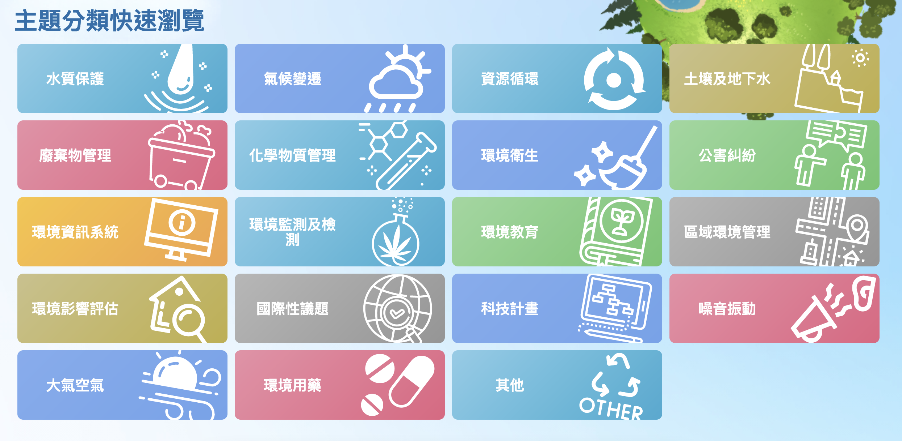
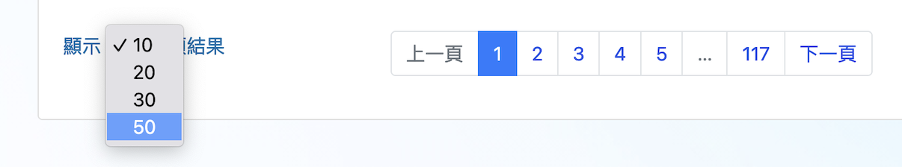

# 環保專案成果書目之下載
{: .no_toc }

<details open markdown="block">
  <summary>
    Table of contents
  </summary>
  {: .text-delta }
- TOC
{:toc}
</details>
---

## 背景

- 環保專案成果報告查詢系統有基本的分類，分別是01水質保護～19環境用藥。




```json
{'01': '水質保護',
 '02': '大氣空氣',
 '03': '噪音震動',
 '04': '土壤及地下水',
 '05': '廢棄物管理',
 '06': '化學物質管理',
 '07': '環境衛生',
 '08': '公害糾紛',
 '09': '環境資訊系統',
 '10': '環境監測及檢驗',
 '11': '環境教育',
 '12': '區域環境管理',
 '13': '環境影響評估',
 '14': '國際性議題',
 '15': '科技計畫',
 '16': '其他',
 '17': '氣候變遷',
 '18': '資源循環',
 '19': '環境用藥'}
```

- 點進去之後，會出現10～50條的書目、需要選取50(以減少網頁儲存的檔案個數)，依序每頁另存即可。
- 總共有幾頁的頁數，也會出現在頁數選擇的最右邊（範例中的**117**），用 `BeautifulSoup` 讀出來就行。
- 網頁讀到畫面上的最後一頁（範例中的第5頁）之後，在第5頁中會自動跳出第6頁，因此不需要特別點選「下一頁」。



## 程式說明

Python 這個[腳本](get_links.py)使用 `Selenium` 和 `BeautifulSoup` 庫從一個特定的網站（「https://epq.moenv.gov.tw/Query/ResultList」）提取數據，並保存到本地 HTML 文件中。以下是腳本的詳細步驟：

1. **導入所需的庫**：
   - 匯入了 `Selenium` 和 `BeautifulSoup` 庫，以及必要的功能，如 `WebDriverWait` 和 `expected_conditions`。

2. **定義點選等待函數** (`click_wait`)：
   - 此函數用於點擊頁面元素，並等待頁面更新後再繼續執行。

3. **瀏覽分類**：
   - 使用`for`循環遍歷不同的類別`cat`（編號從01到19）。

4. **設定無頭模式的Firefox瀏覽器驅動程式**：
   - 建立一個無頭 `Firefox` 瀏覽器實例（不顯示介面的瀏覽器）。

5. **造訪網站並等待元素載入**：
   - 造訪特定類別的頁面。
   - 使用 `WebDriverWait` 等待頁面中的特定元素載入完成。

6. **選擇每頁顯示的出境數**：
   - 找到並顯示選擇下拉式選單來改變每頁的條目數到50。

7. **儲存目前頁面的內容**：
   - 把目前頁面的 HTML 原始碼儲存到一個本機檔案。

8. **使用BeautifulSoup解析HTML，取得總頁數**：
   - 解析已儲存的頁面內容，找到表示頁碼的元素，從而決定總頁碼。

9. **瀏覽所有頁面**：
   - 對於每一頁，使用前面定義的 `click_wait` 函數點擊頁面上的頁面代碼鏈接，切換到對應的頁面。
   - 將每個頁面的 HTML 原始碼儲存到本機檔案。

10. **關閉瀏覽器**：
   - 完成檔案儲存後，關閉瀏覽器。

此主要腳本用於自動化從網站上提取分頁數據，將每一頁的內容保存為本地 HTML 文件，然後進行後續的數據處理和分析。
