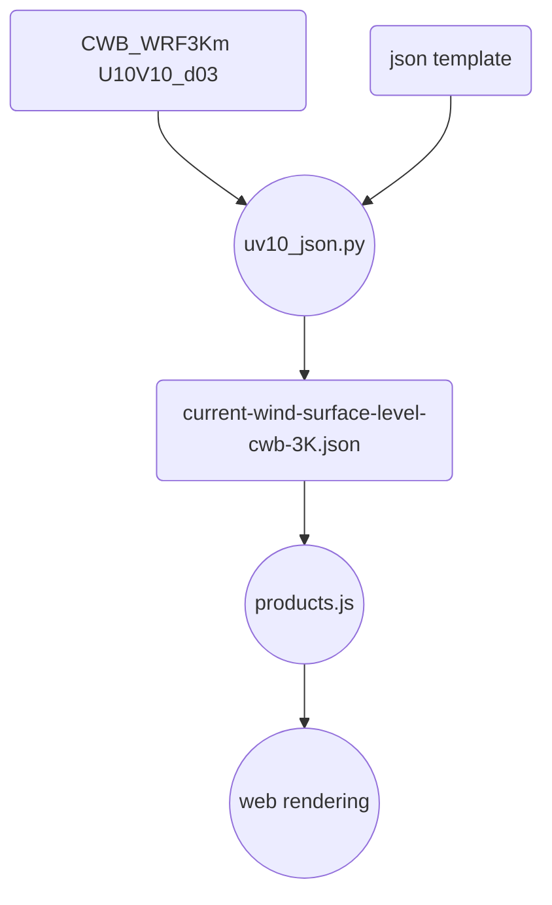

# earth套件讀取CWB_WRF數據
{: .no_toc }

<details open markdown="block">
  <summary>
    Table of contents
  </summary>
  {: .text-delta }
- TOC
{:toc}
</details>
---

## 背景

### 動機與目的

- 中央氣象局雖然每天進行[WRF數值預報][wrf_3km]，網路上卻沒有開發者使用來做氣流線等加值應用。雖然過去發展了[高解析度軌跡近5日預報](https://sinotec2.github.io/traj/)、[calpuff每日的預報](https://sinotec2.github.io/cpuff_forecast/)等等，卻還沒有嘗試以[earth.nullschool][ens]套件來加以延伸、展示。
- 除了每日、即時的展示之外，還有儲存、檢視的內部需求。相較[windy][windy]，[earth.nullschool][ens]可以按照使用者的需要，在url地址列簡單的指令，即可顯示過去特定時間的氣象與(或)濃度場。這個方案目前似乎是網路存取、檢視龐雜的氣象-空品模擬系統成果的最佳平台。

### [earth][ens]的發展與應用

- [earth][ens]套件是Cameron Beccario(cambecc)早期為[東京都環境局環境改善部][tkw]撰寫的套件，後來發展成全球的服務網站，同時也被大陸地方選擇做為[氣象預報可視化系統的設計項目][陈晖2016]。
- [ESRI][esri] 2017年也將其繼續發展成類似[油畫質感](http://esri.github.io/wind-js/)的動畫版本。
- 持續的商業版本除了[windy][windy]之外，[ventusky](https://www.ventusky.com/)也有類似的應用。
- [WebGL][webgl]控制方案與3D繪圖效果([webgl-wind](https://mapbox.github.io/webgl-wind/demo/) by [XXHolic, 2022][XXHolic])。

## 整體工作流程



- uv10_json.py
  - [source code](https://github.com/sinotec2/Focus-on-Air-Quality/blob/main/wind_models/cwbWRF_3Km/uv10_json.py)
  - [IO and program descriptions][uv10_json]
- [earth][ens]套件讀取gfs檔案的核心程式在[products.js](https://sinotec2.github.io/FAQ/2022/07/26/CWBwrf_3Km2NWC.html#filepath-function)，必須讓它能夠讀取cwb轉成的json檔。
  - 找到有關gfs的程式碼：`grep gfs $(find . -name "*.js")|more`
- web rendering
  - intializing by `node dev-server.js 80` or 
  - reload browser@iMacKuang[^2]
  - d3：`http://125.229.149.182/#current/wind/surface/level/orthographic=-237.53,23.30,2000`
  - d1：`http://125.229.149.182/#current/wind/surface/level/orthographic=-236.33,23.30,800`

## diff of first paramter between gfs and cwbwrf_15Km files

- [earth][ens]套件與gfs檔案的連結靠的是[grib2json][g2j]這支程式，cambecc也將其公開在github上。其下載、編譯、與應用的細節歷程可以參考[FAQ->json][json]。
- 經由下列簡單的python指令，可以列出gfs與cwb二者grib檔案內容的差異，作為修改([uv10_json.py][uv10_json])的重要指引。

```python
fname='current-wind-surface-level-gfs-1.0.json'
with open(fname,'r') as fn:
  crnt=json.load(fn)
fname='M-A0061-006.grb2.json'
with open(fname,'r') as fn:
  cwb=json.load(fn)
c=set(cwb[0]['header'])
g=set(crnt[0]['header'])
a=[]
for i in c&g:a.append([i, crnt[0]['header'][i],cwb[0]['header'][i]])
```

### grib file

parameter|gfs|cwbwrf|desc.
-|:-:|:-:|-
length of json list|2|80|gfs is demo, cwb[70~71] are UV10
 productType| 1|2
 productTypeName|Forecast products|Analysis and Forecast products
 productStatus| 0|0
 productStatusName|Operational products|Operational products
 productDefinitionTemplate| 0|0
 productDefinitionTemplateName|Analysis/forecast at horizontal level/layer at a point in time|Analysis/forecast at horizontal level/layer at a point in time
 winds|true|true
 center| 7|0
 centerName|US National Weather Service - NCEP(WMC)|WMO Secretariat
 subcenter| 0|0
 parameterNumber| 2|5
 parameterNumberName|U-component_of_wind|Geopotential_height|first var.
 parameterCategory| 2|3
 parameterCategoryName|Momentum|Mass
 parameterUnit|m.s-1|gpm
 scanMode| 0|64
 gribLength| 131858|61081802
 gribEdition| 2|2
 discipline| 0|0
 disciplineName|Meteorological products|Meteorological products

### grid definition

parameter|gfs|cwbwrf|describe
-|:-:|:-:|-
 shape| 6|6
 shapeName|Earth spherical with radius of 6,371,229.0 m|Earth spherical with radius of 6,371,229.0 m
 gridDefinitionTemplate| 0|30
 gridDefinitionTemplateName|Latitude_Longitude|Lambert_Conformal  
 nx| 360|661
 ny| 181|385
 numberPoints| 65160|254485|=nx&times;ny
 gridUnits|degrees|m
 dx| 1|15000.0
 dy| 1|15000.0
 lo1| 0|78.02554|western most
 la1| 90|-5.693676|northern most
 lo2| 359|78.02554|eastern most
 la2| -90|-5.693676|southern most
 resolution| 48|0

- 所有的實數必須是64位元(np.float64(...))，否則在json.dump時會報錯。
- 緯度的方向是由高到低。雖然dy是給正值，但程式內部gfs[:]['data']的排序在y方向是由北到南，需對其軸進行[np.flip(...)](https://vimsky.com/zh-tw/examples/usage/python-numpy.flip.html)。可以由風速較低值的範圍與海陸界限加以檢視，形狀會南北相反。

```python
gfs[ir]['data']=list(np.flip(np.where(zz!=zz,0,zz),axis=0).flatten())
```

### surface

parameter|gfs|cwbwrf|desc
-|:-:|:-:|-
 surface1Type| 103|100
 surface1TypeName|Specified height level above ground|Isobaric surface| 11 levels from 100 to 1000 hPa, also 0, 2, 10 meter  
 surface1Value| 10|1e-128|gfs in m; cwb strenge unit = 100 hpa
 surface2Type| 255|255
 surface2TypeName|Missing|Missing
 surface2Value| 0|0.0

```python
set(surface1Value)
{0.0, 
1e-128, 1.5e-128, 2e-128, 2.5e-128, 3.e-128, 4e-128, 
5e-128, 7.e-128, 8.5e-128, 9.25e-128, 1e-127, 
2.0, 10.0}
```

### time frame

parameter|gfs|cwbwrf
-|:-:|:-:
 genProcessType| 2|2
 genProcessTypeName|Forecast|Forecast
forecastTime| 3|6
 significanceOfRT| 1|1
 significanceOfRTName|Start of forecast|Start of forecast
 refTime(eg)|2014-01-31T00:00:00.000Z|2021-10-11T06:00:00.000Z

## installation of [earth][ens]

### download and compile

- `git clone https://github.com/cambecc/earth.git` 
- `cd earth`
- `npm install`

### initialize the website
- node dev-server.js 8080 (or 80 for usual port)

## modifications of js

### zoom limits

- from 3000 to 60,000
- function scaleExtent in file `./public/libs/earth/1.0.0/globes.js`

### FilePath function

- 原本(`gfs1p0degPath`)指定檔名的函數，寫死一定要開`current-wind-surface-level-gfs-1.0.json`
  - 引數只提供`attr, type, surface, level`
- 增加`src, res` 2個引數，來源（gfs或cwb）與解析度(`'1p90', '15K', '3K'`)
- in file `./public/libs/earth/1.0.0/products.js`

### default settings

- in file: `./public/libs/earth/1.0.0/micro.js:14:`
- 可設定：
  1. 時間
  1. 貼上特定屬性的shade等值圖
  1. 高度(地面或定壓層)
  1. 座標系統投影方式
  1. 初始中心點經緯度與zoom倍率

```java
var DEFAULT_CONFIG = "current/wind/surface/level/orthographic";
```

- 修正為

```java
var DEFAULT_CONFIG = "current/wind/surface/level/orthographic=-238.80,23.73,7500";
```

### 縣市界

要在[earth][ens]套件中更改海岸線、湖泊線，或是加上縣市界，可以參考詳見[shp檔轉json][shp_json]說明
- topojson檔案放在./public/data/topo目錄下
- 有關的js檔包括
  1. ./public/libs/earth/1.0.0/earth.js (開啟topojson檔)
  1. ./public/libs/earth/1.0.0/globes.js (變數定義)

### 氣流線之調整

[earth][ens]套件的動態氣流線在其程式中稱為particle，可能因為看起來像是顆粒的軌跡動態。particle相關設定有：
1. ./public/libs/earth/1.0.0/[products.js][js1]：` particles: {velocityScale: 1/3000000, maxIntensity: 1 }`，這2個設定前者為風速的尺度(1/3M ~ 1/60K)，其值越小，流線越短。後者為密集度(1 ~ 17)，其值越小會有越多處有particle起點，即使風速很低，適用在小比例尺圖面。
1. ./public/libs/earth/1.0.0/earth.js

```java
    var MAX_PARTICLE_AGE = 100;               // max number of frames a particle is drawn before regeneration
    var PARTICLE_LINE_WIDTH = 1.0;            // line width of a drawn particle
    var PARTICLE_MULTIPLIER = 7;              // particle count scalar (completely arbitrary--this values looks nice)
    var PARTICLE_REDUCTION = 0.75;            // reduce particle count to this much of normal for mobile devices
```

項目|js|參數|範圍|效果說明
-|-|-|:-:|-
風速尺度|[products.js][js1]|velocityScale|1/3M ~ 1/60K|偏向靜風~強風
密集度|[products.js][js1]|maxIntensity|1~17|其值越小會有越多處有particle起點
流線的長度|earth.js|MAX_PARTICLE_AGE|10~100|短(無動感無法辨認方向)~長(遮蔽底圖)
流線寬度|earth.js|PARTICLE_LINE_WIDTH|0.8~1.0|細(辨識不清)~寬(遮蔽底圖)

## 下載與執行

- CWB WRF程式結果每6小時更新，分別為每天的2/8/14/20時等4次。每次預報84-6=78小時(0~6小時warm up)
  - 由於CWB是陸續更新，而其檔名系統又以預報起始時間為0，因此有可能發生錯亂覆蓋的情形。
  - 解決方式：解析結果按照檔案內的時間(grbs[1].validDate)來命名
  - 並將結果按照年月日另建目錄擺放(參[earth/public/test/products-test.html][tst]內容)
  - eg: `"/data/weather/2013/11/20/0800-a-b-c-gfs-1.0.json"`
  - 下載、解讀之自動化腳本(earth_cwbwrf.cs)乃在node03執行，以節省頻寬。
- 網頁程式安放在iMacKuang，以避免防火牆干擾。  
  - current目錄下之檔案：每小時執行連結。

### node03作業

#### 腳本

- [grbuv10_json.py](https://github.com/sinotec2/Focus-on-Air-Quality/blob/main/wind_models/cwbWRF_3Km/grbuv10_json.py)的概略說明可以參考[地面風wrfout檔轉json->grib2 to json directly](https://sinotec2.github.io/FAQ/2022/07/27/uv10_json.html#grib2-to-json-directly)。
  - node03版本加入了後處理項目：
    1. 在mac上創新目錄
    1. 將結果傳遞到mac的指定目錄

```bash
#kuang@node03 /nas1/Data/javascripts/D3js/earthCWB/public/data/weather/current
#$ cat earth_cwbwrf.cs
weather=/nas1/Data/javascripts/D3js/earth/public/data/weather
cd $weather/current
for dom in 4;do
for ((i=6; i<=84; i=i+6)); do
  ii=`printf "%02d" $i`
  fn=M-A006${dom}-0$ii.grb2
  rm -f $fn
  /usr/bin/wget https://cwbopendata.s3.ap-northeast-1.amazonaws.com/MIC/$fn
  ./grbuv10_json.py $fn
done
done
```

#### crontab內容

```bash
crontab -l|grep earth
# earth CWB_WRF
55 2,8,14,20 * * * /nas1/Data/javascripts/D3js/earthCWB/public/data/weather/current/earth_cwbwrf.cs
```

### mac上的任務

#### lnk_curr.cs腳本

- mac的任務就是保持current檔案隨時都是當下的時間
- 執行方式是每小時進行UTC時間的計算，並將對的檔案連結到current
  - `UTC = LST - 8H`
  - 因為不是每小時都有模擬結果。需要進行計算，將LST逐時對照到UTC逐6小時。
  - 文字的數字改成10進位計算：`#10$h`，計算完後再轉成2碼數字
- 因應伺服器重啟時並不會自動重啟node設定，將node執行情況納入每小時確認項目，如沒有在運作，則予以重啟。(2022-11-08 07:14:27)

```bash
#kuang@114-32-164-198 /Users/Data/javascripts/D3js/earthCWB/public/data/weather/current
#$ cat lnk_curr.cs
# confirm the node is running 
n=$(ps -ef|grep node|grep 8083|wc -l) 
if ! [ $n -eq 1 ];then
  cd /Users/Data/javascripts/D3js/earthCWB
  node dev-server.js 8083
fi
now=$(date -v-8H -j  +%Y%m%d%H)
y=$(date -j -f "%Y%m%d%H" "${now}" +%Y)
m=$(date -j -f "%Y%m%d%H" "${now}" +%m)
d=$(date -j -f "%Y%m%d%H" "${now}" +%d)
h=$(date -j -f "%Y%m%d%H" "${now}" +%H)
h=$(( 10#$h / 6 * 6|bc -l ))
h=$(printf "%02d" $h)
weather=/Users/Data/javascripts/D3js/earthCWB/public/data/weather
fn=$weather/$y/$m/$d/${h}00-wind-surface-level-cwb-3K.json
if [ -e $fn ]; then
  ln -sf $fn $weather/current/current-wind-surface-level-cwb-3K.json
else
  echo $fn
fi
```

#### crontab

```bash
0 * * * * /Users/Data/javascripts/D3js/earthCWB/public/data/weather/current/lnk_curr.cs
```

## 成果檢討

### 3公里解析度範圍與流線場

|  |
|:--:|
| <b>2021070206中央氣象局WRF預報之地面風氣流線</b>| 
|  |
| <b>同時間的GFS地面風</b>| 

- CWB預報有颱風、GFS並沒有發現
- 很多地型效應、台灣東側背風渦漩、小島背風面較低風速等等現象，在CWB風場中都有展現。
- 內陸風場細節：GFS無法模擬

### TODO

- other timeframe, fields
- webGL controler
- fine resolution shape file
  - administrative boundies
  - isopleth for terrain elevation(geotiff to KML, KML to shape file)

## resource

### earth package and D3js implements

- cambecc(2016), [earth building, launching and etc](https://github.com/cambecc/earth) on GitHub. 
- cambecc(2017), [grib2json](https://github.com/cambecc/grib2json) on GitHub.
- Roger Veciana i Rovira(2018), [Drawing wind barbs with D3js from a GeoTIFF](https://bl.ocks.org/rveciana/206956c3e142040432c477d75b038749), on bl.ocks.org
- 陈晖, 范玉鑫, 陈杨,及 吴天亭(2016), [吉林省WRF模式数值预报可视化系统设计](https://m.fx361.com/news/2016/1119/9135816.html), 现代农业科技2016年4期.
- Kuan-Jung, Huang(2019), [透過 D3.js 調用外部資料集](https://mybaseball52.medium.com/d3-js-using-external-datasets-21f12cb386dc), mybaseball52.medium.com

### about GFS downloading

- curl command in Github
  - `curl "http://nomads.ncep.noaa.gov/cgi-bin/filter_gfs.pl?file=gfs.t00z.pgrb2.1p00.f000&lev_10_m_above_ground=on&var_UGRD=on&var_VGRD=on&dir=%2Fgfs.${YYYYMMDD}00" -o gfs.t00z.pgrb2.1p00.f000`  
- nomads website has been upgraded since cambecc released [earth][ens]. 
- curl command become:
  - `curl "https://nomads.ncep.noaa.gov/cgi-bin/filter_gfs_1p00.pl?file=gfs.t00z.pgrb2.1p00.f000&lev_10_m_above_ground=on&var_UGRD=on&var_VGRD=on&leftlon=0&rightlon=360&toplat=90&bottomlat=-90&dir=%2Fgfs.${YYYYMMDD}%2F00%2Fatmos"  -o gfs.t00z.pgrb2.1p00.f000`
- [GFS PARAMETERS & UNITS](https://www.nco.ncep.noaa.gov/pmb/docs/on388/table2.html)
- [GRIB Filters and View the URL](https://nomads.ncep.noaa.gov/cgi-bin/filter_gfs_1p00.pl?dir=%2Fgfs.20220804%2F00%2Fatmos)

item|cambecc, 2016|updates|desc
:-:|:-:|:-:|-
pl name|filter_gfs.pl| filter_gfs_1p00.pl|with resolutions
dir name|/gfs.${YYYYMMDD}00|/gfs.${YYYYMMDD}/00/atmos|actually no other choice
windows of LL|?|addative|may be omitted for global range

### about HTTPS

- 詮力科技(2019),[為您的網站加上「-ssl憑證-」，成為https網頁](https://blog.ite2.com/為您的網站加上「-ssl憑證-」，成為https網頁/),十二月 13,2019/[技術探討](https://blog.ite2.com/category/technical-discussion-tw/)
- Mangle Kuo(2021),[設定macOS本地端HTTPs/SSL證書](https://manglekuo.medium.com/設定macos本地端https-ssl證書-b2f79bcdedf0)
- Bharath(2021) [How to install the Securly SSL certificate on Mac OSX ?](https://support.securly.com/hc/en-us/articles/206058318-How-to-install-the-Securly-SSL-certificate-on-Mac-OSX-),support.securly.com

### about json TypeError

- 咸魚(2020), [TypeError: Object of type 'float32' is not JSON serializable解决方案](https://blog.csdn.net/yitanjiong4414/article/details/105902697), blog.csdn.net

[wrf_3km]: <https://sinotec2.github.io/Focus-on-Air-Quality/wind_models/cwbWRF_3Km/> "中央氣象局WRF_3Km數值預報產品"
[ens]: <https://earth.nullschool.net/> "earth, a visualization of global weather conditions, forecast by supercomputers, updated every three hours"
[windy]: <https://www.windy.com/> "Windy是一家提供天氣預報服務的捷克公司，由伊沃·盧卡喬維奇於2014年11月創立。 Windy提供的天氣預報基於美國國家海洋和大氣管理局全球預報系統、歐洲中期天氣預報中心及瑞士NEMS模型的數據。"
[tkw]: <https://air.nullschool.net/> "東京都環境局環境改善部大気保全課, 東京都風速"
[陈晖2016]: <https://m.fx361.com/news/2016/1119/9135816.html> "陈晖, 范玉鑫, 陈杨,及 吴天亭(2016), 吉林省WRF模式数值预报可视化系统设计, 现代农业科技2016年4期."
[esri]: <https://zh.m.wikipedia.org/zh-tw/美國環境系統研究所公司> "美國環境系統研究所公司Environmental Systems Research Institute, Inc"
[webgl]: <https://zh.wikipedia.org/zh-tw/WebGL> "WebGL是一種JavaScript API，用於在不使用外掛程式的情況下在任何相容的網頁瀏覽器中呈現互動式2D和3D圖形。"
[XXHolic]: <https://developpaper.com/how-i-build-a-wind-map-with-webgl/> "How I build a wind map with webgl, 2022-2-12"
[uv10_json]: <https://sinotec2.github.io/FAQ/2022/07/27/uv10_json.html> "地面風wrfout檔轉json "
[g2j]: <https://github.com/cambecc/grib2json> "grib2json"
[json]: <https://sinotec2.github.io/Focus-on-Air-Quality/utilities/netCDF/netcdf2json/> "FAQ -> utilities -> netCDF -> grib2json"
[tst]: <https://github.com/cambecc/earth/blob/master/public/test/products-test.html> "equal(config.toHash(), '2013/11/20/0800Z/a/b/c/x');  equal(paths.primary(), '/data/weather/2013/11/20/0800-a-b-c-gfs-1.0.json');"
[shp_json]: <https://sinotec2.github.io/FAQ/2022/08/08/shp_json.html> "natural earth shp檔轉json"

[^2]: 125.229.149.182為Hinet給定，如遇機房更新或系統因素，將不會保留。敬請逕洽作者：sinotec2@gmail.com.