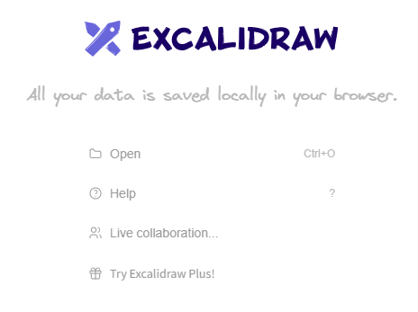
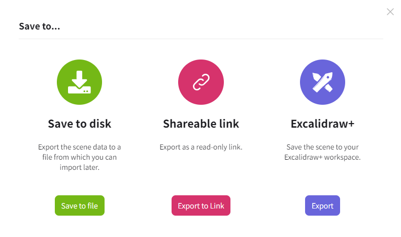
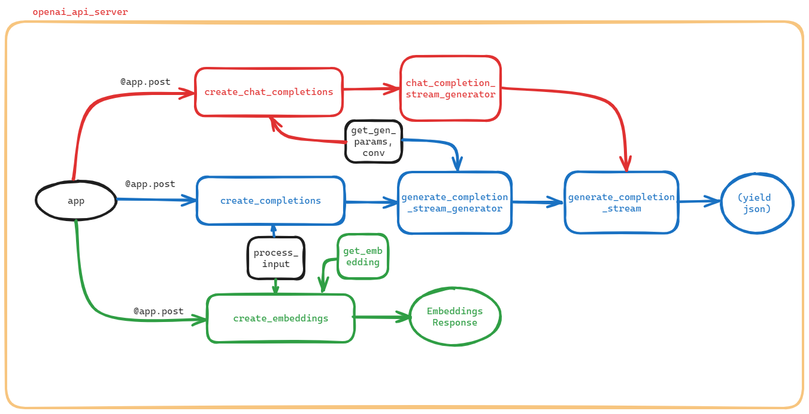

# excalidraw
{: .no_toc }

  

    Table of contents
  

  {: .text-delta }
- TOC
{:toc}

---

## 背景

Excalidraw 是一款開源的虛擬白板繪圖工具，可以讓您輕鬆繪製出具有手繪感的圖表¹。它的開發始於 2020 年 1 月 1 日，僅在一年後就成為了一款成熟的白板產品³。以下是一些 Excalidraw 的主要特點²：

- **免費且開源**
- **無窮的畫布式白板**
- **手繪風格**
- **深色模式**
- **可自定義**
- **支援圖片**
- **支援形狀庫**
- **開放格式** - 可將繪圖導出為 .excalidraw json 檔案
- **多種工具** - 包括矩形、圓形、鑽石形、箭頭、線條、自由繪圖、橡皮擦等
- **支援箭頭綁定和標籤箭頭**
- **支援撤銷/重做**
- **支援縮放和平移**

無論是 Windows / macOS / linux ，甚至是手機，只要打開瀏覽器就能使用⁴。您可以用它來繪製美觀的流程圖、示意圖和開發架構圖等常用圖片，也可以作為會議畫板使用⁴。不僅是一款優秀的繪圖應用，也是一款自由便捷的電子白板應用⁴。¹²³⁴

來源: 與 Bing 的交談， 2024/1/5
(1) Excalidraw | Hand-drawn look & feel • Collaborative • [Secure](https://excalidraw.com/).
(2) 技术文章配图——Excalidraw - [知乎](https://zhuanlan.zhihu.com/p/425837520).
(3) excalidraw/excalidraw: Virtual whiteboard for sketching hand-drawn like diagrams - [GitHub](https://github.com/excalidraw/excalidraw).
(4) Excalidraw - 免费的手绘风格白板应用，能够画各种流程图、示意图、架构图 - [知乎](https://zhuanlan.zhihu.com/p/356694435).

- 服務網址：https://excalidraw.com/
- 無會員、無費用、無遠端存檔

- 範例：

