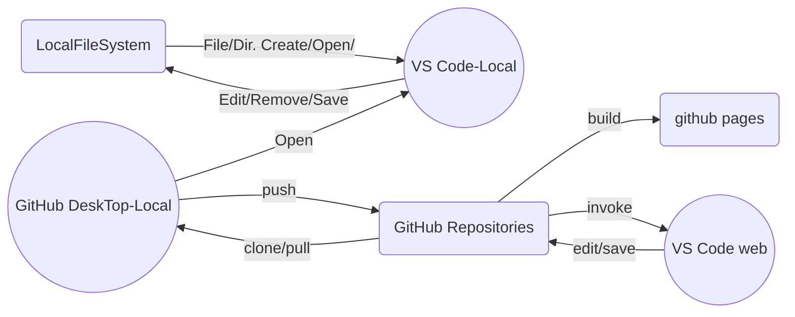

{: .no_toc }

# 數位筆記系統使用心得

## Table of contents
{: .no_toc .text-delta }

1. TOC 
{:toc}

---

## 背景

### 功能需求

- 如題所示，這篇筆記是針對這些年來[筆記系統][NS]的**數位**發展與個人的使用經驗心得。先就**筆記系統**的重要元件及功能要求、條例如下：
  - 介面
    1. 容易操作、容易上手、軟體介面親人性
    1. 中文化輸入、輸出
    1. 有簡潔的顯示版面，最好可以直接展示、用在簡報、教學，不必另外做ppt檔案。
    1. 項目符號、自動排序
    1. 是否接受手寫辨識，要按使用者手寫工整程度而定。
  - 索引系統
    1. 目錄系統：文章內、外；無限制、多層次目錄；目錄要能展開、合併
    1. 時間標籤：文件創始、文件修改日期時間
    1. 跨檔全文搜尋、置換、關鍵字索引系統
    1. 圖、表、公式、(程式碼)、索引系統
    1. (再)訪問次數記錄
  - 儲存、分享、透明度管理
    1. 雲端儲存、異地備援、版本管理。
    1. 團隊協作時易於分享、URL不能是長亂碼。
    1. 檔案格式容易轉移、修改。
  - 品牌、系列
    1. 系統持續更新。不更新的棄養軟體趁早轉換，然而更新速度如果太快也很干擾。
    1. 市佔高、主流化
    1. 系列其他產品功能
- **筆記系統**不是...(不能取代...)：
  1. 隨手速記、概念手記、無法分享的手札
  1. 特殊目的的便利貼app，如記帳、行程約會日誌、
  1. 完整功能的[KM系統][kms]、教學平台

### 網路介紹文章

- 要每年寫這種回顧性的文章不容易，畢竟軟體的領域日新月異、江山代有才人出。
- [2022筆記軟體][welcometw]
  - 這篇介紹10大筆記軟體：#1 [Evernote][Evernote]、、＃2 [Notion][notion]、＃3 [GoodNotes][GoodNotes]、＃4 Notability、＃5 Microsoft [Onenote][onenote]、＃6 [SimpleNote][SimpleNote]、＃7 Google [keep][keep]、＃8 Trello、＃9 Ulysses、＃10 Notebook。其中也有不少下面會介紹到。
  - 這篇介紹筆記軟體的應用範圍不限於工作及學習，還包括生活中的代辦事項、隨手札記、旅行筆記、記帳、行事曆等模板也一應俱全。
- [2021年7大實用筆記軟體推薦][Shining Chan, 2021]
  - 因為是職涯發展公司，介紹的多半是工作筆記，包括了一、[Evernote][Evernote]，二、Microsoft [OneNote][onenote]，三、[Notion][notion]，四、Google [Keep][keep]，五、[GoodNotes][GoodNotes]，六、Notability，七、[SimpleNote][SimpleNote]。
  - 這一篇開頭就把場景拉到學生時代寫紙本筆記的場域，來強調**數位筆記**的必要性與好處。這對剛踏出學校的社會新鮮人會有誘因。不過現在大學生也普遍在使用筆記軟體系統，這篇就顯得有點粗淺了。

### 本文主打方案

- 經過近一年的發展，目前[VSCode+GitHubDesktop][vc_gh]方案已漸趨穩定，適用在程式說明、文獻回顧等領域，有其值得推薦之處。
  1. 目前在此領域市佔率最高。[GitHub][gh]為全球最大程式碼共享平台。
  1. 銜接github.io等等公開分享平台，網站運作穩定、快速
  1. [VS Code][vsc_wiki]有最簡單、完整的編輯界面。
  1. 符合前述**筆記系統**功能需求、同時也是執行程式的[IDE][ide]。
- [VS Code][vsc_wiki]與[GitHub][gh]的連結
  - [VS Code][vsc_wiki]除了編輯本地檔案之外，也能存取雲端[GitHub][gh]內容。
    - 在[VS Code][vsc_wiki]內直接進行[GitHub][gh]的存取，詳見[CoderDave: How To Use GitHub with Visual Studio Code，GitHub VSCode showtime](https://www.youtube.com/watch?v=aUhl3B6ZweQ)，
    - 也可經由本地安裝的[GitHub DeskTop][gh_dt]來存取[GitHub][gh]。  
  - 使用[github pages][ghpg]的免費服務資源，作為公開發布筆記之平台。
  
  - [GitHub][gh]也提供了網路版的[VS Code][vsc_wiki]介面，只需要在Repository畫面下[按下鍵盤“.”](https://www.minwt.com/webdesign-dev/html/23154.html)。
- 整體作業流程(如果圖形無法顯示請看[這裡](https://github.com/sinotec2/FAQ/blob/main/_posts/2022-10-08-about_note_sw.md#本文主打方案))

- [github pages][ghpg]成果範例
  1. [Focus on Air Quality](https://sinotec2.github.io/Focus-on-Air-Quality/)
  1. [Dr. Kuang's Utilities](https://sinotec2.github.io/FAQ/)
  1. [static websites by SINOTEC2](https://sinotec2.github.io/)

## MS word/ppt/exls as note editors

- 對於不想面對複雜軟體介面的使用者而言，在日常作業環境中就能滿足筆記需求的軟體，似乎是最好與最後的方案。
- 如果這些日常作業軟體功能都還有很多尚待熟悉，使用其他專業軟體似乎就有點捨近求遠了。
  - 例如最常用來作為README、release note檔案的格式，其實是`.txt`，這是迄今每個程式發布時最常用到的格式。簡單的wordpad、小作家、[vim](https://zh.wikipedia.org/zh-tw/Vim)就能達到寫作這類筆記的功能。
- 此處介紹3種常用軟體作為**筆記系統**的實例。

### MS Word

- 筆記寫完馬上就可以印出來、繳交課堂作業，豈不一石兩鳥，這是學生喜歡使用MS Word來做學習筆記的理由，可以參考這篇百萬瀏覽（同時也是first search）的[影片介紹](https://www.youtube.com/watch?v=V-08qJRrGxw)，以及痞客邦的[中文介紹][jinrihdelive]。MS Word作為**筆記系統**的強項與問題討論如下。
- [目錄](https://www.techbang.com/posts/12376-let-word-help-you-automatically-generate-the-file-directory)系統(Category)
  - Word檔寫完、執行一下參照，就可以更新文件的章節與編號系統，雖然是半自動作業，但對複雜的章節系統來說，已經是非常方便的功能了。
  - Category可以插在文章之前或最後，讓使用者自行瀏覽查詢、翻閱。可惜:
    1. 目錄不能很方便的合併、展開，對多層次的目錄系統而言，要翻好幾頁才能找到所要去的位置，是個龐雜混亂的經驗。
    1. 沒法很方便的回到目錄、類似browser的回到上一頁(<-)；再者，
    1. 要打開文件才能看到文件的章節，這對跨文件、循目錄搜尋的過程，也是非常消耗記憶體的動作。
    1. 跨平台轉換時，目錄參照不保證能順利轉換，這對龐雜的文件而言，會是個災難。這對使用者持續發展其**筆記系統**而言，是逐漸走向災難與滅亡的歷程，應趁早有所醒悟與合理的替代。
- [註腳、章節附註、參考文獻](https://support.microsoft.com/zh-tw/office/插入註腳與章節附註-61f3fb1a-4717-414c-9a8f-015a5f3ff4cb)
  - Word的註腳參照是個優秀的功能，除了正式的參考文獻之外，也能將重要的註釋、連結訊息等等，都放在這個區塊內，讀者可以追蹤相關訊息、並且不會干擾本文的閱讀。編號也是自動排序，不必擔心插入刪減之後會跳號。
  - 如果將太過細節的訊息(檔案目錄、縮寫全名、名詞解釋或定義、法規摘錄等等)放在註腳之內，對讀者來說，會輕鬆很多。
  - 搜尋時，word也會搜尋註腳內容。
  - 仍可以挑剔的是：
    1. 轉檔過程註腳參照、連結等有可能會消失
    1. 註腳篇幅太多會壓縮本文
    1. 註腳不是鼠標懸停([mouse hover][hover])呈現方式
- [圖表參照](https://aries.dyu.edu.tw/~lhuang/class/office/word-gt-directory.htm)
  - word的圖表參照對圖表很多的複雜報告，是一項省時省力的功能。
  - word早先發展了圖檔隨文儲存的作法，不單讓檔案容量倍增，也寵壞了使用者圖檔管理的習慣。
  - 好在是提供了參照系統，讓使用者的圖檔管理不會失控。這項功能不利於日常筆記的理由：
    1. 圖檔並不是文字搜尋的對象，圖檔龐大的word檔案要進行跨文搜尋，會浪費大量記憶體於開關檔案的時間。這不符合一般[KM系統][kms]、部落格、網頁檔案管理的概念。
    2. **筆記系統**的關鍵在單純、獨立，圖表也是以精簡、必要性為原則，參照似乎沒有太大的幫助，好的圖名、圖說反而是有利搜尋的作法，而不是參照連結。況且，
    3. 在轉檔發布時，參照可能會消失，還是需要一一重建。
- [註解](https://support.microsoft.com/zh-hk/office/insert-delete-or-change-a-comment-5cb1af25-4dfe-4484-9713-2c80391ecf12)：
  - Word可以提供右側欄位讓使用者撰寫註釋、修改歷程等等訊息，這在協作過程有非常優秀的表現（[中文介紹][jinrihdelive]）。
  - 壞處是此類註釋無法關閉。當註釋、批示太多時，會嚴重干擾到本文的閱讀。這是何以正式文件會以頁面、章節之後的註腳來寫註釋的理由，wiki等等電子文件則是以連結(hyperlink)、或鼠標懸停(mouse hover)來呈現註解。
- [大綱模式](http://homepage.ntu.edu.tw/~huangsl/word/wordoutline.pdf)
  - **筆記系統**與正式文件之間最大的差異就是文件的格式，後者有較嚴格、容易閱讀(不利查找)的版面格式，為此Word提供了大綱模式、預覽模式、整頁模式等等閱讀顯示方式，其中大綱模式對撰寫文章時、可以快速瀏覽剛剛寫好的段落，讓段落語意保持順暢，是非常方便的介面。大綱模式的章節升降調整功能，對文章的整理也是非常方便。這麼優秀的功能，還是有別的軟體來挑戰競爭：
    1. 不能同時以不同視窗顯示2種顯示模式，必須寫一段落、切換模式來加以檢查。這在插入圖表時，需要看圖表撰寫討論時，會是個打斷思路的重大瓶頸。
    2. 大綱模式下的字型、整體畫面(版面)太過粗糙，讓人望之卻步，雖然只是用做**筆記系統**的界面，但應該還有更好的選擇。
- 分享與發布
  - 除了列印成書面輸出，Word還能存成pdf檔案、rtf檔案、html網頁、特定部落格(WordPress、SharePoint、TypePad、Telligent Community)等等方式，可供發布。如果有好的發布平台，如[KM系統][kms]、文件管理系統[DMS][dms]，對文件的版本、公開對象、內容摘要等等有進一步的管理，pdf及rtf檔案會是不錯的組合。
    1. 讀者如果要參與協作，很難全抄修改、需要另外的協作系統。
    2. html結果非常不理想。是個連官方都[棄養](https://support.microsoft.com/zh-tw/topic/當您將-word-文件儲存為網頁時的限制-f361de08-ca4c-bc53-11ef-138c0e405c44)的功能。
    3. 大多數的部落客並不使用word內的直接發布，除了格式的問題，主要還有圖檔管理的問題。一般網頁的圖文是分開管理，並不是隨文附圖的概念。（參考[傑哥架站教室2022，高效寫作部落格文章的6個技巧](https://jclassroom.net/6-tips-for-efficient-writing-blog-posts/)）
    4. 如果沒有好的[KM][kms]或[DMS][dms]，發布檔案對讀者來說會有嚴重的版本管理問題。
- 其他word問題
  1. 一般word檔案(報告)會隨著計畫儲存備份，有開案結案的時間、有良好的管理。但是筆記卻是跨計畫、技術核心的屬性，無法隨每個計畫儲存，這是報告、筆記這2類文件最大的差異。
  2. 項目序號更新偶爾會不靈
  3. 程式碼的縮排：容易出錯
  4. 跨文搜尋：非常慢
  5. 字型、格式：無法在每台電腦都保持一致
  6. 分享發布的形式就是直接複製檔案，沒有版本管理、沒有更新日期管理、沒有同步功能。

### MS PowerPoint

- 這裡提的不是筆記軟體輸出到ppt、或者在筆記軟體中輸入ppt檔案進行編輯加工，而是直接使用ppt作為跨計畫的筆記檔案格式。
- ppt檔案的條例大綱寫法，跟筆記形式很接近，同時在[備忘稿](https://support.microsoft.com/zh-tw/office/新增演講者備忘稿到投影片-26985155-35f5-45ba-812b-e1bd3c48928e)，可以提供類似註腳的功能，將詳細的連結、參考文獻、細節訊息等等，都放在此處，待日後或其他讀者進一步追蹤查詢。此外不同視窗可以同時寫筆記、看圖表，這是非常有助寫作的功能。這些是ppt作為筆記檔案格式的強項。
- 其他跟word類似的強項是
  1. 筆記與重要圖表整理好，隨時可以簡報、不用另外花時間做簡報。
  1. 每頁投影片標題、次標題等，會自動彙整到大綱模式，雖然也沒有合併、展開的功能。
  1. 除了文件外連結，也提供文件內、不同頁面的連結參照。
  1. 本文、備忘稿、都能快速搜尋
- 缺點：
  - ppt基本上不是個完整的編輯軟體，而是單一頁面、專為投影片使用的界面。如果內容超出單頁範圍，編輯起來會很辛苦。筆記的編寫往往會有增減頁面的情況，這是最不利的衝突點。
  - 備忘稿不是ppt的主要功能，的它界面不是最優秀的設計，雖然也有些格式設定，但還是很簡略。
  - 發布分享、文件管理的問題，與word一樣。
  - 沒有人用ppt的備忘稿來寫程式說明文件、至少筆者沒有嘗試、也沒有成功經驗。

### MS Excel

- 筆者曾經使用excel來記錄常用的unix指令、使用方法、範例、心得與自製小工具(如[unix.csv](https://github.com/sinotec2/Focus-on-Air-Quality/blob/main/utilities/OperationSystem/unix.csv)、[unix_kbin](https://github.com/sinotec2/Focus-on-Air-Quality/blob/main/utilities/OperationSystem/unix_kbin.csv))。
- 好處
  - 隨意排序、搜尋快速、一覽無遺
  - 檔案不大、方便更新。容易傳遞。
  - 檔案留在桌面上方便開啟
- 不足之處
  - 範例太少、說明文字太少、難以編輯、儲存格內不方便製作多個超連結、(別人看不懂)
  - 開啟excel太慢，還不如直接搜尋網路。
  - 發布、共筆、版本管理...：無此等功能

## [VS Code][vsc_wiki]簡介

### [VS Code][vsc_wiki]是什麼

- (後台)文字編輯軟體、程式編譯與執行界面、檔案總管（[整合開發環境][ide]），
  1. 有關[IDE][ide]的習慣、比較與近來的發展，可以參考[這篇中文討論](https://bearask.com/zh-tw/tech/73597.html)、與
  1. [英文的完整比較](https://ide.financesonline.com/)、
  1. [列表比較](https://en.wikipedia.org/wiki/Comparison_of_integrated_development_environments#Python)
- MS提供的免費軟體、自由插件平台
- [GitHub][gh]官方指定、推薦、內設連結之[IDE][ide]

### 為何需要[VS Code][vsc_wiki](特色與必須性)

- 與[GitHub][gh]平台完全融合、持續共同發展
- 多種語言自動編譯、執行、預覽。標記式語言(MarkDown)及插件之解析、預覽。
- 快速跨檔案搜尋、置換
- 低度記憶體使用，以iMac平台而言，開啟Page需要200MB，開啟VS Code只需60MB。
- 跨越平台：MS Window、Mac OS、Linux、Web Service（與MS Window有最好的相容性）

### [VS Code][vsc_wiki]的使用

- 複製(下拉)遠端[Repo][repo]
- 創建本地資料夾與檔案
- 檔案與目錄之上傳更新
- Repo全文搜尋、置換
- 標記式語言(MarkDown)之解析、預覽
- 插件安裝

### [VS Code][vsc_wiki]的充分特性

- 熟悉程式發展作業環境，逐步學習程式語言，工作成果、工具數位化、模式化。
- 與全球優秀資訊人員同步發展

## [GitHub][gh]簡介

- 雖然[GitHub][gh]平台大量提供了有關程式碼的支援，包括版本管理、協作系統、論壇、以及程式說明的發布網站([github pages][ghpg])等等，但也有不少人運用在一般性網誌的發布、程式教學的互動平台。
- 因為是社群媒體網站，發布內容還是以社群可能會有興趣的項目為主。
- 各國官方程式碼的公開平台，很多也是選擇在[GitHub][gh]發布，其中包括美國環保署、大氣研究聯盟等等。
- 除了[github pages][ghpg]之外，也開發了[Git Book][gbook]系統，免費提供讓個人使用，讓使用者可以發布整本書的內容。

### [GitHub][gh]的使用

1. 登錄會員
1. 創建新的目錄(Repository)、設定開放對象、複製網址（假設名稱為notes）
1. 貼在本地GitHub DeskTop、創建本地相對應目錄
1. 開啟[VS Code][vsc_wiki]進行檔案或目錄新增、編寫
1. 上推至[GitHub][gh]

### 公開網頁[github pages][ghpg]之創建

1. 點進前述步驟2.所建立的[GitHub][gh] notes目錄
1. 按下齒輪 Settings頁面，在左側點進Pages頁面，選擇一個分支(branch)名稱,如main
,並在root處鍵入新io網頁的名稱（如`docs`）,按下save之後，系統將會建立https://USERNAME.github.io/notes 網頁
1. 複製網頁模版到本地暫存目錄、貼到本地Repository目錄，將所有個別帳戶名稱處都修改成正確的url，再將其上推至[GitHub][gh]。
1. [GitHub][gh]將會自行將md碼編譯成html，建立相對應的網頁。
1. 如果前述notes目錄不打算公開，就不必（也不能）設定[github pages][ghpg]
1. 詳參[Just the Docs](https://github.com/just-the-docs/just-the-docs)

### [github pages][ghpg]模版之選擇

- 參考[jekyll主題版本比較評估](https://sinotec2.github.io/FAQ/2022/06/24/NotesAboutPageViews.html#jekyll主題版本比較評估)，以[JTD](https://just-the-docs.github.io/just-the-docs)與[TeXt](https://tianqi.name/jekyll-TeXt-theme/)較為合用。

### 本地git界面的選擇

- [git][git]作為是遠端與本地檔案及版本管理的程式，可以在任何unix-like界面、window命令列上執行，同時也有多個界面軟體可供選擇。如(參[DEVART, 2021, Best Git GUI Clients for Windows](https://blog.devart.com/best-git-gui-clients-for-windows.html))：
  1. [GitHub Desktop](https://desktop.github.com/)
  1. 其他[GUI Clients](https://git-scm.com/downloads/guis) tools
  1. [SmartGit](https://www.syntevo.com/smartgit/)
- 選擇[GitHub Desktop](https://desktop.github.com/)的理由
  1. [VS Code][vsc_wiki]內部的git功能會需要最新的.Net程式與設定，需要更新windown版本，這對本地作業平台的管理是項挑戰。因此[VS Code][vsc_wiki]外部簡易的git GUI有其必要。
  1. GitHub官方維護、發展、推荐
  1. 如果是單一檔案的更新，會自動代出檔案名稱作為更新批次標籤
  1. 記憶體需求量低

### [GitHub][gh]的缺點

- .md檔案可以直接在Repository中呈現，但在公開的Github Pages上呈現會需要編譯部署的時間，複雜的系統可能會花費到5 ～ 10 分鐘以上。
- 下班時間公司會關閉[GitHub][gh]部分功能、不能進行檔案更新上載。對於長時間工作的程式發展者而言是項嚴重的限制。

## 標記式(MarkDown)語言

- 標記式(MarkDown)語言是讓文件在各個平台都能保持彈性、並且呈現出相同格式的重要語言。如果要讓筆記軟體不佔據大量的記憶體、又能呈現必要的文件格式，會需要較文字檔`.txt`略為複雜、又比`.doc`、`.rtf`等特殊軟體格式簡略一些的文件檔案格式。
- 這些格式包括
  1. 章節標題（用井字號#的個數定義層級）
  1. 項目符號(-或*)、序號(1.)
  1. quote或程式碼，以三個引號起訖
  1. 字型：以1 ～ 3個星號起訖，來呈現斜體、粗體、粗斜體等
  1. 連結[ ]\( )、註釋引用[ ][ \]，註釋內容 [ ]: < url> "content"
  1. 圖形、表格等
  1. 公式
- 使用範例詳[wiki](https://zh.wikipedia.org/zh-tw/Markdown) 、[Mac範例](https://teshenglin.github.io/post/2019_markdown/)、[markdown math 数学公式语法](https://blog.csdn.net/dss_dssssd/article/details/82692894)
- [玉樹芝蘭2017,如何用Markdown寫(學術)論文？](https://kknews.cc/zh-tw/education/rpgy9vv.html)

## 使用經驗與評論

- 此處討論對象以完整的**筆記軟體系統**(editor+filesystem)為主，前述僅半套的word/ppt作法則不予列表討論。

### 主要筆記軟體

#### [Evernote][Evernote]

- 使用時間最長、也成為付費會員，現停止付費，仍然使用中。
- 但後來因為對程式碼太不友善、且網路更新速度超慢、分享網站是長串隨機碼，看了許多付費網友紛紛解約，也就不再維護了。

#### ios APPs

- [GoodNotes][GoodNotes]用在ipad上看報告、改報告很好用，但隨著筆者公司職務的調動不再需要改報告，硬體也沒有持續更新，在iPad平台上就沒有持續發展。
- 值得一提的是[noteshelf](https://apps.apple.com/tw/app/noteshelf-%E8%A8%BB%E9%87%8B-%E8%A8%BB%E9%87%8B/id1271086060)在手寫界面軟體中有非常優秀的表現，其他iPad平台上的應用比較，可以看[知乎][知乎]這一篇。

#### [notion][notion]

- 在程式員領域有人推薦[notion][notion]，可以協作、也可以接受照片。
- 但目錄層次僅有2層，寫了一些也必須放棄(見[範例](.https://www.notion.so/dbf2csv-py-048fc056841d48d98b5f12e601c07318))。

#### [onenote][onenote-tutorial]

- 因為涉及隨時連結雲端存取空間之資安問題，很多公司並不開放microsoft的onedrive與onenote功能。

- 其他詳細比較條列如下。

### 使用經驗評論列表

項目|[Evernote][Evernote]|[notion][notion]|[boostnote][boostnote]|[GoodNotes][GoodNotes]|[VSCode][vc_gh]+[GitHub][gh]
:-:|:-:|:-:|:-:|:-:|:-:
本地記憶體需求|>1G|>200M|<100M|~|<120M
網頁界面|有|有|有|無|有
離線開啟|可|否|否|可|可
目錄系統|無|二層|二層|無|無限制
跨檔案搜尋|快|快|搜尋完整字|慢|快
儲存檔案格式|自訂|md|md|pdf|md
手寫辨識|無|無|有|無|無
**程式碼**|縮排會亂掉|OK|OK|無|OK
費用|付費可存3機器以上|付費多存|5~8 USD/月|付費app|免
url發布|長串隨機碼|長串隨機碼|可轉html檔|無|指定目錄
索引系統|HPL|HPL|HPL|無|HPL、ref.、Fig.
流程圖|無|無|無|手繪|[mermaid](https://mermaidjs.github.io/)
公式|圖形|無|無|手寫|有
IDE|n|n|n|n|yes

- md:markdown
- HPL：hyperlinks

## [VS Code][vsc_wiki]安裝使用

- 詳見[另文](https://sinotec2.github.io/FAQ/2022/11/10/code_ug.html)
- 針對筆記內容如果以Markdown語言撰寫，[VS Code][vsc_wiki]提供了哪些特別能提高編寫效率的功能([VS Code提供Markdown語言的功能](https://sinotec2.github.io/FAQ/2022/11/15/md_code.html))

[welcometw]: <https://www.welcometw.com/筆記軟體推薦/> "好好玩台灣電子報，    2022-08-01工具教學	，2022筆記軟體｜筆記app軟體正夯，推薦10個大家都在用的熱門筆記軟體，線上作筆記超便利"
[Shining Chan, 2021]: <https://glints.com/tw/blog/note-taking-software-recommendation/> " Shining Chan, 2021 職涯成長->技能提升->工具->筆記軟體是什麼？有什麼優點？2021年7大實用筆記軟體推薦"
[Evernote]: <https://evernote.com/intl/zh-tw> "整理您的工作、整頓您的生活。您的記事、工作事項、行事曆全都集中一處，輕鬆記住所有事情、處理任何專案都游刃有餘。"
[notion]: <https://www.notion.so/zh-tw/product?fredir=1>
[GoodNotes]: <https://www.goodnotes.com/zh-hk> "靈感，無紙境。以手寫的觸感，享受在無限的空間下紀錄每個想法的樂趣。"
[onenote]: <https://www.microsoft.com/zh-tw/microsoft-365/onenote/digital-note-taking-app> "Microsoft OneNote您的數位筆記本一個跨功能的筆記本可滿足您所有做筆記的需求。"
[onenote-tutorial]: <https://glints.com/tw/blog/onenote-tutorial/> "不藏私OneNote教學！7個實用技巧帶你從0上手筆記軟體"
[keep]: <https://keep.google.com/> "隨時隨地記錄所思所想"
[SimpleNote]: <https://simplenote.com/> "The simplest way to keep notes, All your notes, synced on all your devices. Get Simplenote now for iOS, Android, Mac, Windows, Linux, or in your browser."
[知乎]: <https://www.zhihu.com/question/22238071> "iPad 笔记应用 UPad、Noteshelf、GoodNotes 哪个更值得买？"
[vc_gh]: <https://code.visualstudio.com/docs/sourcecontrol/github> "Working with GitHub in VS Code"
[jinrihdelive]: <https://jinrihdeliver.pixnet.net/blog/post/276862136> "今日訊息jinrih,Jan 31 2019【Word教學｜筆記術、閱讀筆記】學習第一步？先學如何做筆記！痞客邦 "
[ide]: <https://zh.wikipedia.org/zh-tw/集成开发环境> "集成开发环境、整合開發環境"
[vsc_wiki]: <https://zh.wikipedia.org/wiki/Visual_Studio_Code> "Visual Studio Code（簡稱 VS Code）是一款由微軟開發且跨平台的免費原始碼編輯器[6]。該軟體支援語法突顯、程式碼自動補全（又稱 IntelliSense）、程式碼重構功能，並且內建了命令列工具和 Git 版本控制系統[7]。使用者可以更改佈景主題和鍵盤捷徑實現個人化設定，也可以透過內建的擴充元件程式商店安裝擴充元件以加強軟體功能。"
[gh]: <https://zh.wikipedia.org/zh-tw/GitHub> "GitHub是一個線上軟體原始碼代管服務平台，使用Git作為版本控制軟體，由開發者Chris Wanstrath、P. J. Hyett和湯姆·普雷斯頓·沃納使用Ruby on Rails編寫而成。在2018年，GitHub被微軟公司收購。GitHub同時提供付費帳戶和免費帳戶。這兩種帳戶都可以建立公開或私有的代碼倉庫，但付費使用者擁有更多功能。根據在2009年的Git使用者調查，GitHub是最流行的Git存取站點。[5]除了允許個人和組織建立和存取保管中的代碼以外，它也提供了一些方便社會化共同軟體開發的功能，即一般人口中的社群功能，包括允許使用者追蹤其他使用者、組織、軟體庫的動態，對軟體代碼的改動和bug提出評論等。GitHub也提供了圖表功能，用於概觀顯示開發者們怎樣在代碼庫上工作以及軟體的開發活躍程度。 "
[kms]: <https://zh.wikipedia.org/zh-tw/知识管理> "知識管理（英語：knowledge management，縮寫為KM）包括一系列企業內部定義、創建、傳播、採用新的知識和經驗的戰略和實踐。這些知識和經驗包括認知，可以是個人知識，以及組織中商業流程或實踐。知識管理是一項在1990年代中期開始在全球崛起的學術與商業應用主題，針對個人及社群所擁有的顯性知識和隱性知識的確認、創造、掌握、使用、分享及傳播進行積極及有效的管理。其主要涵蓋的固有理論及應用層面包括學習型組織、企業文化、資訊科技應用，及人事管理等。而由於知識管理的概念通常與企業的各種改善願景扯上關係，知識管理在現今企業上的實踐愈來愈受到重視，亦因此為顧問和科技公司帶來了不少商機。知識管理在非商業上的應用亦很廣泛，其中維基百科經常被指為網際網路上其中一個最成功的知識管理系統。 "
[ghpg]: <https://zh.wikipedia.org/zh-tw/GitHub_Pages> "GitHub Pages是GitHub提供的一個網頁代管服務，於2008年推出[1][2]。可以用於存放靜態網頁，包括部落格、項目文檔[3][1]甚至整本書。[4]Jekyll軟體可以用於將文檔轉換成靜態網頁，該軟體提供了將網頁上傳到GitHub Pages的功能。[5]一般GitHub Pages的網站使用github.io的子域名，但是用戶也可以使用第三方域名。[6] "
[gh_dt]: <https://desktop.github.com/> " GitHub Desktop, Focus on what matters instead of fighting with Git. Whether you're new to Git or a seasoned user, GitHub Desktop simplifies your development workflow. "
[gbook]: <https://www.gitbook.com/> "Where technical teams document, GitBook makes it easy to plan, centralize and share knowledge, from start to ship."
[git]: <https://backlog.com/git-tutorial/tw/intro/intro1_1.html> "git是一個分散式版本控制軟體，最初由林納斯·托瓦茲創作，於2005年以GPL授權條款釋出。最初目的是為了更好地管理Linux核心開發而設計。應注意的是，這與GNU Interactive Tools不同。 git最初的開發動力來自於BitKeeper和Monotone。"
[hover]: <> "滑鼠滑到反白處即顯示註釋文字"
[dms]: <https://www.enago.tw/academy/何謂文件管理系統dms？/> "enago.tw/academy/何謂文件管理系統dms？"
[NS]: <https://en.wikipedia.org/wiki/Note-taking> "Note-taking (sometimes written as notetaking or note taking) is the practice of recording information from different sources and platforms. By taking notes, the writer records the essence of the information, freeing their mind from having to recall everything.[1] Notes are commonly drawn from a transient source, such as an oral discussion at a meeting, or a lecture (notes of a meeting are usually called minutes), in which case the notes may be the only record of the event. Since the advent of writing and literacy, notes traditionally were almost always handwritten (often in notebooks), but the advent of notetaking software has made digital notetaking possible and widespread."
[boostnote]: <https://boostnote.io/> "Boost Note, your way. Trusted by many, Boost Note powers developer teams all around the world. Explore which option is right for you."
[repo]: <https://zh.wikipedia.org/wiki/儲存庫> "儲存庫（英語：repository）[1]亦稱倉庫、資源庫、資源庫、版本庫、代碼庫、存放庫，在版本控制系統中是指在磁碟儲存上的資料結構，其中包含了檔案、目錄以及元資料。儲存庫可能為分散式（如Git）或集中式（如Subversion）。[2]分散式的儲存庫可以複製到每個使用者的本地；集中式的儲存庫只能儲存在伺服器上。[3]"
