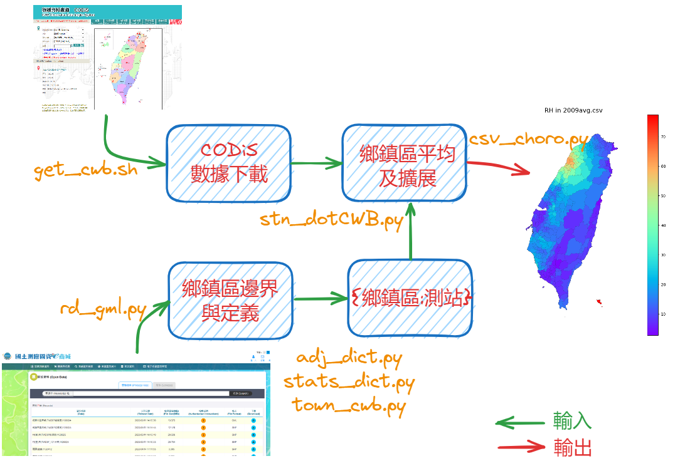
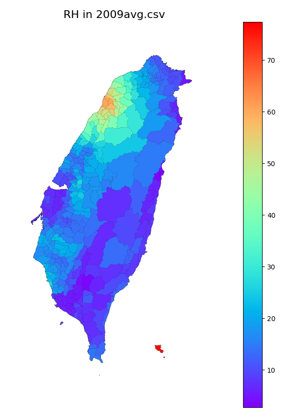

# 氣象局自記站數據鄉鎮區平均值之計算
{: .no_toc }

<details open markdown="block">
  <summary>
    Table of contents
  </summary>
  {: .text-delta }
- TOC
{:toc}
</details>
---

## 背景

- 這項作業是仿照[環保署測站數據鄉鎮區平均值之計算](https://sinotec2.github.io/Focus-on-Air-Quality/AQana/TWNAQ/stn_dot/)的作法，將氣象局所有測站上的數值，向外推展到鄰近的鄉鎮區。該局歷史資料的來源詳[CODiS日報表下載整併](1.cwb_daily_download.md)。
- 平均方式：此處一樣使用內積`np.dot`方式，以加快計算速度。
- 時間上，本程式讀取全年逐日檔案，並在程式內先進行日均值的計算。
- 處理結果
  - 以外積方式，將日期及鄉鎮區的維度向量，與1維的單位矩陣進行外積(`np.outer`)，以張開成為2維的矩陣，再壓平成為資料表格式輸出。
  - 矩陣轉資料表過去的迴圈作法可以參考[移動源排放檔案之轉檔-整併與輸出][lineinc]
  - 檢視：參[geoplot繪製行政區範圍等值圖(csv_choro.py)][geoplot]
- 本項作業牽涉到的相關程式，其關係如圖所示。(或訪問[excalidraw with links](https://excalidraw.com/#json=xxpf8hfrXvDI10FRxUJn6,pfyjiNDdgaUf3R4nCGXf2w))



## 程式基本

### IO's

- 引數
  - 需要1個引數：年代(4碼)
- 鄉鎮區與測站編號的對照表[town_cwb.csv][town_cwb.csv]，求取方式詳見[附近行政區之定位](https://sinotec2.github.io/Focus-on-Air-Quality/EmisProc/area/dictProc/adj_dict/)、
- 輸出：YYYYres.csv

### 檔案讀取與測站之確認

- 因為跨了20年，測站及鄉鎮區的設定略有變更，須逐年測試、修正檢討。

```python
yr=sys.argv[1]

path='/home/backup/data/cwb/e-service/'
fname=path+'read_web/town_cwb.csv'
twn=read_csv(fname)
twn=twn.loc[twn.aq_st.map(lambda x:x!='0;')].reset_index(drop=True)
twn['stns']=[Series([int(i) for i in j[:-1].split(';')]) for j in twn.aq_st]
all_stn=set()
for i in twn.stns:
  all_stn|=set(i)
```

- cwb數據是逐時紀錄，一天一個檔案，因此需形成一個迴圈來累積
  - 全日缺值：以前一天來替代
  - 日平均值：在迴圈內執行，以減少記憶體容量

```Python
directory = path+yr+'/'
file_extension = '.csv'
fnames=[fname for fname in os.listdir(directory) if fname.endswith(file_extension)]
fnames.sort()
df=DataFrame({})
cols=['stn','ObsTime','RH']#,'Precp']
col2=['stn','ymd','RH']#,'Precp']
dt_old=datetime.strptime(yr+'0101','%Y%m%d')
for fname in fnames:
  try:
    dfi=read_csv(directory+fname)
  except:
    dfi=read_csv(directory+fname,encoding='big5')
  dfi['stn']=[i[:6] for i in dfi.stno_name]
  dfi.ObsTime=np.array(dfi.ObsTime,dtype=int)
  dfi=dfi[cols]
  dfi=dfi.dropna(axis=0).reset_index(drop=True)
  if len(dfi)==0:
    ymd=dt_old.strftime("%Y%m%d")
    dfi=df.loc[df.ymd==int(ymd)]
    ymd1=(dt_old+timedelta(days=1)).strftime("%Y%m%d")
    dfi['ymd']=int(ymd1)
  else:
    dfi['ymd']=dfi.ObsTime//100
  dfi=pivot_table(dfi,index=col2[:2],values=col2[2:],aggfunc=np.mean).reset_index()
  df=df.append(dfi[col2],ignore_index=True)
  dt_old=datetime.strptime(str(list(df.ymd)[-1]),'%Y%m%d')
```

- 處理測站集合

```python
df.stn=[int(i) for i in df.stn]
col=df.columns[2:]
s=set(df.stn)

new=s-all_stn
old=all_stn-s
if len(old)>0:
    print(old)

if len(new)>0:
  df=df.loc[df.stn.map(lambda x:x not in new)].reset_index(drop=True)
```

## 程式重點說明

### 測站缺值之填入

- 在排序、轉成矩陣之前，需對測站是否不存在造成缺值情況進行處理。
- 此處以`pivot_table`進行計數，篩出測站數不足的日數，先填入`np.nan`，再一併以`fillna`全部將`np.nan`改成負值，以利後續遮罩之應用。

```python
nt,ns,ni=len(set(df.ymd)),len(set(df.stn)),len(col)

if len(df)!=nt*ns:
#sys.exit('time or station data missing!')
  pv=pivot_table(df,index='ymd',values='stn',aggfunc='count').reset_index()
  ymd_ng=list(pv.loc[pv.stn!=ns,'ymd'])
  for i in ymd_ng:
    ss=set(list(df.loc[df.ymd==i,'stn']))
    for j in s-ss:
      df1=DataFrame({'ymd':[i],'stn':[j]})
      for c in col:
        df1[c]=np.nan
      df=df.append(df1,ignore_index=True)
```

### 輸入csv檔轉成矩陣

- 負值必須將其遮蔽

```python
df=df.sort_values(['ymd','stn']).reset_index(drop=True)
df=df.fillna(-999)
dta=df.values
var=np.zeros(shape=(ni,nt,ns))
m=0
for t in range(nt):
  var[:,t,:]=dta[m:m+ns,2:].T
  m+=ns
var = np.ma.masked_where(var< 0, var)
```

### 測站編號與序號的對照

- 因測站編號不是從0開始，也會跳號，因此需以一個字典(`seqn`)來記錄編號與序號的對照關係。

```python
nw=len(twn)
twn=twn.sort_values(['new_code']).reset_index(drop=True)
seq=list(all_stn-old)
seq.sort()
seqn={seq[i]:i for i in range(len(seq))}
```

### 矩陣內積之執行

- 形成疏鬆矩陣fac，個別鄉鎮區的總和為1。
- 因`var`矩陣中存在有缺值，是個遮蔽矩陣，因此必須使用`np.ma.dot`，否則只要有一個`nan`值，該日全部的鄉鎮區平均結果都會是`nan`
- py27對於除法的分子分母是整數或實數較為敏感，py37能(會)做的(`1/n=1./n`)，在py27則否。

```python
fac=np.zeros(shape=(ns,nw))
for t in range(nw):
  it=[i for i in twn.stns[t] if i in seqn]
  n=len(it)
  if n==0:
    continue #sys.exit('no stations in this town')
  for i in it:
    fac[seqn[i],t]=1./n

res=np.ma.dot(var,fac)
```

### 將矩陣轉為資料表

- 資料操作使用矩陣，表示的資料的維度具有規則性，即使改成資料表的型態，其內容也具有重複性，[過去][lineinc]即以迴圈方式來進行複製。
- 此處使用1維的單位矩陣(unit matrix、`np.ones`)即單位向量、與維度向量進行外積(`np.outer`)，將維度向量(日期、鄉鎮區代碼)重複足夠多次，以使壓平後的總長度符合二者長度的乘積。
- 外積的定義`A[m] x B[n] = C[m,n]`(`x`為外積符號cross)
- 相對濕度不可能為0，須將其列為NaN

```python
ymd=list(set(df.ymd));ymd.sort()
ymd=np.array(ymd,dtype=int)
one=np.ones(shape=(nw),dtype=int)
ymds=np.outer(ymd,one)
cod=list(set(twn.new_code));cod.sort()
cod=np.array(cod,dtype=int)
one=np.ones(shape=(nt),dtype=int)
cods=np.outer(one,cod)
dd=DataFrame({'ymd':ymds.flatten(),'TOWNCODE':cods.flatten()})
i=0
for c in col:
  dd[c]=res[i,:,:].flatten()
  dd.loc[dd[c]<=0,c]=np.nan
  i+=1
```

1. 最終的維度順序仍然保持[日期,鄉鎮區]
2. 外積2個向量、長度依序為m,n，則將會產生一個[m,n]的矩陣。因此順序非常重要。
   1. 日期向量(`ymd[m]`)外積時，必須在前、單位向量(`one[n]`)在後
   2. 鄉鎮區向量外積時、必須單位向量(`one[m]`)在前、鄉鎮區向量(`cod[n]`)在後
   3. 配合的單位向量長度，也必須有相應的長度。
3. 相較過去[迴圈的做法][lineinc]，此法減省非常多時間。

### 結果輸出

```python
dd=dd.loc[dd.TOWNCODE>0].reset_index(drop=True)
dd.set_index('ymd').to_csv(yr+'res.csv')
```

## 結果檢視

- 因RH的測站並不多，且有集中在同一行政區的情形，此處將鄉鎮區代表範圍向外擴張約15公里(0.15度)，以取得較平緩、充滿大多數行政區範圍之結果。
- 由圖中結果看來，鄉鎮區所代表的空間範圍確實有其地理上的意義，圖中顯示在新竹有較高的相對濕度，而蘭陽平原、雲嘉彬海及高雄地區則較低，高山範圍也較低(低溫)。
- 繪圖程式參[geoplot繪製行政區範圍等值圖][geoplot]



## 程式下載



[town_cwb.csv]: https://github.com/sinotec2/Focus-on-Air-Quality/blob/main/AQana/GAQuality/NCAR_ACOM/CAM_pys/town_cwb.csv "鄉鎮區與測站編號的對照表"
[geoplot]: https://sinotec2.github.io/Focus-on-Air-Quality/utilities/Graphics/matplotlib/choropleth_geoplot/ "geoplot繪製行政區範圍等值圖"
[lineinc]: https://sinotec2.github.io/Focus-on-Air-Quality/EmisProc/line/lineinc/#整併與輸出 "移動源排放檔案之轉檔-整併與輸出"