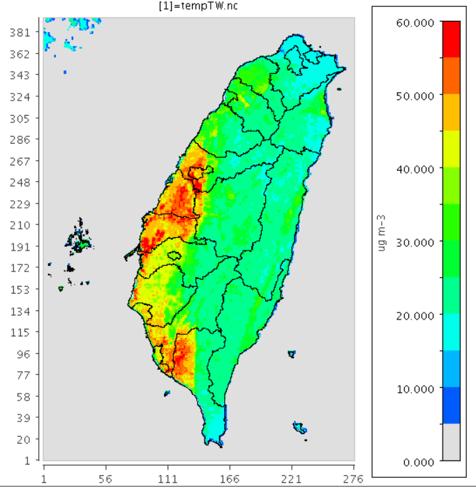

# LGHAP 衛星數據批次轉檔
{: .no_toc }

<details open markdown="block">
  <summary>
    Table of contents
  </summary>
  {: .text-delta }
- TOC
{:toc}
</details>
---

## 背景

- [LGHAP](../../AQana/RegAQ/LGHAP/LGHAP.md#背景)已經是解析度1公里的數據檔了，但因為範圍是東亞、且可能存在網格方向的誤差，因此有必要重新進行regrid。
- 新網格系統參照[tempTW.nc](../../AQana/GAQuality/NASA_MCD19A2/2.genN_D4T.md#ios),公版模式範圍、解析度為1Km。
- 目標是進行[鄉鎮區平均](../../utilities/GIS/mk_gridLL.md)，因此內插後直接以`pandas.pivot_table`來進行行政區範圍內之平均。
- 內插採用`scipy.interpolate.griddata`模組（參考[Near Real Time](../../AQana/GAQuality/ECMWF_NRT/2.CAMS_NRT.md)的檔案處理），因解析度相近，此處就不使用cubic spline，而以線性內插即可。

## [LGHAP2csv][LGHAP2csv]程式說明

### 執行方式

`for yr in 20{00..22};do sub python LGHAP2csv.py $yr;done`

### [LGHAP2csv][LGHAP2csv] IO's

- 引數：仍為4碼年期
- 舊座標系統的模板：`fname='LGHAP.PM25.D001.temp.nc'`
- LGHAP檔案目錄全部都在一處

### 座標轉換

- LGHAP檔案的經緯度是1維的向量
- 需先將其展開成2維、再進行座標轉換。
- 因變數名稱正好是`lat/lon`，2維變數需更名。

```python
25c25
< fname='slev/EARR.slev.20100606.t12z.nc'
---
> fname='LGHAP.PM25.D001.temp.nc'
28c28
< for v in V0[1]:
---
> for v in V0[0]:
30c30
< V0=[i for i in V0[1] if i[0] != 'l']+['precip_acc6h']
---
> V0=[i for i in V0[1]]
32c32,33
< x,y = pnyc(lon, lat, inverse=False)
---
> ln,lt=np.meshgrid(lon, lat)
> x,y = pnyc(ln, lt, inverse=False)
```

### 檔案及迴圈管理

- 檔案目錄及檔名管理：較為單純

```python
56,60d56
< # file directories
< dirs=['slev','precip']
< tail={'slev':'.nc','precip':'.f06h.nc'}
< ndiv={'slev':4,'precip':1}
<
61a58
> v=V0[0]
```

### 迴圈的層數

- 因LGHAP數據已經整理成日均值、而且沒有其他項目，只有PM<sub>25</sub>一項，因此只剩下日數的迴圈。
- LGHAP數據特性
  1. 海上數據全被遮蔽，因此需先取值(`.data`)，再用`np.where`取為0，以避免錯誤內插，後面再將0值網格剔出平均之範圍，如此就可以完全避免海上的干擾。 
  2. 維度順序為`[lon,lat]`，與ioapi不同，因此在idx的應用上需予以轉置`var[idx[1][i], idx[0][i]]`。
  3. 網格間距為1Km，內插時不需要`cubic` spline，直接以線性(`linear`)方式即可。

```python
61a58
> v=V0[0]
64,80c61,70
<   zz={v:np.zeros(shape=(nrow,ncol)) for v in V0}
<   for d in dirs:
<     for h in range(0,24,6):
<       fname=d+'/EARR.'+d+'.'+nowd+'.t{:02d}z'.format(h)+tail[d]
<       nc ...
---
>   fname='LGHAP.PM25.D001.A'+nowd+'.nc'
>   nc = netCDF4.Dataset(fname,'r+')
>   var=nc[v][:,:].data
>   var=np.where(var==65535.,0,var)
>   c=np.array([var[idx[1][i], idx[0][i]] for i in range(mp)])
>   zz=griddata(xyc, c[:], (x1, y1), method='linear')
>
>   df[v]=zz.flatten()
```

### 後處理與輸出

- 沒有降雨量

```python
77,79d81
<   precip=df['precip_acc6h']
<   precip=np.where(precip>=0,precip,0)
<   df['precip_acc6h']=precip
```

- 因海上沒有值，如果填0，在鄉鎮區平均後、沿海地區的濃度會低估失真。需將這些網格先予以剔除，再進行pivot_table。

```python
<   df_tm=pivot_table(df,index='TOWNCODE',values=V0,aggfunc=np.mean).reset_index()
---
>   df1=df.loc[df[v]>0].reset_index(drop=True)
>   df_tm=pivot_table(df1,index='TOWNCODE',values=V0,aggfunc=np.mean).reset_index()
```

- 輸出檔名的差異

```python
88c78
< df0.set_index('YMD').to_csv('EARR'+yr+'.csv')
---
> df0.set_index('YMD').to_csv('LGHAP'+yr+'.csv')
```

### [LGHAP2csv][LGHAP2csv]程式下載



### 結果

|  |  |
|:-:|:-:|
| <b>LGHAP整合衛星數據檔案中的PM25日均值濃度。單位&mu; g/M<sup>3</sup></b>|  <b>同左，但為鄉鎮區平均值</b>|

[LGHAP2csv]: https://github.com/sinotec2/Focus-on-Air-Quality/blob/main/wind_models/EARR/LGHAP2csv.py "LGHAP2csv.py"