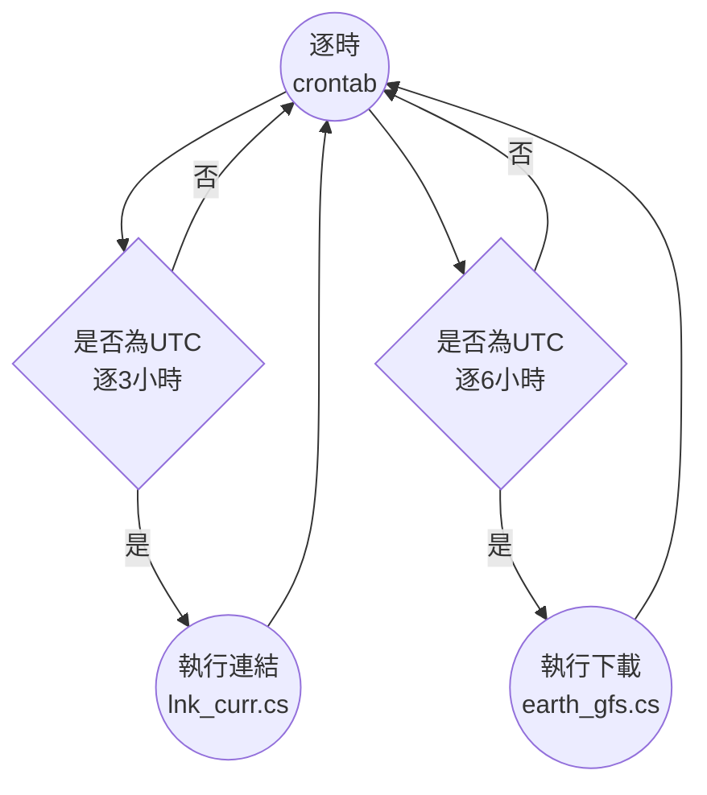
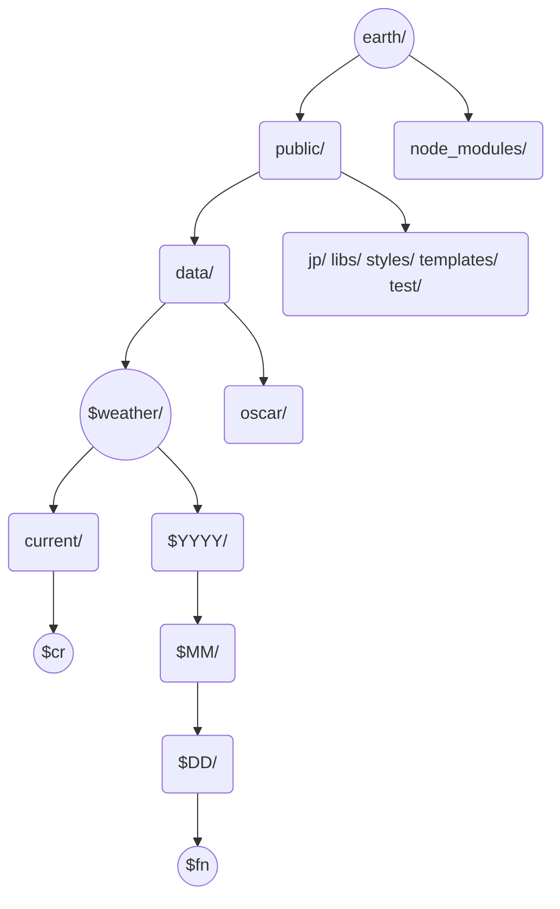

# GFS數據自動下載轉換
{: .no_toc }

<details open markdown="block">
  <summary>
    Table of contents
  </summary>
  {: .text-delta }
- TOC
{:toc}
</details>
---

## 背景
- [GFS][GFS]是美國國家氣象局運行的全球氣象數值預報模式，**每6小時更新**預報，每次預報未來180小時(7天半)範圍。提供**逐3小時**結果。模式結果公開的時間較實際時間晚6小時。
- 在此時間框架下，此處任務需定期下載、處理、並放置在[earth][ens]套件指定的位置([earth_gfs.cs][earth_gfs.cs])，連結當下檔案（[lnk_curr_cs](https://sinotec2.github.io/Focus-on-Air-Quality/wind_models/GFS/earth_gfs/#lnk_curr.cs腳本內容)）以利使用者透過網路讀取檢視。
- 整體作業時間框架




## 批次執行腳本IO
- 引數：無。crontab程式會按照工作站系統時間呼叫批次檔。

### 數據名稱對照關係
- GFS數據項目，對照關係如下表
  - 地面：MSLP、temp、
  - 10m：uv
  - 1000mb：uv、temp(計算air_density用)、O3MR

項目|GFS變數名稱|[earth][ens]變數($item)|高度|說明
-|:-:|:-:|:-:|-
風|UGRD, VGRD|wind|10m, 1000mb|[GFS][GFS]並沒有2維的u10、v10，因此地面風需指定其高度為10m。同一時間的U、V需同批下載，儲存在同一json檔案內，先指定U、再指定V。
平均海面氣壓|PRMSL|mean_sea_level _pressure|(不適用)|與地面氣壓不同，[GFS][GFS]之PRMSL為2維變數，不能指定高度
氣溫|TMP|temp|地面, 1000mb|[GFS][GFS]沒有精確指定地面氣溫的高度(如wrf的T2)，指定為surface_level即可
臭氧|O3MR|(ozone)|1000mb|[earth][ens]原始套件**沒有臭氧**，需[修改](https://sinotec2.github.io/FAQ/2022/08/03/wind_ozone.html#earth系統新增臭氧之讀取繪圖功能)。[GFS][GFS]提供的是定壓層模擬結果，濃度較[CAMS][CAMS]為低，後者雖也是定壓層，但圖層放在地面。
空氣密度|(無)|air_density|1000mb|密度是計算粒狀物的重要變數，[GFS][GFS]輸出有這項，但**不提供**perl程式下載，以[earth_dens.py][earth_dens.py]程式另行計算。[earth][ens]提供了定壓層的展示，但目前仍未試成功。

### 對應json檔
- 命名邏輯
  - 日期目錄
  - `fn=$時間-$item-$levTyp-$level-$mdl-$res.json`

順序|代碼|意義|範例|說明
-|-|-|-|-
1|時間|小時或當下|${HH}00($fn)或current($cr)|標示檔案的小時。此檔名會與url網址列時間一致
2|item|變數名稱|wind、mean_sea_level_pressure、temp、air_density、ozone等等|小寫。[earth][ens]只認檔名不認json header之內容。wind需2筆json，其餘1筆
3|levTyp|指定高度的類型|surfae或isobaric|指向html中的Sfc或等壓面高度
4|level|哪一層高度|如為地面此值即為level，如為等壓面其單位為百帕(如1000hPa)|如為2維數據(MSLP)第3及4項皆無(Null)。
5|mdl|模式名稱|[earth][ens]只提供gfs|如需其他模式，需修改[js程式](https://sinotec2.github.io/FAQ/2022/07/26/CWBwrf_3Km2NWC.html#filepath-function)。
6|res|模式解析度|[earth][ens]沒有內設，只與檔名有關。網格系統計算乃讀取json檔頭有關[網格設定內容](https://sinotec2.github.io/FAQ/2022/07/26/CWBwrf_3Km2NWC.html#grid-definition)。|如需其他解析度，也需修改[js程式](https://sinotec2.github.io/FAQ/2022/07/26/CWBwrf_3Km2NWC.html#filepath-function)。
      

### 檔案目錄架構 
- [earth][ens]套件$weather的目錄架構如下圖所示
  - `weather=./earth/public/data/weather`
  - 時間目錄
    - 按照年、月、日(UTC)分別建立目錄
    - 其下則為當天所有氣象(與臭氧)檔案，命名方式如前述`$fn`
  - 當下目錄($weather/current)
    - 按照工作站系統時間判定，解析度為3小時
    - 連結到前述時間目錄及檔案
    - 命名邏輯
      - `cr=current-$item-$levTyp-$level-$mdl-$res.json`



## [earth_gfs.cs][earth_gfs.cs]腳本內容
### 任意格式時間的讀取
- linux date對任意時間的讀取僅限日期，如有小時或需指定讀取格式時則會出錯、不像macOS date可以任意指定格式。
- 經試誤發現
  1. linux可以讀取`+%c`(locale’s date and time (e.g., Thu Mar  3 23:05:25 2005))格式的時間標籤，來進行時間的加減計算
  1. 需指定作業環境的$LC_ALL，使date結果可以被自己辨識。
    - 指定目前時間標籤 `cdate=$(LC_ALL='en_US.UTF-8' date -d now +%c)`
    - 指定模擬開始時間 `cdate=$(LC_ALL='en_US.UTF-8' date -d @$bdate +%c)`
  1. 需格式轉換時，則需讀取`+%s`格式(seconds since 1970-01-01 00:00:00 UTC)的時間標籤

### [GFS][GFS]模式模擬起始時間`$bdate`。
- 由於[GFS][GFS]模式結果目錄檔名(`$ROOT`)中含有啟始日期與時間，因此需先計算與轉換
  - 減14小時，包括時差8小時、模式結果上架時間差(6小時，檢視[GFS][GFS]官網https檔案之時間戳記得知。)

```bash
cdate=$(LC_ALL='en_US.UTF-8' date -d now +%c)
bdate=$(date -d "$cdate -14hours" +%s)
YMD=$(date -d @$bdate +%Y%m%d)
BH=$(date -d @$bdate +%H)
...
ROOT=https://nomads.ncep.noaa.gov/cgi-bin/filter_gfs_1p00.pl?file=gfs.t${BH}z.pgrb2.1p00
cdate=$(LC_ALL='en_US.UTF-8' date -d @$bdate +%c)
...
curl -s "${ROOT}.f${iii}&lev_10_m_above_ground=on&var_UGRD=on&var_VGRD=on&dir=%2Fgfs.${YMD}%2F${BH}%2Fatmos"  -o gfs.tmp
```
- `%2F`為正斜線，指令中的
  - 目錄(dir)為：`dir=/gfs.${YMD}/${BH}/atmos`
  - 檔名為：`file=gfs.t${BH}z.pgrb2.1p00.f${iii}`。檔名中的`${iii}`則為預報`${iii}`小時的模擬結果(000~180)。

### 逐3小時預報時間標籤的計算
```bash
for ((i=0; i<=180; i=i+3)); do
  iii=`printf "%03d" $i`
  sdate=$(date -d "$cdate +${i}hours" +%s)
  YYYY=$(date -d @$sdate +%Y)
  MM=$(date -d @$sdate +%m)
  DD=$(date -d @$sdate +%d)
  HH=$(date -d @$sdate +%H)
  path=$YYYY/$MM/$DD
  mkdir -p $path
... 
```
- 因為時間會向前推演，需每次都確定目錄已經都妥善準備好。

### 地面數據下載轉換
- UGRD、VGRD是10m高度值
- TMP、PRES是地面值
- PRMSL是2維數據，不能指定高度。
- [grib2json](https://sinotec2.github.io/Focus-on-Air-Quality/utilities/netCDF/netcdf2json/#grib2json)為作者[cambecc](https://github.com/cambecc/grib2json)提供的轉換程式。

```bash
  curl -s "${ROOT}.f${iii}&lev_10_m_above_ground=on&var_UGRD=on&var_VGRD=on&dir=%2Fgfs.${YMD}%2F${BH}%2Fatmos"  -o gfs.tmp
  $grib2json -n -d --fp wind --fs 103 --fv 10.0 -o ${path}/${HH}00-wind-surface-level-gfs-1.0.json gfs.tmp
  curl -s "${ROOT}.f${iii}&lev_surface=on&var_TMP=on&dir=%2Fgfs.${YMD}%2F${BH}%2Fatmos"  -o gfs.tmp
  $grib2json -n -d  -o ${path}/${HH}00-temp-surface-level-gfs-1.0.json gfs.tmp
  curl -s "${ROOT}.f${iii}&lev_surface=on&var_PRES=on&dir=%2Fgfs.${YMD}%2F${BH}%2Fatmos"  -o gfs.tmp
  $grib2json -n -d  -o ${path}/${HH}00-pres-surface-level-gfs-1.0.json gfs.tmp

  curl -s "${ROOT}.f${iii}&var_PRMSL=on&dir=%2Fgfs.${YMD}%2F${BH}%2Fatmos"  -o gfs.tmp
  $grib2json -n -d  -o ${path}/${HH}00-mean_sea_level_pressure-gfs-1.0.json gfs.tmp
```

### 定壓層數據之下載轉換
- 定壓層沒有**壓力**項可供下載

```bash
#1000mb
  curl -s "${ROOT}.f${iii}&lev_1000_mb=on&var_UGRD=on&var_VGRD=on&dir=%2Fgfs.${YMD}%2F${BH}%2Fatmos"  -o gfs.tmp
  $grib2json -n -d  -o ${path}/${HH}00-wind-isobaric-1000hPa-gfs-1.0.json gfs.tmp
  curl -s "${ROOT}.f${iii}&lev_1000_mb=on&var_TMP=on&dir=%2Fgfs.${YMD}%2F${BH}%2Fatmos"  -o gfs.tmp
  $grib2json -n -d  -o ${path}/${HH}00-temp-isobaric-1000hPa-gfs-1.0.json gfs.tmp
  curl -s "${ROOT}.f${iii}&lev_1000_mb=on&var_O3MR=on&dir=%2Fgfs.${YMD}%2F${BH}%2Fatmos"  -o gfs.tmp
  $grib2json -n -d  -o ${path}/${HH}00-ozone-isobaric-1000hPa-gfs-1.0.json gfs.tmp
```
- 最後再執行[earth_dens.py][earth_dens.py]進行空氣密度與臭氧單位之計算

### crontab定期執行
- 設定每6小時更新

```bash
# earth GFS
0 2,8,14,20 * * * /nas1/Data/javascripts/D3js/earth/public/data/weather/current/earth_gfs.cs
```

## [earth_dens.py][earth_dens.py]空氣密度與臭氧單位之計算
- 臭氧濃度從重量混合比(kg/kg)轉成ppb
  - 覆蓋原檔案數據

```python
air_mw=28.97
O=np.array(ozone[0]['data'][:])*air_mw/48.*1.E9
ozone[0]['data']=list(O)
with open(fnames[3],'w') as f:
  json.dump(ozone,f)
```
- 密度計算：採標準氣體公式 n/V=P/(RT)

```python
R=8.3144598
T=np.array(temp[0]['data'][:])
P=np.ones(shape=T.shape)*100000. #（1000hPa定壓層）
...
D=P/(R*T)*air_mw/1000.
temp[0]['data']=list(D) #使用temp的json容器（header 內容與data長度）。
dens=temp
with open(fnames[2],'w') as f:
  json.dump(dens,f)
```



## 當下檔案($cr)與逐3小時檔案($fn)的連結
- 因應伺服器重啟時並不會自動重啟node設定，將node執行情況納入每小時確認項目，如沒有在運作，則予以重啟。(2022-11-08 07:14:27)
- 因為[GFS][GFS]檔案時間皆為UTC，需先取得當下UTC的年月日時。
  - **now**可以不必特別指定。而且可以直接進行計算。
- 小時數需round到每隔3的間距，並取2碼文字作為檔案名稱的前綴`${h}00`。
- 先執行地面項目的連結
  - 地面臭氧為[CAMS][CAMS]1000mb數據，[需另行下載計算](https://sinotec2.github.io/FAQ/2022/08/03/wind_ozone.html#數據下載與轉換)。
- 再執行1000mb項目的連結。

### lnk_curr.cs腳本內容

- 先確認一下dev-server.js是否正常運作，如果沒有，就先啟動。（如重新開機不需另外一一啟動）
- 將現在時刻(current)連結到正確的檔案
- 注意事項
  1. 以陣列方式連續處理不同解析度的路徑與網路服務埠的對照
  2. macOS及Linux的date指令略有差異
  3. 小時數需進行計算，因此需先將字串轉成以10為底的整數
  4. 如有檔案才連結，避免無檔案的錯誤。

```bash
#$ cat /nas1/Data/javascripts/D3js/earth/public/data/weather/current/lnk_curr.cs
# confirm the node is running 
now=$(date -v-8H -j  +%Y%m%d%H)
y=$(date -j -f "%Y%m%d%H" "${now}" +%Y)
m=$(date -j -f "%Y%m%d%H" "${now}" +%m)
d=$(date -j -f "%Y%m%d%H" "${now}" +%d)
h=$(date -j -f "%Y%m%d%H" "${now}" +%H)
h=$(( 10#$h / 3 * 3|bc -l ))
h=$(printf "%02d" $h) 
rrs=( 45 09 03 )
nod=( 8084 8085 8086 )
for i in 0 1 2;do
  res=${rrs[$i]}
  num=${nod[$i]}
  n=$(ps -ef|grep node|grep ${num} |wc -l) 
  if ! [ $n -eq 1 ];then
    cd /Users/Data/javascripts/D3js/earthFcst$res
    ～/bin/sub node dev-server.js $num >& /dev/null
  fi
  weather=/Users/Data/javascripts/D3js/earthFcst${res}/public/data/weather
  path=$weather/$y/$m/$d
  for itm in wind ozone ozone8 so2 no2 vocs pm1 pm10 pm25;do
    lev=-surface-level
    fn=${h}00-${itm}${lev}-fcst-${res}.json
    cr=${fn/${h}00/current}
    if [ -e $path/$fn ]; then
      ln -sf $path/$fn $weather/current/$cr
    fi  
  done
done
```

### crontab定期執行
- 設定每小時更新連結。
  - （適用在任何時間解析度的資料來源）

```bash
# earth GFS
0 * * * * /nas1/Data/javascripts/D3js/earth/public/data/weather/current/lnk_curr.cs
```
## 展示系統
- 使用[earth][ens]系統進行展示，位置與通訊埠在$IP:8080
  - [內部IP](http://200.200.31.47:8080/)
  - [外部IP](http://125.229.149.182:8080/)

[GFS]: <https://en.wikipedia.org/wiki/Global_Forecast_System> "全球預報系統 (GFS) 是一個全球數值天氣預報系統，包含由美國國家氣象局 (NWS) 運行的全球尺度氣象數值預報模式和變分分析。"
[CAMS_wiki]: <https://en.wikipedia.org/wiki/Copernicus_Atmosphere_Monitoring_Service> "哥白尼大氣監測服務是由2014年11月11日啟動的歐洲中程天氣預報中心提供的一項服務，提供有關大氣成分的連續數據和信息。CAMS是哥白尼計劃的一部分， 它描述了當前情況，對未來幾天的情況進行了預測，並持續分析了近年來的回顧性數據記錄。 维基百科（英文)"
[ens]: <https://earth.nullschool.net/> "earth, a visualization of global weather conditions, forecast by supercomputers, updated every three hours"
[earth_gfs.cs]: <https://github.com/sinotec2/Focus-on-Air-Quality/blob/main/wind_models/GFS/earth_gfs_cs> "GFS數據自動下載轉換腳本"
[earth_dens.py]: <https://github.com/sinotec2/Focus-on-Air-Quality/blob/main/wind_models/GFS/earth_dens.py> "由GFS數據計算空氣密度與臭氧"
[CAMS]: <https://ads.atmosphere.copernicus.eu/cdsapp#!/dataset/cams-global-atmospheric-composition-forecasts?tab=overview> "CAMS每天2次進行全球大氣成分的5天預報，包括50多種氣狀物和7種顆粒物(沙漠塵埃、海鹽、有機物、黑碳、硫酸鹽、硝酸鹽和銨氣溶膠)。初始條件為衛星及地面觀測數據同化分析結果，允許在地面觀測數據覆蓋率低、或無法直接觀測到的大氣污染物進行估計，除此之外，它還使用到基於調查清單或觀測反衍的排放估計，以作為表面的邊界條件。"