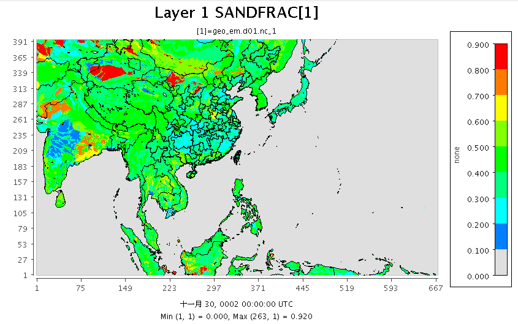

# 數據之準備 

{: .no_toc }

  

    Table of contents
  

  {: .text-delta }
- TOC
{:toc}

---

## 背景
- 此處以最簡單的揚沙個案進行WRF-chem的測試。
- WRF-chem模擬揚沙不需要邊界或初始條件，也不需要額外準備排放量數據，只需在`geo_em`檔案內加上研究地區的風蝕、沙及泥的比例等參數即可。
- 注意WPS程式之版本

## geo_em檔案之準備
- 模擬範圍：揚沙現象來自廣大的裸露地(barren land)、沙漠、石漠、礦區等。因為揚沙濃度很高，如果受到邊界的切割，又沒有妥善的邊界條件，將會造成嚴重低估。此處設定包括到中亞與大陸西北的重要沙塵暴發源地。
- 網格解析度：設定15Km
- 下載風蝕、沙及泥的比例參數計算所需[Thompson全球數據](https://www2.mmm.ucar.edu/wrf/src/wps_files/geog_thompson28_chem.tar.gz)
  - 到`geog_data_path`所指定的目錄下進行解壓縮動作
  - `bz2`的解壓縮： `tar xjf file`
- 複製`geogrid/GEOGRID.TBL.ARW_CHEM`檔案成為`GEOGRID.TBL`
- 執行`geogrid.exe`
- 在[VERDI](https://sinotec2.github.io/Focus-on-Air-Quality/utilities/Graphics/VERDI/VERDI_Guide/)內打開`geo_em.d01.nc`檔案，進行確認。

## met_em檔案之準備
- 與一般`ungrib`、`metgrid`的過程沒有差別，見[dowps.sh的執行](https://sinotec2.github.io/Focus-on-Air-Quality/wind_models/WPS/dowps.cs/#dowpssh%E7%9A%84%E5%9F%B7%E8%A1%8C)

## fdda相關檔案之準備
- fdda可以避免程式發散，造成揚沙現象的高估
- OBSGRID程式也有更新，如果用到舊版會因檔案TITLE的全域屬性不正確而跳出。解決方案
  - 使用新版OBSGRID
  - 手動以[ncatted]()修改
  - WRF4.3的協定是`TITLE = "OUTPUT FROM OBSGRID V4"`
  - WRF-chem4的協定是`TITLE = "OUTPUT FROM OBSGRID V4."`，多了句點。
- 其餘程序與[傳統作法](https://sinotec2.github.io/Focus-on-Air-Quality/wind_models/OBSGRID/obsYYMM_run.sh/)一樣。  

## 結果檢視
- `EROD`變數的第1軸不是一般的垂直維度(`z-dimension0003`)，因此[VERDI](https://sinotec2.github.io/Focus-on-Air-Quality/utilities/Graphics/VERDI/VERDI_Guide/)無法順利讀取。
- `SANDFRAC`與`CLAYFRAC`為互相消長的變數。以下為`SANDFRAC`

## Reference
- 